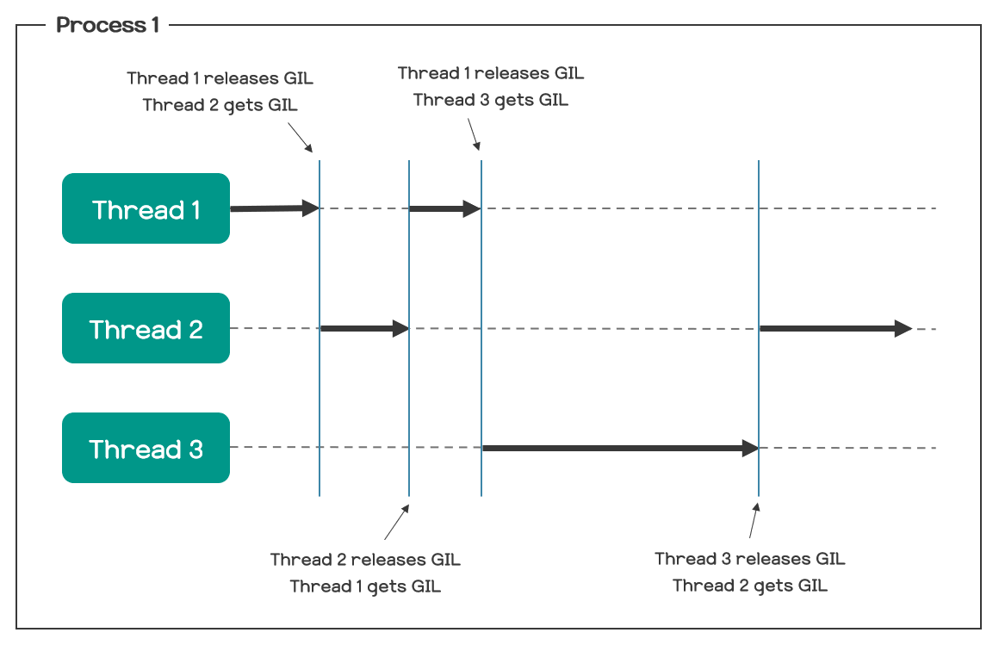

**GIL**은 Global Interpreter Lock의 약자이다.

Global이 붙으니 전역적이라는 의미이고, Lock을 사용하니 무언가를 제한한다는것은 알겠는데 Interpreter는 뭘까?
인터프리터에 대해서 제한을 건다는 것이 어떤 의미일까?

아래에서 쭉 알아보자.

## Interpreter

짧게 얘기하면 **Python 인터프리터는 코드를 한 줄씩 읽으면서 실행**하는 프로그램이다.

> 이 방식때문에 인터프리터 언어가 느리단 얘기가 나오는 것이고, Java에서 이를 개선해서 등장한 방식이 JIT다.

이 인터프리터의 구현체는 여러가지가 있는데 대표적인 구현체가 C로 구현한 것이고, 이를 **CPython**이라고 한다.

이 글에서는 CPython 기준으로 설명할 것이다.

> [Python 위키](https://wiki.python.org/moin/GlobalInterpreterLock) 항목을 읽어보면 ***Non-CPython implementations***에 Jython, IronPython은 GIL이 없고, PyPy는 CPython과 비슷한 GIL을 가지고 있다. 또 Cython에는 CIL이 존재하지만, `with` 키워드를 이용하여 잠시동안 해제가 가능하다고 한다.

대충 인터프리터가 어떤 의미인지는 알았으니 본론으로 들어가서 GIL에 대해서 알아보자.

## GIL

[Python 위키](https://wiki.python.org/moin/GlobalInterpreterLock)를 계속 참고해보면, 이렇게 정의하고 있다.

> In CPython, the **global interpreter lock**, or **GIL**, is a mutex that protects access to Python objects, preventing multiple threads from executing Python bytecodes at once. The GIL prevents race conditions and ensures thread safety. A nice explanation of [how the Python GIL helps in these areas can be found here](https://python.land/python-concurrency/the-python-gil). In short, this mutex is necessary mainly because CPython's memory management is not thread-safe.

중요한 부분 위주로 해석을 해보면,

GIL은 CPython에서 객체들에 대한 접근을 보호하는 뮤텍스(Mutex)로써, 여러개의 쓰레드가 동시에 파이썬의 바이트코드를 실행하는 것을 방지하는 역할이라는 것이다.  
따라서 GIL은 경쟁 상태에 진입하는 것을 막아주고, 쓰레드 안전성을 보장한다.  
또 간단하게 말해서, **CPython의 메모리 관리가 쓰레드-안전이 아니기 때문에** 뮤텍스가 필요하다는 것이다.

더 간단하게 말하면, *Python 인터프리터에 대해서 전역적으로 잠금*이 걸리기 때문에 **한 시점에 오직 하나의 쓰레드만 인터프리터를 실행할 수 있다.**

또 이어지는 설명에서 이렇게 설명을 한다.

> In hindsight, the GIL is not ideal, since it prevents multithreaded CPython programs from taking full advantage of multiprocessor systems in certain situations.

해석해보자면 돌이켜보았을때 GIL은 멀티쓰레딩 CPython 프로그램이 특정 상황에서 **_멀티프로세서 시스템의 장점을 다 사용하지 못_** 하게끔 하기 때문에 GIL은 이상적이지 않다.

> 여기서 말하는 멀티프로세서 시스템의 장점은 **멀티 쓰레딩 동작을 할때 여러 개의 쓰레드가 각각의 프로세서 상에서 병렬적으로 실행됨**을 의미한다.

즉, **GIL 때문에 CPython에서는 그러한 병렬적인 실행이 불가능하다는 것이다.**



### GIL의 필요성

괜히 멀티쓰레딩만 방해하고, GIL은 대체 왜 있는걸까?

이것에 대한 해답은 아까 말한 정의에 나와있다.

**_GIL is ... mutext that protects access to Python Objects._**

Python에서 모든 것은 객체로 존재하고, [CPython에서 각각의 객체들이 C 구조체를 통해 만들어진다는 것을 생각해보면,](https://github.com/python/cpython/blob/main/Include/object.h) 수 많은 객체에 대응되는 수 많은 구조체가 있음을 알 수 있다. 

그러면 자연스럽게 메모리 관리를 생각하게 된다.

Python에서 메모리 관리는 참조 횟수(reference count)를 이용해 GC(Garbage Collection)를 수행하는데, 이 참조 횟수가 C 구조체 안에 적혀 있다.
CPython의 소스코드를 확인해보면 이렇게 코드가 나와있다.

> [https://github.com/python/cpython/blob/main/Include/object.h](https://github.com/python/cpython/blob/main/Include/object.h)

```c
typedef struct _object {
    _PyObject_HEAD_EXTRA
    Py_ssize_t ob_refcnt;
    PyTypeObject *ob_type;
} PyObject;
```

잘 보면 PyObject 구조체 안에 참조 횟수를 **직접 저장**하고 있다.

운영체제를 열심히 들으신 분이라면 바로 왜 위에서 언급한 **경쟁 상태**가 생길수 있는지 아실 것이다.

만약 CPython의 의도와는 정반대로 여러개의 쓰레드가 동시에 Python 인터프리터를 실행한다면,  
참조 횟수에 병렬 프로그래밍의 고질적 문제 중 하나인 [**경쟁 상태**](https://becomeweasel.me/mutex-and-semaphore/#race-condition)가 발생하게 된다.

단순히 여기서 그치는 것이 아니라 아까 Python GC의 원리가 참조 횟수에 기반을 둔다는 점을 다시 생각한다면,
**올바르지 않은(비정합적인)** 참조 횟수를 기반으로 GC가 일어남으로써 **GC가 의도한 바와는 다르게 동작할 수 있다는 것이다.**

그렇다고 객체에 대해서 작업을 할때, 좀 더 좁게 말하자면 **`ob_refcnt`에 대한 작업을 수행할때마다** 별도의 뮤텍스를 이용해서 Lock을 얻고 해제한다면 비효율적이고, 프로그래머가 일일이 제어하기에는 부담이 가는 작업이다.

그렇기에 CPython에서는 **한 쓰레드가 인터프리터를 실행 중일때는 다른 쓰레드가 실행하지 못하도록 인터프리터를 잠궈버렸다.**  
이렇게 된다면, 객체의 참조 횟수에 대한 경쟁 상태 역시 고려할 필요가 없어진다.

> GIL을 선택한 이유에 대해서 조금 더 자세하게 알아보자면, 이 [링크](https://softwareengineering.stackexchange.com/questions/186889/why-was-python-written-with-the-gil)와 이 [링크](https://realpython.com/python-gil/)를 참조하면 된다.

> 짧게 얘기하자면, Python을 처음 만들때는 쓰레드라는 개념이 인기 있기 전이였고, 그 후에 쓰레드가 등장했을때 가장 **현실적이고 쉬운** 방법이 GIL이였다.

첨언하자면, 왜 GIL이 아닌 다른 해결책을 도입하지 않냐고 하자 Python의 개발자인 [**Guido van Rossum**](https://en.wikipedia.org/wiki/Guido_van_Rossum)은 이렇게 말했다고 한다.

>”단일 쓰레드 프로그램에서(그리고 I/O 바운드 멀티 쓰레드 프로그램) 성능이 저하되지 않는 GIL 해결책을 가지고 오면, 그 해결책을 기쁘게 받아들이겠다.”

```toc

```
