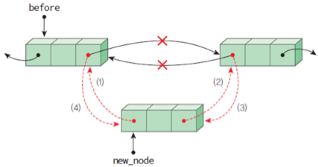
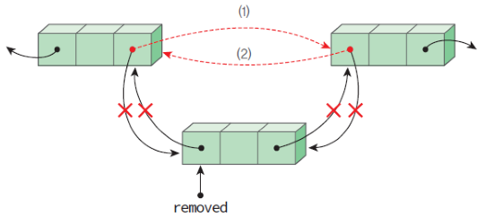

## Array

논리적 저장순서와 물리적 저장순서가 일치한다. 다시 말해서 `a[2]` 와 다음에 오는 `a[3]` 는 물리적으로 연결되어 있다. 
하지만, 하나의 Array의 크기가 너무 커 하나의 page(혹은 frame) 안에 다 못들어오는 경우에는 **virtual adress는 *연속적*으로 이어져있지만, physical adress에서도 그렇다는 보장은 없다.** 

>💡 하지만 physical adress와 virtual address에 관한 문제는 OS가 처리할 일이고 프로그래머에게 보이지 않는 추상계층이기에 우리가 깊게 생각할 필요는 없다고 생각한다.

또, 한번 사이즈가 정해지면 변할 수 없다. 이를 해결하는 방법이 Dynamic Array다.

- 조회 : 인덱스를 기반으로 한 접근이 가능하다. 인덱스를 알고 있다면 `O(1)`의 시간 내에 접근이 가능한데 , **이것을 Random Access**라고 한다.
- 삽입 : Array의 특정 위치에 삽입을 할때는 원소를 넣고 끝나는 것이 아니라, 기존의 원소들을 shift 해주는 비용이 생기기 때문에 `O(n)`의 비용이 든다.
- 삭제 : 삽입과 마찬가지로 shift의 비용 때문에 `O(n)`이 소요된다. 만약 shift를 해주지 않는다면 삭제를 한 곳에 빈 공간이 생기게 될것이고, contiguous한 Array의 특성이 깨진다.

## ArrayList

Java 기준으로 primitive만 저장 할 수 있는 Array와는 다르게 Object도 가능하다. ArrayList에 add를 사용하여 primitive한 데이터를 집어넣을때는 Auto-boxing이 사용된다. 또 제네릭이 사용 가능하다.

하지만 가장 큰 차이점은 **ArrayList는 Dynamic Array라는 것이다.** ArrayList는 내부적으로 Array와 사이즈 정보를 가지고 있다.

Array의 초기 사이즈가 고정되어 있고 늘어나지 않는것에 비해서, ArrayList는 add를 이용해서 원소를 삽입하다가 원소가 가득차게 되면, 내부적인 Array의 크기를 두배 혹은 1.5배 정도로 늘여서 기존의 원소들을 다 옮기게 된다.

이 과정에서의 시간 복잡도를 고민해보면, 기존 원소의 개수가 0개이고 사이즈가 `n`개라고 해보자. 
이때 `n`번의 add를 할때까지 내부 Array는 가득차지 않고 각각의 삽입연산의 시간복잡도는 `O(1)`이다.

하지만 한번 더 add를 한다면 내부 Array를 두배로 늘리고 , 기존의 `n`개의 원소들을 모두 옮겨야 하니 `O(n)`의 시간이 소요된다. 
`n+1`번의 add에 걸리는 시간복잡도가 `O(1)*n+O(n)`이니, 평균적인 시간 복잡도는 `(O(1)*n+O(n))/(n+1)=O(1)`이 되는 것이다.

이것을 분할 상환(Amortized Analysis)라고 한다.

## LinkedList

LinkedList는 불연속적인 데이터들의 집합이다. LinkedList는 Node라고 불리는 내부구조들의 chain으로 구성되어 있는데 구조는 아래와 같다.

```c
struct Node {
	Node* next;
	int val;
}
```

이처럼 Node는 원소와 그 다음 Node를 가리키는 포인터로 구성된다. 각각의 원소들은 오직 자기 다음에 오는 Node의 정보만을 가리키고 있는 것이다.(Singly Linked List 기준). 물론 `next` 라는 포인터를 하나 더 유지하는 메모리 사용량도 무시할 순 없다.

이것을 이용하여 삽입과 삭제를 `O(1)`만에 할 수 있다. 삽입을 할때는 단순히 `next` 만 교체하면 되고, 삭제 역시 마찬가지다.

- 조회 : k번째 원소를 찾기 위해서는  `O(k)`만큼의 시간이 소요된다.
- 삽입 : 동작 자체만으로는 `O(1)`이 걸리지만, 원하는 위치를 찾기 위해 LinkedList를 순회해야 하기 때문에 평균적으로 `O(n)`이 소요된다. 단, 맨 앞에 삽입하는 경우는 `O(1)`이 소요된다.
- 삭제 : 삽입과 동일. 맨 앞 삭제는 `O(1)`, 맨 뒤 삭제는 `tail` 에 대한 정보가 있어도 `O(n)`이 걸리는데 그 이유는 마지막 원소를 가리키는 직전 원소를 찾기 위해 `O(n)`의 시간이 걸리기 때문이다.

그럼에도 LinkedList가 중요한 이유는 Tree 구조를 이해할때 필수적이기 때문이다.

### Doubly Linked List

앞서 살펴본 Linked List는 일반적으로 Singly Linked List를 지칭하는 말이다. Singly Linked List는 아래처럼 다음 원소를 가리키는 `next` 포인터 하나만을 가지고 있다.

```c
struct Node {
	Node* next;
	int val;
}
```

이에 반해서 Doubly Linked List는 `next` 포인터와 그 직전 원소를 가리키는 `prev` 포인터 역시 가지고 있는 아래와 같은 구조를 띈다.

```c
struct Node {
	Node* next;
	Node* prev;
	int val;
}
```

또 일반 Singly Linked List와는 다르게 헤드 역시 Node로 이루어져 있다.

- 삽입 : new_node를 삽입하는 과정인데 살펴볼 필요가 있다.
    
    
    
    1. new_node의 `prev`가 before을 가리키게 한다.
    2. new_node의 `next`가 before의 `next`를 가리키게 한다.
    3. before의 `next`의 `prev`가 new_node를 가리키게 한다.
    4. before의 `next`가 new_node를 가리키게 한다.
    
    이 과정에서 순서에 유의해야 하는데, 1번은 언제 일어나도 상관이 없다.
    하지만 2번,3번의 경우 4번보다 먼저 일어나야 하는데, 그렇지 않으면 before의 `next`가 가리키는 node를 접근 할 방법이 없어지기 때문이다. 또 당연히 첫 순서로 실행되어서는 안된다.
    
- 삭제 : removed node를 삭제하려는 과정이다. removed의 이중 연결을 해제해주고, removed의 `next`와 `prev`를 서로 연결시켜준다.
    
    
    
    1. removed의 prev가 removed의 `next`를 가리키게 한다.
    2. removed의 next가 removed의 `prev`를 가리키게 한다.
    
    두 연산은 순서를 바꿔도 상관이 없다.
    
- 조회 : Doubly Linked List에는 `prev` 포인터가 있기 때문에, 최악의 경우 `O(n)`이 소모되었던 Singly Linked List와는 다르게 `O(n/2)`의 시간 안에 찾을 수 있다. 찾으려는 원소의 인덱스의 범위에 따라 `end`에서 `prev` 포인터를 이용해서 돌아가거나, `head`에서 `next` 포인터를 이용해 찾는 방법이다. 또, 직전 원소를 찾는 before도 쉽게 구현 할 수 있다.

이런 장점을 이용해서 연속적인 탐색과 접근에 유리하지만 , 구현이 상대적으로 복잡하고 `prev` 포인터를 유지해야 하기 때문에 메모리 사용량이 2배 정도 증가한다.

하지만 사용성때문에 플레이리스트, 되돌리기와 같은 기능에 사용되는 자료구조다.

## Array vs LinkedList

일반론적인 얘기에서 조회는 **Random Access**를 지원하는 Array가 `O(1)`의 시간복잡도를 가지고 있어서 LinkedList보다는 빠르다.

삽입과 삭제는 모두 LinkedList가 빠르다고 하지만 이유에 대해서 조금 더 면밀하게 살펴볼 필요가 있다.

*빠르다* 라고 하는 것은 삽입과 삭제 그 자체에 주목하는 부분이다. 
만약 바꿔야 할(삽입 혹은 삭제) 위치를 정확히 아는 상태에서는 Array보다 LinkedList가 항상 빠르다. 단순히 `next` 포인터만 변경해주면 되기 때문이다. 

평균적인 경우에서는 Linkedlist는 `O(n/2)`개의 원소들을 살펴보아야 하고, Array도 동일한 원소의 개수들을 shift 해줘야하니 비슷하다.

그렇기 때문에 Usage에 따라 두 자료구조를 적절히 아래와 같이 선택해야 한다.

- 삽입과 삭제가 빈번하게 일어나는 경우 →  **LinkedList**
- 데이터에 대한 접근(Access)가 빈번하게 일어나는 경우 → **Array**

### Cache

또 한가지 더 깊게 생각해보자면, **캐싱**과 연관이 있다. 정확히 말하면 **Spatial Locality.**

CPU가 일을 처리할때는 메모리에서 필요한 데이터를 로드하고, 일부를 캐싱한다. 그 캐시 안에 들어있는 요소들을 레지스터로 가져와서 일을 처리하는데, 이 과정에서 차이가 발생한다.

LinkedList는 데이터들의 주솟값들이 서로 연속적이지 않기 때문에, loop를 돌때 (Iterator든 뭐든) 매번 다음 메모리 주소를 찾아야 하고 , CPU가 메모리에 계속적으로 접근해서 로드하는 과정이 생길 수 있다. 

**불필요한 오버헤드가 생기는 것이다.**

반대로 배열은 연결된 데이터 구조를 가지기 때문에, 특정 영역에 존재하는 데이터들을 한번에 로드해와서 bulk들을 캐싱한다. 
그렇기에 loop를 돌때도 Array가 매우 크지 않으면 이미 캐시되어 있는 리소스들을 사용할 수 있게 되고 LinkedList와 비교했을 때 상대적으로 적은 메모리 접근이 일어나니 더 빠르다.


```toc
```