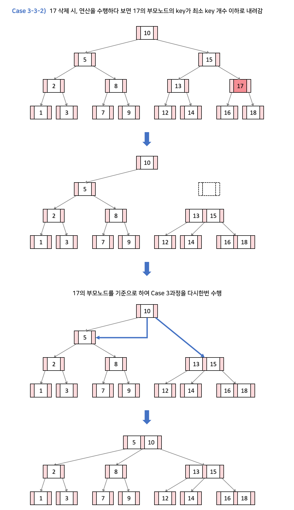

## Why B 트리?

B 트리는 이진트리와 다르게 하나의 노드에 많은 정보를 가질 수 있는 트리를 의미한다.  
노드의 최대 자식의 개수를 `M`이라고 할때, `M`차 B트리라고 한다.

B 트리는 **고전적인 메모리 계층 구조의 물음에서 출발한다.**   
이진탐색트리의 시간복잡도가 최악이 될 때는 노드가 편향된 경우인데, 이를 해결하는 것이 AVL,RB 트리와 같은 균형이진트리다.

그런데 이것만으로 부족하다. 왜 그러냐면, `O(logn)` 을 보장하는 균형이진트리의 최악을 생각해보자.  
최악이 있을까? 분명히 있다.

RB트리에서 원소가 1백만개라고 해보면, 트리의 높이는 최대 `2*log(10^6)`이다. 따라서 대략 20정도이다.
> RB 트리에서 Red 노드는 최대 두개만 연속으로 되어있음을 생각하면 쉽게 알 수 있다.

그러면, 원하는 원소를 찾기 위해서 20번 정도의 노드 액세스가 필요한데,  
만약 모든 노드가 메인 메모리에 있다고 생각해보면, **매우 비싼 20번의 메모리 접근**이 일어나는 것이다.

심지어 메인 메모리가 아닌 디스크에 있다면? **더 많은 시간이 단순히 노드에 접근하는데 쓰일 것이다.**

따라서 이러한 메모리, 디스크에 관한 접근을 줄여야 한다. 그러기 위해서는 **트리의 탐색 높이를 줄여야 한다.**   
이진트리에서 log의 베이스가 2인 이유가 2개의 자식노드임을 기억했을때 degree를 늘려야 하는 것이다.

> 💡 실제로는 트리 노드들이 하나의 캐시 라인이나 디스크 블록을 채울 수 있는 가장 큰 차수를 사용하고 있다.

따라서 B 트리는 아주 많은 양의 데이터들이 존재하는 곳에 사용되고, 높이를 `h` 라고 할때,  
**조회,삽입,삭제 등등의 동작 모두 `O(h)` 의 디스크 접근을 요구한다**.  
B 트리는 노드에 가능한 최대의 키들을 삽입하면서 트리의 높이를 낮게 유지한다.
> 즉, Balanced를 삽입,삭제 과정에서 혼자서 유지한다는 것이다.

**그렇기에 AVL,RB 트리와 비교해서 매우 낮은 디스크 접근을 수행한다.**

> 💡 이게 뭔말인가 했더니 노드의 사이즈를 디스크 블록 사이즈와 거의 동일하게 유지한다는 말, 어차피 디스크 액세스할때 1K 읽나 , 1 Byte 읽나 오버헤드는 같으니까, 한번에 많이 읽어오면 되는거다.

이러한 여러가지 특성때문에 B 트리는 B+트리와 더불어서 DBMS에서 많이 사용되고 있다.
> 💡 인덱스 다룰때 많이 쓴다고 한다. 요즘에 MongoDB 만지는데 대놓고 공식문서에 인덱스는 B트리 쓴다고 되어 있다. 물론 PostgreSQL 이런건 B+트리도 쓰고, MySQL은 B 트리,B+트리, 해시 다 쓴다.

## B 트리 정의

degree가 m인 B트리는 아래와 같은 특성을 가진다.

- 루트 노드는 적어도 2개의 자식을 가진다.
- 루트 노드와 외부 노드를 제외한 모든 내부 노드는 **적어도 `올림(m/2)`개, 최대 `m` 개의 자식**을 가진다.
    - m=2이면, 1~2개의 자식 노드 → 포화 이진 트리
    - m=3이면, 2~3개의 자식 노드 → 2-3 트리
    - m=4이면, 2~4개의 자식 노드 → 2-3-4 트리
- **모든 외부 노드들은 같은 레벨**에 있다. (Perfectly Balanced)
    - 이게 매우 중요... 높이의 상한을 준다는 것이니까 디스크 접근에 대한 상한을 준다는 것.
    - 그림에서 `{8,11}, {22,23}, {58,59}` 같은 애들을 외부 노드라고 부른다.
- 각각의 노드는 적어도 `[m/2]` 개, 최대 `m-1` 개의 키를 가질 수 있다.
    - 아래 그림을 보면, m=3일때, `[3/2]=1` ~ `3-1=2` 개의 키를 가진다.

      

    - 이런 조건이 있는 이유는, 만약 m=5일때 , 1개의 키가 있다고 해보자. 다음 키는 그 키보다 작거나 크거나 즉 두개인데, 그러면 3-4-5 트리를 만족하지 않는다.

B 트리의 목적이 데이터를 넓게 흩뿌리면서 높이를 낮게 가져간다는 점을 생각해보면서, `n`개의 원소가 있다고 할 때, 높이의 상한에 대해서 계산해보자.

- Best Case
    - 최고의 경우는 가장 잘 흩뿌려질때니
    - `logm(n) n=(log n)/(log m)=O(log n)`
- Worst Case
    - 최악의 경우는 가장 덜 흩뿌려질때, 즉 노드가 최소의 자식을 가지는 **`올림(m/2)`** 갈래로 흩어질때임.
    - `log올림(m/2)(n)=(log n)/(log(올림(m/2))=O(log n)`

즉 모든 최고,최악의 경우 모두 `O(log n)` 의 높이가 보장됨을 알게 되었다.

## 조회

조회는 이진탐색의 그것과 매우 비슷하다. 이진 탐색에서 조회는 분기가 세가지다. (못 찾는 경우 제외)

내가 찾는 키를 `k` 라고 하고, 노드의 키를 `v` 라고 하면,

- `k=v` : 같거나 → 찾았다.
- `k>v` : 작거나 → 왼쪽 서브 트리로 간다.
- `k<v` : 크거나 → 오른쪽 서브 트리로 간다.

이것처럼 B 트리에서도 비슷한 방식대로 움직이는데, 분기가 두가지다.

- `k=v` : 같거나 → 찾았다.
- `i-th v< k < i+1-th v` 를 만족하는 `i` 를 찾고 `i-th pointer` 가 가르키는 서브트리로 간다.
    - 이때 만족하는 `i` 는 최대 `m-1` 개이므로, **루프를 돌아도 되고, 이진 탐색을 수행해도 된다. ←** 루프를 돌아도 안전한게, 어차피 같은 메모리안에 올라와
      있다. 추가적인 디스크 액세스가 필요하지 않다.
      

## 삽입

삽입부터 B 트리가 복잡해지고, 또 그 과정에서 B 트리가 가지는 균형유지의 전략을 볼 수 있다.

**일단, 조회의 과정을 거치고, 삽입할만한 적절한 리프 노드 위치를 찾는다. 그 다음부터 분기가 나뉜다.**

> 💡 리프 노드에 넣는 이유는 아래에서 설명하겠지만 삽입시에 일어나는 분할이 상향식이기 때문이다.

- 삽입할 곳에 **자리가 남아있다면 (`current capacity<m-1`) , 그냥 넣고 끝낸다.**
- 삽입한 뒤에 **넘친다면, 분할한다.**

### 분할

리프노드에 삽입한 후에 m개의 키를 가진다면, 분할하는 과정을 거친다. m개의 키를 가진 노드에 대해서 세 그룹으로 분할한다. (아래 과정은 m이 홀수일때)

1. 중위순서의 **키보다 작은** 키들로 이루어진 노드들
2. 중위순서의 키
3. 중위순서의 **키보다 큰** 키들로 이루어진 노드들

그리고 1번과 3번 그룹의 부모를 2번으로 만든다. 즉, 여전히 성질이 깨지지 않게끔 하는 것.

만약 이때 부모가 넘친다면? 또 다시 진행한다. **그렇기에 리프노드에서의 넘침이 상향식으로 전파될 가능성이 있는것.**

이게 루트까지 넘친다면, 루트에 대해서 두 개의 자식을 가지는 새로운 노드를 만든다.

예시를 다 보여주기에는 어려우니, 가장 복잡한 예시만 들면 아래와 같다.

- **예시**

  

  우선 67이 들어갈 위치를 찾는 과정을 거치고, 넣을만한 곳을 찾았는데 넣는 순간 5개의 키를 가지면서 넘친다. **분할 발생!**

  중위순서의 키는 67이니, `{55,66}, {67}, {68,70}` 로 나눈 후 `{55,66} → {67} ← {68,70}` 으로 만든다.

  

  근데 67이 들어갈 위치는 50의 옆이다. 그런데 그럼 루트에서 넘침이 생기니, 루트에 대해서 상향식으로 분할이 전파된다.

  따라서 `{5,10} → {22} ← {50,67}`의 구조로 만든 후 체크하면 5개의 키를 안 넘치니 끝.

  

## 삭제

삭제는 삽입보다 복잡하다.  
B트리에서의 삭제는 삭제된 후에 B트리의 성질을 유지하기 위해서 최소키의 개수를 만족하는지,  
만족하지 않으면 추가적인 조치가 필요하기 때문이다.

B트리에서의 삭제는 크게는 두가지, 작게는 세가지 경우가 있는데 , **먼저 삭제할 키인 `k`가 리프에 있는지 없는지를 따져서 두가지로 나뉜다.**

> 💡 모든 삽입, 삭제 과정에서 `k`가 들어갈 혹은 삭제될 위치를 찾는 조회과정이 선행된다.

### `k`가 리프에 있을때

근데 여기서 또 나뉜다. 골치 아프다. 아래 과정에서 `m`은 3이다. (2-3트리)

- `k`가 있는 노드의 키의 개수가 **최소 키의 개수보다 클때** → 그냥 `k`를 삭제해도 아무런 문제가 없다.
- **형제 노드 중 하나의 키의 개수가 최소 키의 개수보다 클때**
    1. 부모 키의 값으로 `k`를 대체한다.
    2. 최소 키의 개수보다 큰 형제노드가 왼쪽 형제라면 가장 큰 값을, 오른쪽 형제라면 가장 작은 값을 부모 키로 대체한다.

       

- **양 쪽 형제가 최소 키의 개수**를 가지고 있고 , **부모 노드의 키가 최소 키의 개수보다 많다면,**
    1. `k`를 삭제한 후, 부모 키와 형제 노드를 병합한다. → **정확히는 부모 키가 내려오는 것.**
    2. 부모노드의 키를 하나 줄이고, 자식 수 역시 줄여서 B트리의 특성을 유지한다.

  

- 양 쪽 형제가 **최소 키의 개수를 가지고 있고, 부모 노드 역시 최소 키의 개수면** → 부모를 루트로 한 서브 트리의 높이 자체가 줄어들기 때문에 재구조화가 이어진다. 아래
  참조
    - 어디에서 가져오든, 무조건 빵꾸가 생기잖아요~

### `k`가 내부노드에 있고, 현재 노드 혹은 자식 노드의 키의 개수가 최소 이상일때

`k`를 predecessor(왼쪽 서브트리의 가장 큰 값) 혹은 successor(오른쪽 서브트리의 가장 작은 값)와 교환해준다. 찾는 과정은 BST의 그것과 매우 유사.

그런 후에 리프 노드가 된 `k` 를 삭제한 후 필요에 의해서 리프노드에서의 삭제 핸들링 과정으로 넘어간다.


위의 그림에선, 양쪽 형제 모두 최소 키의 개수만큼 가지고 있고, 부모노드의 키의 개수가 최소개수 이상이니 15,17이 병합된다.

### `k`가 내부노드에 있고, 현재 노드,자식 노드의 키의 개수가 최소개수일때

만약 이 상황에서 `k`를 삭제하면, 전체적인 높이가 낮아지면서 B 트리의 조건을 유지하려 함. 이를 트리의 재구조화라 한다.

1. `k`를 삭제하고, `k`의 자식을 하나로 합친다.
2. `k` 의 부모 키를 인접한 형제노드에 붙인다. (이때 `k` 는 당연히 루트가 아니다. 루트면 위에서 걸렸겟지)
3. 아까 병합한 노드를 2번의 자식노드로 설정한다. (왼쪽 혹은 오른쪽)
4. 만약 이럴때, 부모노드의 키의 개수에 따라 수행 과정이 다르다. 이에 대해서 또 분기한다.


- 새로 구성된 인접 형제노드(부모 키 붙인)가 **오버플로우 나면, 삽입연산에서의 분할 수행**
- 인접 형제노드가 구성되더라도, `k`의 부모 노드가 최소 키의 개수보다 작아진다면, 다시 위의 2번 과정부터 수행한다.



- 다른 예시

  

  4를 삭제하자. 이러면 현재 노드, 자식 노드 모두 키가 최소다.

  

  2와 6을 합치고,

  

  내 부모 노드와 합친것을 자식-부모관계로 연결시켜준다.

  

  이때 7,9,11이 오버플로우가 나니 중앙값인 9를 분할해 처리한다.

  

  당연하게도 9,15에 대해서 **분할의 propagation**이 일어날 수 있다.

## 차수에 대한 고민

결국에 높이를 최대한 낮춘다는 것이 B 트리의 성능 개선점이라고 보았을때,  
차수(degree 혹은 order)를 잘 고르는 것이 중요하다.

좋은 차수를 고르는 방법은, **페이지 사이즈에 꽉 맞춰 들어가는 최대한 큰 사이즈의 노드**를 고르는 것이다.

만약에 디스크에서 읽어오는 데이터베이스를 B 트리를 통해서 구성하려 한다면,  
각각의 노드가 **디스크 페이지 크기에 딱 맞는 사이즈**를 골라야 할 것이다.

만약에 In-memory 데이터베이스를 구성하려 한다고 해보자.  
그 말은 데이터는 메모리<->메모리 간 이동이 많을 것이고 중간에 L2 혹은 L3 캐시에 적재될때가 가장 빠른 접근을 할 수 있을때이다.  

따라서  최대한 캐시 효율을 누릴 수 있게 **L2나 L3 캐시의 라인 사이즈에 맞게끔**, 즉 **초과해서 캐시 바깥의 노드를 읽을 필요가 없게끔 구성해야한다.**

모든 케이스에서 어떤 차수를 사용하는지 고르기 전에 먼저 하드웨어에 대한 스펙을 봐야할것이고,  
내가 구현하려는 기능에서 B 트리가 어떤 역할을 하는지 알아야 할 것이다.

>💡 Typically, you'd choose the order so that the resulting node is as large as possible 
> while still fitting into the block device page size. 
> If you're trying to build a B-tree for an on-disk database, you'd probably pick the order 
> such that each node fits into a single disk page, 
> thereby minimizing the number of disk reads and writes necessary to perform each operation. 
> If you wanted to build an in-memory B-tree, you'd likely pick either the L2 or L3 cache line sizes as your target 
> and try to fit as many keys as possible into a node without exceeding that size. 
> In either case, you'd have to look up the specs to determine what size to use.

## 강점

B 트리가 어떻게 균형을 유지하는지는 알았는데 실용적으로 어떤 강점이 있을까?  
HashTable의 grow 된다는 점을 생각하지 않았을때, `O(1)` 이어서 더 유리한거 아닌가?

분명한 건 해시테이블을 이용할때는 하나의 조회에 있어서 `O(1)`이 소요되는것은 맞다.  
하지만, 이 조회는 어디까지나 `Hash Table.eqaul(key)` 의 결과물이지 DB에서 쓰이는 `range` 와 같은 연산을 수행하지 못한다.

>💡 실제로 회사에서 설계를 하면서 Redis를 사용하자는 의견이 나왔을때, 이 근거로 반대했다. `range` 연산이 필요한 곳에서는 HashTable에 기반한 redis는 전혀 이점을 누릴 수 없다.

즉, `range` 와 같은 연산을 수행할때는 계속된 참조가 필요한 것이다.  또, 해시테이블에서 특별한 구현체를 제외하고는 일반적으로 데이터가 정렬되어 있지 않다.
그렇기에 **`range` 와 같은 연산이 매우 비효율적인것이다.**

그럼 해시테이블과 비교했을때 강점에 대해서는 알았는데, 다른 트리랑 비교하면 어떨까?    
다른 트리에서도 `O(log n)` 을 지원하는데 그건 왜 사용되지 않을까?

앞서 말한 높이의 상한에 있어서의 엄격함과 더불어서 B 트리의 노드들의 데이터는 배열속에서 순차적으로 저장되어 있고,  
**연속적으로 메모리에 저장되어 있음을 뜻한다.** 즉, **공간지역성이 높다는 것이다.**

다시 말해서, B 트리노드 끼리 참조로 이동할때는 디스크 액세스가 필연적이지만, **노드 내부의 데이터들은 배열과 같은 구조로 저장되어 있기 때문에 Sequential access에
유리하다. 이는 공간지역성에 의해서 캐시효율이 높음을 의미한다.**

그렇기에 같은 `O(log n)` 의 시간복잡도를 가져도, 다른 트리보다 빠른 접근이 가능한 것이다.  
다른 트리는 노드끼리 이동할때 자연스럽게 추가적인 메모리 접근이 필요하지만, B 트리에서 노드 안의 데이터 접근은 공간지역성을 충분히 누릴 수 있다는 것.

정리하자면,

1. 항상 정렬된 상태이기에 **부등호 연산에 유리**하다.
2. 참조 포인터가 적어 **빠르게 메모리 접근**이 가능하다.
3. 데이터 탐색뿐 아니라 삽입, 삭제에도 `O(h) = O(log n)`의 시간 복잡도를 가진다.
```c
#define order 3

struct B_node {
		int order; /* number of children */ 
		B_node *child[order]; /* children pointers */ 
		int key[order-1]; /* keys */
}
```
> 💡 그런데 이제 h에 밸런싱을 곁들인...

> 요즘 MongoDB에 대해서 빡세게 사용중인데, 정말 자료구조가 중요함을 새삼 느낀다.
> 백엔드 개발자가 DB 모르는건 말이 안되니까.


```toc
```