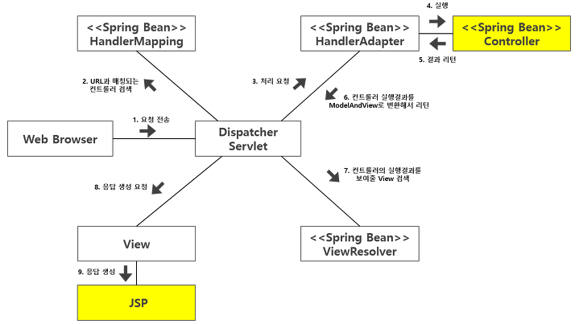

>글이 매우 복잡하고 깁니다. 양해 부탁드립니다.

>틀린 정보나 이해가 가지 않는 부분은 댓글 남겨주시면 참고하겠습니다.

### HandlerMapping의 역할
Spring MVC에 대해서 공부하던 중, `HandlerMapping`이 request를 처리하기에 적절한 handler를 찾아온다는 설명을 들었다.
좀 더 찾아보니 _`HandlerMapping`은 **request의 URL과 매칭되는 handler**를 선택하는 역할을 수행한다_ 는 것을 보았다. 

request의 URL만 보고 어떻게 찾아온다는 것일까? 그리고 _찾아진_ handler는 method인데 어떠한 방식으로 가져온다는 것일까?

한가지만 기억하고 가자. 
**HandlerMapping은 원하는 handler를 찾아오는 역할을 수행한다.**

### Spring MVC Request flow
`HandlerMapping`의 역할에 대해서 살펴보기 전에 Spring MVC에서 request가 어떠한 순서로 처리되는지 먼저 보아야 한다.


1. 먼저 `front-controller`의 역할을 하는 `DispatcherServlet`이 request를 받는다.
2. **`DispatcherServlet`은 적절한 controller를 선택하는 일을 `HandlerMapping`에게 요청한다.**
3. **`HandlerMapping`은 적합한 controller를 선택한다.**
3. `DispatcherServlet`은 선택된 controller의 비즈니스 로직 실행 작업을 `HandlerAdapter`에게 위임한다.
4. `HandlerAdpater`가 controller의 비즈니스 로직을 호출하고 결과를 `ModelAndView` 객체에 담아서 `DispatcherServlet`이 에게 return한다.
5. `DispatcherServlet`이 `ViewResolver`를 이용하여 결과를 보여줄 View를 가져온다.
6. View 객체에게 `DispatcherServlet`이 응답 결과 생성을 요청한다.

이 긴 과정 속에서 이 글에서 살펴볼 과정은 2,3번이다.  
Request flow 순서대로 `HandlerMapping`에 대해서 알아볼 것이다.

### DispatcherServlet
먼저 `DispatcherServlet`에서 부터 출발해야한다. 상속구조부터 보면,
```java
public class DispatcherServlet extends FrameworkServlet
			↓
public abstract class FrameworkServlet extends HttpServletBean implements ApplicationContextAware
			↓
public abstract class HttpServletBean extends HttpServlet
			↓
public abstract class HttpServlet extends GenericServlet
```
이렇게 상속구조를 통해 `DispatcherServlet`은 결국 `HttpServlet`을 상속함을 알 수 있다.  
그렇기 때문에 `DispatcherServlet`도 `Servlet`의 생명주기와 비슷하게 흘러감을 알 수 있다. (`init(),doGet(),doPost(),service() 등등`)

실제로 디버깅을 해보면, `doService`가 호출된다.  
그 후 `DispatcherServlet`은 `front-controller` 역할을 하기 때문에 `doDispatch`를 호출한다.
```java
protected void doService(HttpServletRequest request, HttpServletResponse response) throws Exception {
...
...
	try {
	doDispatch(request, response);
	}
...
...
}
```
`doDispatch`의 javadoc을 보면 Servlet의 `HandlerMapping`을 순서대로 처리하여 handler를 가져온다고 되어있다.

>Process the actual dispatching to the handler. The handler will be obtained by applying the servlet's HandlerMappings in order. The HandlerAdapter will be obtained by querying the servlet's installed HandlerAdapters to find the first that supports the handler class.

`doDispatch`의 실제 코드를 보면 아래처럼 request에 대해서 handler를 가져오는 `getHandler` 함수를 호출하고 있다.
```java
protected void doDispatch(HttpServletRequest request, HttpServletResponse response) throws Exception {
...
...
	try {
	...
        // Determine handler for the current request.
	mappedHandler = getHandler(processedRequest);
	...
...
...
```
`getHandler` 함수는 `DispatcherServlet`의 method로 아래와 같다.  
이게 실제로 적절한 handler를 가져오는 방식인데 전혀 감이 안온다. 하나하나 풀이해보자.
```java
@Nullable
protected HandlerExecutionChain getHandler(HttpServletRequest request) throws Exception {
  if (this.handlerMappings != null) {
    for (HandlerMapping mapping : this.handlerMappings) {
      HandlerExecutionChain handler = mapping.getHandler(request);
      if (handler != null) {
        return handler;
      }
    }
  }
  return null;
}
```

>`DispathcerServlet`은 처음 `init`되는 과정에서 여러가지 `handlerMapping`들을 등록하고 `List`를 통해 `handlerMappings`라는 이름으로 관리하고 있다. `handelrMappings`안에는 여러가지 `handlerMapping`들이 등록되어 있는 것이다. 

그러므로 아래 코드는 _`DispatcherServlet` 안에 `handlerMapping`들이 등록되었다면_ 이라는 뜻이다.
```java
if(this.handlerMappings!=null)
```

등록되어있는 `HandlerMapping`들을 loop 하면서
```java
for(HandlerMapping mapping : this.handlerMappings){

```

**`HandlerMapping`들에게 request에 맞는 handler를 가져오게하고, 가져왔다면 그 handler를 return**하는것이다.
```java
  HandlerExecutionChain handler=mapping.getHandler(request);
  if (handler!=null)
    return handler;
```

핵심 부분은 **`HandlerMapping`에게 request에 맞는 handler를 가져오는** 부분이다. 이게 궁금해서 이 먼 길을 돌아온 것이다.

`DispatcherServlet`부분의 내용을 정리하자면, 
1. `doService`이 호출된다.
2. `doService`내에서 `doDispatch`가 호출된다.
3. `doDispatch`내에서 `getHandler`가 호출된다.
4. `getHandler`내에서 등록된 `HandlerMapping` 중에서 request에 걸맞는 handler를 가져온다.

>이제 거의 다왔다.


### HandlerMapping이 handler를 가져오는 과정
`HandlerMapping`은 `interface`로 함수의 선언부만 가지고 있다.
```java
public interface HandlerMapping {
	HandlerExecutionChain getHandler(HttpServletRequest request) throws Exception;
}
```
실제로 handler를 가져오는 `getHandler`는 추상 클래스인 `AbstractHandlerMapping`에 정의되어 있다.  

우리가 흔히 아는 `RequestMappingHandlerMapping,SimpleUrlHandlerMapping` 같은 것들의 부모(_바로 윗단계는 아니지만_)가 `AbstratHandlerMapping`이다.

아래는 `AbstractHandlerMapping`의 `getHandler` 코드이다.  
`getHandlerInternal`을 통해서 handler을 찾아오고, `HandlerExecutionChain`을 return하는데,  
우리가 원하는건 handler를 찾아오는 방식이므로 `getHandlerInternal`을 봐야겠다.
> `HandlerExecutionChain`은 간단하게 handler와 handler interceptor들을 모아놓은 것이다.
>Handler execution chain, consisting of handler object and any handler interceptors. 

```java
public final HandlerExecutionChain getHandler(HttpServletRequest request) throws Exception {
  Object handler = getHandlerInternal(request);
  ...
  HandlerExecutionChain executionChain = getHandlerExecutionChain(handler, request);
  ...
  return executionChain;
}
```

`getHandlerInternal`은 `AbstractHandlerMapping`을 상속한 `AbstractHandlerMethodMapping`에 정의되어 있다. 
`AbstractHandlerMethodMapping`은 복잡하지만 이런 구조를 가지고 있다.


아래는 `getHandlerInternal`의 코드다. 이번에도 차근차근 살펴보자.
```java
public abstract class AbstractHandlerMethodMapping<T> extends AbstractHandlerMapping {
...
...
// Look up a handler method for the given request.
protected HandlerMethod getHandlerInternal(HttpServletRequest request) throws Exception {
  String lookupPath = getUrlPathHelper().getLookupPathForRequest(request);
  this.mappingRegistry.acquireReadLock();
  try {
    HandlerMethod handlerMethod = lookupHandlerMethod(lookupPath, request);
    return (handlerMethod != null ? handlerMethod.createWithResolvedBean() : null);
    }
  finally {
    this.mappingRegistry.releaseReadLock();
  }
}
...
...
}
```
먼저 javadoc을 보면 _주어진 request에 대한 handler method를 찾습니다._ 라고 되어있다.  
동작원리의 핵심적인 부분인것이다.
>Look up a handler method for the given request.

`lookupPath`는 현재 servlet mapping 안에서의 검색경로인데, request 요청을 분석해서 얻을 수 있다.  
그리고 **`mappingRegistry`에 대한 ReadLock을 가져오고 있다.**
```java
String lookupPath = getUrlPathHelper().getLookupPathForRequest(request);
this.mappingRegistry.acquireReadLock();
```

`lookupPath`를 바탕으로 `lookupHandlerMethod`를 통해서 **적절한 `handlerMethod`를 가져온 후 return 한다**.  

이 `handlerMethod`가 바로 우리가 직접 Controller 안에 정의한 함수인것이다.

```java
try {
  HandlerMethod handlerMethod = lookupHandlerMethod(lookupPath, request);
  return (handlerMethod != null ? handlerMethod.createWithResolvedBean() : null);
}
```


정리해보자면, `DispatcherServlet` 함수 안에서 `handlerMapping`이 여러 과정을 거쳐서 **적절한 `handlerMethod`** 를 가져온다는것은 알 수 있다.

.jpg)

그러나 궁금증이 더 남아있다.  

**url에 해당하는 적절한 method를 구별하는 방법과, method를 가져오는 것이 여전히 궁금하다.**  
각각 **MappingRegistry**와 **Reflection**이 답이다.

나머지 궁금증은 2편에서 마저 다루도록 한다.

### 출처
[Interceptor 사용법](https://bgpark.tistory.com/72) : Request flow에 대해서 잘 정리되어 있었다.
[AbstractHandlerMethodMapping javadoc](https://docs.spring.io/spring-framework/docs/4.3.2.RELEASE_to_4.3.3.RELEASE/Spring%20Framework%204.3.3.RELEASE/org/springframework/web/servlet/handler/AbstractHandlerMethodMapping.html)
[MappingReigstry javadoc](https://docs.spring.io/spring-framework/docs/4.3.2.RELEASE_to_4.3.3.RELEASE/Spring%20Framework%204.3.3.RELEASE/org/springframework/web/servlet/handler/AbstractHandlerMethodMapping.MappingRegistry.html)
[LinkedMultiValueMap javadoc](https://docs.spring.io/spring-framework/docs/current/javadoc-api/org/springframework/util/LinkedMultiValueMap.html)

```toc

```
