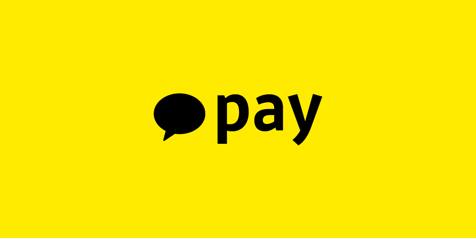

도전기? 후기? 어느단어를 써야할지 한참 고민하다가 도전기로 선택했습니다.
**도전기로 선택한 이유는 결과와 상관없이 공채의 모든 과정에서 배운점이 굉장히 많았거든요.**
> 그런면에선 개발자 취준생인 저의 성장기도 맞는 것 같습니다.

>글이 **굉장히,매우** 호흡이 깁니다. 적당히 스크롤 내려가면서 스킵하면서 읽어주세요.. 공채 얘기만 궁금하시면 뜬금없는 블라인드 공채 목차쯤부터 보시면 됩니다. 

## 조금 늦은 시작
저는 서울 소재 H대학교에서 컴퓨터계열을 전공하다 3학년을 수료하고 20년도 초에 사회복무요원으로 입대하게 되었습니다.
여러가지 사정들로 군 복무가 굉장히 늦어졌고, 3학년을 마칠때까지 아직 **진로에 대해서 확실히 정하지 못했습니다.** 분명 개발을 좋아하고 적당히 실력도 있었지만, 그만큼 컴퓨터공학에 대한 열정도 있어서 진학 후 연구도 하고 싶었습니다. 개발자와 진학 중 하나를 선택하기 위해서는 일단 군 문제 먼저 해결해야한다고 생각해 일단 복무를 시작했습니다.

그러던 중, 5월쯤 취업한 친한 과 동기를 만나서 여러가지 얘기를 하던 중, 본인의 입사동기 중 한명은 _**매일 백준에서 알고리즘 1문제를 꾸준히 풀었다**_ 라는 말을 듣게 되었습니다. 일반적인 사람이라면 흘려듣거나 or 조언을 받아들일텐데 저는 태생적으로 **반골**기질이 있어서인지 **그게 그렇게 어렵고 대단한 일인가?** 라는 생각이 먼저 들게 되었습니다. 그 노력을 폄하하려는게 절대 아니라 **정말 순수하게 궁금했습니다.**
>사실 이전까지 알고리즘 문제를 단 한번도 풀어보지 않았지만 갑자기 저런 당돌한 생각이 들더라구요.

## 습관 들이기와 실패
학부때 배운 알고리즘 지식을 제외하고 PS계통에 대한 지식은 전무했습니다. 자료구조와 알고리즘에 대한 조금의 배경지식은 있었지만, 그것을 제외하고는 완전한 뉴비수준이었습니다.
일반적으로 근무지에서 정해진 일을 하고 난 후에 어느정도의 개인시간이 보장되기에 노트북을 들고와 대략 6월부터 [백준](https://www.acmicpc.net/)사이트에서 아주 난이도가 낮은 문제부터 한 문제씩 풀기 시작했습니다. 

구현, 자료구조, 탐색, DP 와 같은 알고리즘 분류도 조금씩 신경쓰면서 풀었습니다. 매일 문제가 잘 풀리거나 쉬운 문제 같은 경우는 2~3문제, 어려운 문제라면 1시간씩 고민해가면서 풀고 정 풀리지 않으면 해답을 참고하되 저만의 논리구조를 머릿속에 구상해서 다시 풀어보았습니다. 평균적으로 1일 1문제 정도는 꼬박꼬박 풀었습니다.
>https://github.com/BecomeWeasel/daily_algo_challenge 에 업로드하면서 성취감을 느꼈습니다. 여러분도 참고해보세용!

3개월간은 정말 재밌게, 그리고 제가 느끼기에도 성장한다는 것을 느낄정도로 열심히 했습니다. 하지만 문제가 생겼습니다. 10월쯤 되어서 조금씩 귀찮아지기 시작했고, 다시 로스트아크라는 게임에 열중하게 되면서 알고리즘을 완전 뒤편으로 미루게 되었고 시간을 좀 허비하게 되었습니다.
>로스트아크는 정말 재밌게 했습니다. 진짜 재밌었어요..

## 다시 시작하기
21년도 4~5월쯤 되어서야 흘러가는 시간이 너무 아깝다고 느껴서 다른 개발 공부와 알고리즘 풀이를 다시 시작했습니다. 이전의 감각을 찾기 위해서 무리하지 않고 평일에만 1문제씩 풀고, **주말은 무리하지 않고 알고리즘 공부가 아닌 다른 개발 공부를 했습니다.** 또 백준뿐만 아니라 리트코드와 프로그래머스 문제들도 풀었습니다.
개인적으로 문제들의 다양성은 백준이 좋지만, **질은 리트코드가 압도적**이라고 생각합니다. 
또 동아리 **후배 둘과 스터디를 구성해 알고리즘 스터디**를 시작했습니다. 
**개인적으로 이게 정말 정말 많은 도움이 되었습니다.** 여러분들도 단기적인 스터디 말고 긴 호흡의 스터디를 구성하는걸 추천드립니다.
>같이 스터디를 하면서 함께 성장한 IS 오렌지와 CS 강민이 정말 고마웡,,🙇‍♂️

## 뜬금없는 블라인드 공채

알고리즘 문제를 조금씩 풀면서 스터디를 해가던 중 카카오에서 **2022 신입 개발자 블라인드 채용** 공고를 올린 것을 보게 되었습니다. 일반적으로 코딩테스트의 난이도를 생각했을때 문제의 질이나 난이도적인 측면에서 높은 기업이기에 이전에도 종종 카카오 코테를 참고하곤 했습니다.

입시를 준비할때도 실전모의고사가 가장 효과가 좋듯 정말 가볍게 코딩테스트만 보기로 마음먹고 지원을 해보았습니다. 모두들 아시다시피 카카오는 지원을 할때 필수적인 정보만 적고 **자기소개서나 학력같은걸 일체 명시하지 않습니다.**

지원자격도 **학력 및 전공에 제한이 없고 남성의 경우 군필의 제한만** 있었습니다.
저는 지원할때는 아직 소집해제 전이였지만, **입사전에는 소집해제를 하기 때문에 지원을 해보았습니다.**

또 저는 3학년까지 밖에 마치지 않았고 졸업하기까지는 1년이 남았지만 , **일반적인 기업에서 요구하는 것처럼 졸업이나 졸업예정자 조건을 카카오는 요구하지 않았습니다.**

저는 아래처럼 4개의 전형절차중에서 1단계인 1차 온라인 코딩테스트만 **찍먹**만 해보려고 지원을 했습니다.

지원과정에서 입사를 희망하는 계열사를 1지망 2지망으로 선택하는데 저는 **카카오페이**와 **카카오 본사**를 각각 선택했습니다.

## 1차 코딩테스트
1차 코딩테스트는 9월 11일로 지원하고 일주일 정도의 시간이 있었습니다. 엄청 대단한것을 준비하지는 않았고, 기출문제들을 풀어보면서 카카오 코테들의 **경향성을 파악**하는데 시간을 들였습니다. 이 경향성 분석이 조금 도움이 되었던 것 같습니다. 기본적인 자료구조와 알고리즘을 다시 복습하고, 제가 스스로 정리한 문제 분류별 해결방법을 다시 읽어보면서 기다렸습니다.

9월 11일이 되어서 5시간동안의 1차 코딩 테스트를 응시했습니다. 1차 코딩테스트의 후기는 다른 글에도 많이 정리되어있으니 크게 다루지는 않겠습니다.
총 7개의 문제가 있었고, 확실히 이전보다는 난이도가 많이 낮았습니다. 난이도는 체감상 실버 2문제, 골드 3문제, 플래티넘 이상 2문제 정도였습니다.

그렇지만 첫 코딩테스트이기도 하고 시간이 정해져있다는 압박감에 5번문제(양과 늑대) 같은 쉬운 탐색 문제나 6번문제 (구간합)문제를 보고 머리가 하얗게 변했습니다. 풀이도 잘 떠오르지 않았습니다.

결과적으로 **4.5개**의 문제만 해결할 수 있어서 탈락을 직감했습니다.

그렇게 지내던 중, **[카카오] 2022 신입 개발자 블라인드 채용 1차코딩테스트 결과 안내드립니다.** 라는 제목의 메일을 받게 되었고, 뒹굴거리면서 확인을 했는데 결과는 충격적이게도 **합격**이었습니다.


기쁘다는 감정보다 **이때까지 공부하던것이 그렇게 헛되지 않았구나**라는 감정을 먼저 느끼게 되었습니다.
## 2차 코딩테스트
그리고 정말 급급하게 2차 코딩테스트를 준비해야 했습니다. 2차 코딩테스트를 준비하면서 알게된 점이 2차 코딩테스트는 엄청난 알고리즘 실력보다 디자인(_그 디자인이 아닌 설계_)과 최적화에 집중해야 한다는 것을 알게 되었습니다.

기출 문제와 채점하는 환경이 대부분 공개되어 있기때문에 2021,2020 블라인드 공채 2차 코테문제를 스터디원 중 한명과 같이 풀어보았습니다. 그런데 아무리 해봐도 풀리지가 않았습니다. 전날까지 보고갔는데도 도저히 모르겠더라구요.. 
**자포자기의 심정이었습니다.**

그렇게 9.25일이 되어서 2차 코딩테스트를 치루게 되었습니다. 2차 코딩테스트는 10문항 정도의 CS 객관식+주관식 문제와 하나의 문제인 시스템 설계와 최적화 파트로 구성되어 있습니다. 중간 중간 휴식시간을 포함해서 총 7시간 정도 응시하고, 캠과 화면 모니터링을 켜고 봐야합니다.

### CS 문제
대부분의 문제는 **CS 코어 과목에서 출제되었고 기본에 충실한 문제들이었습니다.** 학부 수업을 충실하게 들은 전공자라면 큰 부담이 되지 않는 문제 8문제 정도와 살짝 헷갈릴 수 있는 2문제 정도로 구성되어 있습니다. 저는 10문제 중에서 7개 정도 맞았던 걸로 기억합니다.
>CS 테스트는 점수보다 적부라는 썰이 있습니다.

### 설계와 최적화 문제
어차피 해설이 올라올 것이고 아직은 민감할 수 있기 때문에 자세히는 언급하지 않고 간단하게 말씀드리겠습니다.

2차 코딩테스트는 ICPC같은 대회처럼 응시자들의 점수와 나의 등수를 실시간으로 확인할 수 있기에 부담이 되었습니다. 저는 부담을 최대한 덜 받기 위해서 잘 확인하지 않았습니다.
문제가 시나리오1,2로 구성되기에 합산점수로 최종점수가 매겨집니다.

복수의 사용자들의 실력에 맞게끔 정렬하는 것이 최종 목적인데, 사용자들의 실제 실력을 알 수 없기 때문에 온라인 게임에서 많이 볼 수 있는 **랭크 기반 매칭시스템**을 구현하는 것이 방법입니다.

제한적인 검색이 가능하기 때문에 사례를 많이 찾아보았고 Elo 시스템을 채택하였습니다. 그 후 적당히 최적화 방법을 계속 구현해 최종점수를 조금씩 끌어올렸습니다. 응시 종료 30분전 점수판이 프리징되는데 그 때 기준으로 **300등대 초반으로 마무리했습니다.**

2차 코테를 끝내고 카카오가 3자리수대의 채용을 한다고 했으니 약간 희망을 품었지만,신경쓰지 않고 얼마 안남은 소집해제만 대비하며 내년 복학준비만 생각하고 있었습니다.

그러던 와중 **소집해제일인 10.14일**이 되었고 뭔가 기분이 묘한 감정을 느끼던 와중에 
**[카카오] 2022 신입 개발자 블라인드 채용 2차코딩테스트 안내드립니다.** 라는 제목의 메일을 받게 되엇습니다.

1지망으로 작성한 카카오페이에 **합격**이었습니다. 뭔가 **일이 이상하게 굴러가고 있다**는 것을 느끼게 되었고 기분이 이상했습니다.
## HR 인터뷰
### 자기소개서와 HR 인터뷰 준비하기
특이하게도 카카오페이는 1차가 기술인터뷰가 아닌 HR인터뷰였습니다.
일반적으로 최종면접이 인성면접인데 **순서가 반대였습니다.**
>후에 알게되었지만, 다 이유가 있었습니다.

HR인터뷰 단어가 생소했지만, 컬쳐핏 면접이나 인성면접으로 생각했습니다. 소집해제 날부터 급하게 자기소개서를 준비했습니다.

공대생치고는 드림클래스나 서포터즈,교내 홍보대사같은 대외활동을 많이 해본편이어서 여러 대외활동을 위한 자기소개서는 꽤 써보았지만, 취업준비를 당연히 해본적이 없기에 **자기소개서부터 걱정이였습니다.** 하지만 다행히도 문항들은 평이한 수준이었고, 프로젝트 경험과 같은 일반적인 질문들로 구성되었습니다.

입대하기전 **SKT에서 수상했던 AI 공모전 우승**경험을 중점적으로 작성했고 그 과정에서 접근방식과 해결방식 위주로 작성했습니다. (후술하겠지만 이 부분에서 굉장히 좋은 평가를 받았습니다.) 또 아주 조그만 프로젝트도 작성했습니다.

자기소개서와 포트폴리오를 작성하면서 느낀 점이 프로젝트 경험이 많이 부족하다는 점을 절실히 깨닫게 되었습니다.
>**알고리즘+CS+프로젝트** 이 삼박자가 완벽해야 취준에 성공할 수 있어보입니다.

자기소개서를 제출하고는 급하게 HR인터뷰를 준비했습니다. 경험이 전무하다보니 어디서부터 접근해야할지 몰라 많이 헤맸지만, **교내 홍보대사 활동을 통해서 다양한 전공의 사람들과 많이 만날수 있게 되었고, 대부분이 취업준비를 하거나 이미 취업을 한 상태여서 주변에서 정말 정말 많은 도움을 받게 되었습니다.**
>학교생활을 하면서 다양한 전공의 사람들과 **교류하며 인맥을 넓히는 것은 확실하게 도움이 됩니다.**

또 카카오페이라는 테크핀 기업에 대한 분석과 **결제&송금 도메인에 대한 지식**을 공부하게 되었습니다. 여러 유튜브를 참고하면서 인성면접 빈출문제에 대한 답변과 개발회사에 국한되는 가치관 질문을 거의 다 준비했습니다.
### 인터뷰를 마치고
HR인터뷰는 10월 말경에 **화상으로 진행되었습니다.**
덜덜 떨면서 참여했는데, 면접관분이 긴장을 풀어주시려고 많이 노력해주셨고 **면접관의 태도나 질문에서 따뜻함**을 느낄 수 있어서 결과에 상관없이 카카오페이에 대한 이미지가 매우 좋게 각인되었습니다.
인터뷰는 다행히도 일반적인 수준과 익숙한 질문들로 구성되었지만 면접관분이 **가끔 정말 날카로운 질문으로 답변 내용을 확인하고는 하셨습니다.** 

1,2차 코딩테스트를 마치고는 둘다 탈락했다고 생각했지만, HR인터뷰를 마치고는 합격에 대한 아주 조금의 확신을 가지게 되었습니다. 
자세히는 말씀드리기 어렵지만, 복수의 파트에서 좋은 평가를 받게 되어 조금의 희망이 생겼습니다.

1,2차 코딩테스트를 응시할때는 정말 _**모의고사** 느낌으로 보자, 경험만 쌓자_ 였지만, 
HR인터뷰를 마치고부터는 정말 **진심모드로 최선을 다해서 준비해야겠다**는 생각을 하게 되었습니다.

면접을 마치고 일주일쯤 뒤에 메일 제목부터 강한 **스포일러**를 당했습니다.
**[카카오페이] HR 인터뷰 전형 합격을 축하드립니다!** 라는 메일을 받게 되었습니다. 
이제 그렇게 열망하던 **카카오 입사까지 1단계만 남았다는 것이 실감나게 되었습니다.**

## 기술 인터뷰
### 기술인터뷰 준비하기
기술 인터뷰, 2차 인터뷰, 최종 면접 다 맞는 말이지만 **기술 인터뷰**라고 하겠습니다.

얼렁뚱땅 시작한 공채 지원도 이제 마지막 단계, 그리고 가장 어려운 단계만 남기고 있었습니다.
당연하게도 기술면접 경험이 없었기에 주변의 개발자들에게 조언을 많이 구했고 캐치카페와 같은 사이트도 참조하면서 기술면접을 준비했습니다.

일반적으로 기술면접은 **포트폴리오에 명시한 프로젝트+CS 기본기**로 진행됩니다. 저는 포트폴리오가 처참할정도로 빈약하기에 CS 기본기에 올인했습니다.

CS 기본기는 github 저장소에 정말 많은 자료들이 있습니다. 예를 들자면
1. [한재엽님의 CS 질문 저장소](https://github.com/JaeYeopHan/Interview_Question_for_Beginner) : 대체적으로 많이 참고되는 저장소입니다.
2. [Woovicotry님의 CS 질문 저장소](https://github.com/WooVictory/Ready-For-Tech-Interview) : 1번과 비교해서 상대적으로 덜 알려져 있지만 퀄리티는 뒤지지 않습니다.
이런 저장소들을 참고해서 공부했습니다.

단, **반드시 명심해야할 것이 인터넷의 자료는 완벽하지 않고 실제로 명백하게 틀린 부분도 꽤 많아서** 저는 저장소에서는 질문을 참고했고 실제 답변은 **영문 공식문서나 원서를 주로 참고**했습니다.

또 기술 면접은 **DFS**로 준비해야 한다는 말을 많이 들었습니다. 그래서 단순히 안다 or 모른다가 아니라 아래와 같은 기준으로 깊게 준비했습니다.
* **왜 이 기술이 사용되었는지**
* **내부 구조는 어떻게 되어있는지** 
* **왜 A가 아닌 B를 선택해야 하는지** 
* **실제 활용은 어떻게 되는지**

제가 가장 좋아하는 자료구조인 **HashTable**을 예로 들어서 설명드리겠습니다.
* **왜 이 기술이 사용되었는지**일반적으로 $$O(1)$$ 시간복잡도로 조회,삽입,수정이 가능하다.
* **내부 구조는 어떻게 되어있는지** : hashtable은 충돌을 잘 관리해야하는데, 일반적으로 개방주소법/분리연결법이 사용된다.
* **왜 A가 아닌 B를 선택해야 하는지** : 개방주소법은 구현이 간단하고, 캐시에서의 이점이 있지만 로드팩터에 민감하고 삭제가 어렵지만 분리연결법은 로드팩터에 영향을 조금 덜 받고 hashtable의 확장이 더디게 일어나지만 추가적인 오버헤드가 있다.
* **실제 활용은 어떻게 되는지** : Python 3에서는 개방주소법,Java에서는 분리연결법을 사용한다.
### 부족함
사실 위는 꽤 자세하게 준비한 것 같지만 **저는 절대적으로 부족하다고 생각합니다.**
예를 들어 개방주소법은 왜 캐시효율이 좋을까요? 또 개방주소법에서도 여러가지 기법이 있고, 그에 따른 추가적인 트레이드오프가 있습니다. 분리연결법에서도 버킷에 연결리스트를 구성하는 방법과 트리로 구성하는 방법등이 있습니다. 

그러면 왜 트리를 사용할까요? 또 **Java는 왜 분리연결법**을 사용할까요? Java 8 부터 사용하는 분리연결법은 트리와 연결리스트를 동시에 사용하는데, 이때 **균형이진트리인 RB 트리를 사용**합니다.
AVL이나 Splay도 있는데 왜 RB 트리일까요? 
이렇게 준비할때도 끊임없이 하나씩 의문을 제기하면서 deep 하게 준비했습니다.

>이처럼 노션을 활용해서 대략 50개 정도의 질문들 하나하나를 깊게 준비했습니다.

포트폴리오는 제가 했던 프로젝트의 설계와 DB 모델링을 다시 점검하고, 특정 기술을 사용한 이유에 대해서 고민하며 준비했지만 매우 빈약했습니다 ㅠㅠ
### 기술 인터뷰
기술 인터뷰 역시 화상으로 진행되었으며 1:N 방식으로 1시간 가량 진행되었습니다.
단순히 _이거 알아요?_ 보다는 _이 기술을 사용한 이유가 뭐에요?_ 부터 시작하는 꼬리물기 형태의 질문으로 인터뷰 전체가 흘러갔습니다. 또 포트폴리오 질문은 단순히 **포트폴리오 질문이 아니라 CS로 자연스럽게 이어지는 질문이었습니다.**

다만 CS 질문이 다른 계열사처럼 폭포수처럼 쏟아지지는 않았고 **핵심적인 부분만 질문하셨습니다**. 또 흥미로운게 제가 제출한 블로그의 글들을 보시고 그와 관련된 질문들을 하셨는데, 이것도 굉장히 깊숙히 질문하셨습니다.
인터넷에 정말 많은 기술글들처럼 _단순히 글을 실어 나른것인지_ 가 아니라 **_내부구조부터 깊게 고민해보았는지_** 에 대한 질문들이셨습니다.

면접이 끝나고 사실 반반의 심정이였습니다. 아쉽게도 제가 준비한 모든것을 보여드리진 못했지만, 급급하게 준비한거치고는 방어를 적당히 한것 같다라는 느낌이였습니다.

꽤 긴 기다림의 시간끝에 **[카카오페이] 안녕하세요. 카카오페이입니다.** 라는 제목의 메일을 받게 되었습니다.

아쉽게도 결과는 **불합격**이었습니다. 어찌보면 **당연한 결과라고 생각했습니다.** 준비를 하면서 알게된 점이 입사하시는 분들의 공통점은 **꾸준함과 탁월함**임을 알게되었는데, 저는 두 부분 모두 빈약했던것 같습니다.

## 과정을 끝내고
**얼렁뚱땅 시작된 공채지원이였지만, 최종면접까지 가게 되었습니다.** 저는 최종탈락이라는 결과에 주목하기보다는 그 과정까지 가면서 준비하면서 제가 **부족한 점이 무엇인지** 확실히 깨닫게 되었습니다.
또 여러 과정, 특히 인터뷰를 하면서 카카오라는 기업이 정말 젠틀하고, 지원자 중심에서 생각해주는 기업이라는 점을 알게 되어 카카오에 입사하고 싶은 열망이 더 커지게 되었습니다.
>내년에도 다시 1,2차 코테부터 할 생각하니까 아찔하긴 합니다.

3학년을 갓 마치고, 조금의 특수성은 있지만 군 복무를 마친 직후에 해본 첫 시도가 **가장 챌린징스럽고 배운점이 많아 굉장히 뿌듯했습니다.** 아마 이제는 복학을 준비하면서, 제가 **부족했던 부분을 돌아보면서 그 부분을 개선하는 방식**으로 진행할것 같습니다.

굉장히 긴 글이여서 쓰는 저 만큼이나 읽으시는 분들이 부담스러울텐데 투머치토커의 기질을 숨기기 쉽지않네요. 이 글을 읽으시는 모든 분들이 모두 원하는 회사에 합류하기를 기원합니다🙏

>진짜 소집해제 한날부터 면접날까지 제대로 쉰 날이 없엇기에 이젠 좀 편하게 쉬면서 공부하려구요..

```toc

```
