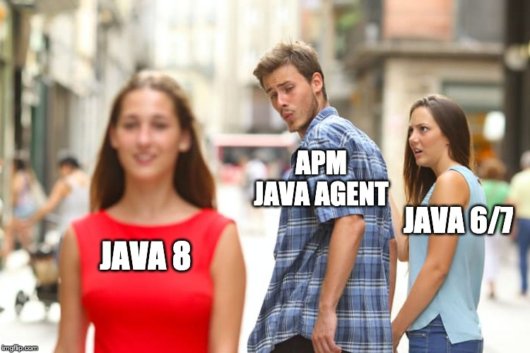
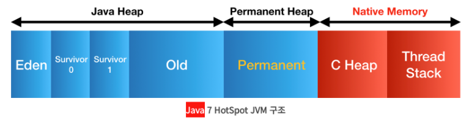
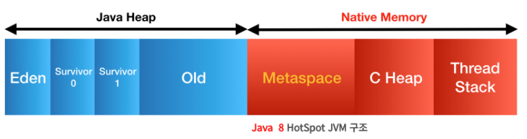
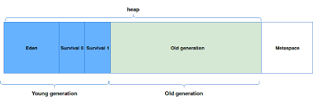
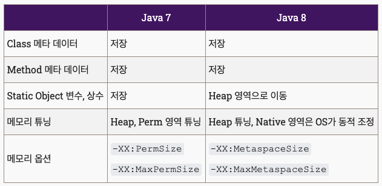

## Java 7의 JVM

기존의 Java 7 까지의 Non Heap Area였던 Permanent Generation이 Native 영역인 Metaspace로 바뀌었다.

기존의 Permanent 영역에는 아래와 같은 정보들이 저장되었다.

- **Class의 메타데이터 (바이트코드 포함)**
- Method의 메타데이터
- **static 객체, static 상수**
- **상수화된 String Object**
- Class와 관련된 배열 객체 메타데이터
- JVM 내부적인 객체들과 JIT의 최적화 정보

### OOM 문제점
이런 많은것들이 PermG안에 있다보니 , String Constant Pool, static object, Class 메타 데이터들이 쌓여 OOM이 발생하곤 했다. PermG는 시작할때부터 크게 잡지 않는 이상 리사이징이 되지 않아 그런 문제가 발생하곤 했다. [좋은 글](https://goodgid.github.io/Java-8-JVM-Metaspace/)

## Java 8의 JVM

Java 8에서부턴 PermG 영역을 삭제하고 **Metaspace** 영역을 추가해 **Native 메모리의 영역**으로 이동시켰다.



### 구체적인 변경점
기존의 PermG 영역에 있던 정보들은 이렇게 변경되었다.

- Class의 메타데이터 (바이트코드 포함) → MetaSpace로 이동
- Method의 메타데이터 → MetaSpace로 이동
- static 객체,static 변수 (class variable) → **Heap으로 이동,**
- 상수화된 String Object → **Heap으로 이동**
- Class와 관련된 배열 객체 메타데이터 → Metaspace로 이동
- JVM 내부적인 객체들과 JIT의 최적화 정보 → Metaspace로 이동



위와 같이 변경하면서 , 기존 PermG에 있던 Static Object가 Heap 영역으로 옮겨져서 GC의 대상이 될 수 있게 하였다.

- 장점
    - Native(Metaspace)로 많은 부분을 옮기면서, Native 영역은 JVM에 의해서 크기가 강제되지 않고, 프로세스가 이용할 수 있는 메모리 자원을 최대로 활용할 수 있게 되었다.

>💡 Metaspace 영역은 Heap이 아닌 Native 메모리 영역안에 있다. Heap 영역은 JVM이 관리하고 Native 영역은 OS레벨에서 관리해 자동으로 크기를 조절하고, Metaspace가 Native 메모리를 사용함으로써 개발자는 메모리에서의 영역확보의 상한을 크게 인식할 필요가 없게 되었다. 이것이 Java 8에서 Metaspace가 도입된 이유이다.


```toc

```