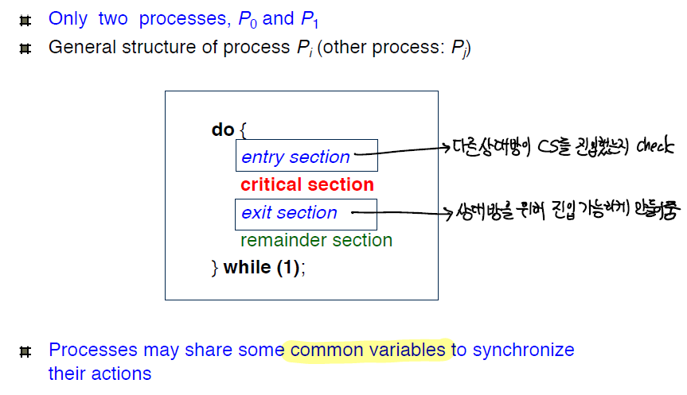
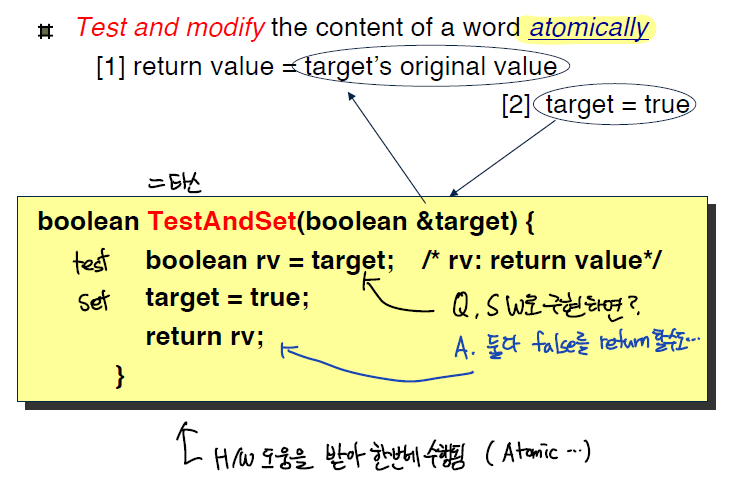
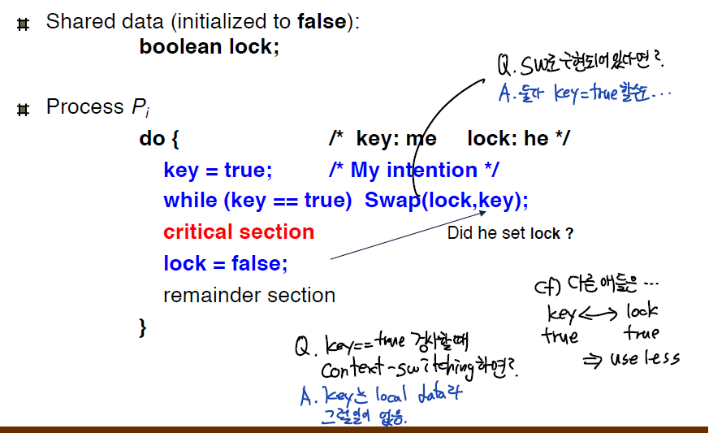
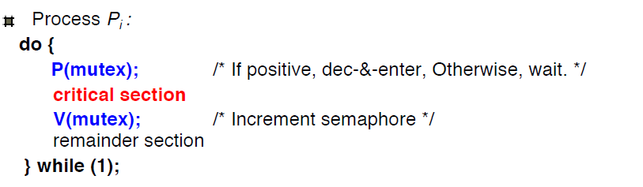
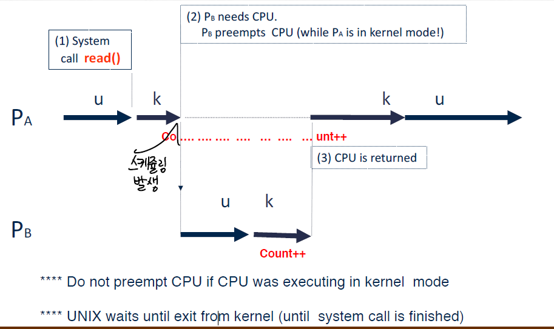

>난 운영체제가 제일 재밌고 좋다. 최고👍

세마포어와 뮤텍스를 본격적으로 얘기하기에 앞서서 두 방법이 나오게 된 문제상황인 **Race Condition**과 **Critical-Section**을 먼저 소개한다.

## Race condition

**두 개 이상의 프로세스가 공유 데이터에 대해서 동시에 접근하고 조작하려하는 상황**을 의미한다. 즉 Race라는 뜻 그대로 하나의 자원을 놓고 서로 경쟁하려는 상태이다.

이 공유된 데이터의 마지막 값은 어느 프로세스가 마지막으로 끝내는지에 따라 달려있다. 만약 interleaved execution(서로 번갈가면서 명령어 수행시) 데이터의 무결성이 침해받는다. → **불확실성**

이것을 예방하기 위해서, 동시에 진행되는 프로세스는 반드시 동기화가 되어야 한다.

## Critical-Section

이러한 문제를 **임계구역**(Critical-Section) 문제라고 한다. 임계구역이란 동일한 자원에 대해서 접근하는 영역을 의미한다.
해결하기 위해서는, 한 프로세스가 **임계구역에 진입해 작업을 진행할때**, **다른 프로세스들은 임계구역에 진입하는 것을 허락하지 않는것이다.**

동기화를 해결하는 방법은 세가지 필수적인 조건을 맞춰야 한다.

1. **상호배제(Mutual Exclusion)**
    - 어떠한 프로세스 혹은 스레드가 **임계구역에서 작업을 진행하면**, 다른 프로세스 혹은 스레드는 **임계구역에 진입할 수 없다.**
2. **진행(Progess)**
    - 무기한으로 연기되는것을 막기 위해서 필요하다.
    - 만약, 다른 프로세스가 임계구역에서 작업을 하고 있지 않다면, **다른 진입을 원하는 프로세스의 진입은 지체되어서는 안된다.**
3. **한계가 있는 대기 (Bounded Waiting)**
    - 과도한 방지를 막기 위해서 필요하다.
    - 프로세스가 임계구역에 들어가기 위해서 요청하고 **대기하는 시간은 한정**되어 있어야 한다. **즉, 무기한적으로 대기되는것을 막기 위해서 필요하다.**

## 문제에 대한 개괄적인 해결방식



두 개의 프로세스만 있다고 가정했을때, 임계구역에 진입가능했는지 체크하고, 임계구역을 빠져나올때는 진입가능성을 열어준다.
이 때 프로세스들은 동기화를 위한 데이터를 공유해야 한다.

## 뮤텍스
CS를 가진 스레드 혹은 프로세스들의 실행시간(Running Time)이 서로 겹치지 않고 각각 단독으로 실행될 수 있게끔 하는 기술이다.  
일반적으로 한 프로세스에 의해 소유될 수 있는 **Key 객체**를 기반으로 작동되며, **이 객체를 소유한 스레드 혹은 프로세스만이 공유자원에 접근할 수 있다.**

뮤텍스를 구현하는 방식에는 세가지 정도가 있는데, 모두 각각의 장단점이 존재한다.

### Swap turn
- 첫번째 해결방식, **Swap turn**
    
    ```c
    // P0
    **do {
    while (turn != 0) ; /* My turn? */
    critical section
    turn = 1; /* Now it’s your turn */
    remainder section
    } while (1);**
    
    // P1
    **do {
    while (turn != 1) ; /* My turn? */
    critical section
    turn = 0; /* Now it’s your turn */
    remainder section
    } while (1);**
    ```
    
    - 공유 변수 `turn` 을 두고, 서로 입장 가능한지 while로 체크한다.
    - **상호배제는 만족하지만, 진행도는 만족하지 못한다.**
    - 두 프로세스는 무조건 **in-turn 방식**(왔다갔다)으로만 진입할 수 있다.
        - 만약 P0→P1 순서대로 들어갔다고 해보자. 이때 P1이 추가적인 진입을 원하더라도 P0의 차례이기 때문에 P1은 진입 할 수 없고, 진행도를 만족하지 못한다.
    - 즉, P1이 CS에 더 자주 접근해야하는 시스템이라고 해보자. 그럴때는 P0에 의존적이다. 두번 연속으로 CS 진입이 불가능하기 때문이다.
### Dekker's Algorithm
- 두번째 해결방식,**데커 알고리즘**
    
    ```c
    boolean flag[2]
    초기에는 flag[i]=flag[j]=flase // 아무도 CS안에 있지 않다.
    // Pi
    do {
    flag[i] = true; /* Pretend I am in */
    while (flag[j]) ; /* Is he also in? then wait*/
    critical section
    flag [i] = false; /* I am out now*/
    remainder section
    } while (1);
    ```
    
    - 만약 `flag[i]==true` 이면, Pi는 CS에 진입할 수 있다.
    - 첫번째 Swap turn 방식의 문제점인, 연속적인 진입이 불가능한 점을 해결한다.
    - **상호배제는 만족하지만, 진행도는 만족하지 못한다.**
    - 만약 `flag[i]=true` 일때 컨텍스트 스위칭이 일어나면, Pj가 생각하기에 Pi가 들어가있다고 생각할것이다. 실제로는 그렇지 않은데.
        - 그러면 둘다 CS에 진입하지 못하고 기다려야 한다. 다음 컨텍스트 스위칭이 일어날때(선점식일때)까지 기다려야 한다.
        - `flag[i]=true` 로 바꾸는 저 부분이 유저 코드이기 때문에 중간에 인터럽트의 방해를 받을 수 있는 **non-atomic**이기 때문이다.
### Peterson's algorithm
- 세번째 해결방식 (피터슨 알고리즘)
    
    ```c
    do {
    flag [i]= true; /* My intention is to enter …. */
    turn = j; /* Set to his turn */
    while (flag [j] and turn == j) ; /* wait only if …*/
    critical section
    flag [i] = false;
    remainder section
    } while (1);
    ```
    
    - 1번과 2번의 공유 변수를 조합한 방식이다.
    - `flag[j]` 변수를 활용해서, swap-turn은 해결했다. 또 `turn` 문제를 이용해서 **무조건 둘 중 하나는 CS에 들어갈 수 있음을 보장한다.**
    - 상호배제,진행도,한정된 대기시간이라는 두 프로세스간의 해결책에서의 조건을 모두 만족한다.
    - 여러 프로세스로 확장가능하다. 하지만, while loop에서 CPU는 계속 체크해줘야 하는 **busy waiting 문제가 여전히 남아있다. CPU cycle을 낭비하고 있는것이다.**

### HW 지원
이렇게 해결책에도 여전히 문제점이 남아있기 때문에, 많은 시스템들은 하드웨어의 지원을 받는다.

- I/O가 없을때 CS 진입 후 선점적인 스케쥴링을 방지.
- 유니프로세서 시스템에선 인터럽트를 꺼버린다. 왜냐면 timeout이 있기 때문에. 하지만 대부분의 멀티프로세서 관점에서는 불리하다.
- 현대의 대부분의 시스템들은 **원자적인(atomic) 하드웨어 명령어**를 지원받는다.
    - TAS(test and set)
        
        
        
    - CAS(compare and swap)
        - 원자적으로 두 변수를 바꾼다.
            
            
            
        - key=true일때 lock이 false면, 진입해버린다. key=true인데 lock이 true면 계속 기다린다.
        - 이때 key는 lock과 달리 지역변수라 컨텍스트스위칭에 안전하다.

## 세마포어

뮤텍스와 비슷하게 동기화 기법이지만, 뮤텍스는 동시접근을 막으려는 측면이 강하고,  
세마포어는 **접근 순서 동기화**에 조금 더 관련이 있다.

근본적으로 `wait()` 와 `signal()` 을 이용해서 제어를 하는 방식으로 세마포어를 여러개를 둠으로써 CS에 접근 가능한 task의 개수를 조절한다.  
개수가 1개이면 binary semaphore로 mutex 처럼 작동을 한다.

```c
P(s) // atmoic 해야함
func {
	while S<=0 do nothing;
	S--;
}
V(s) // atomic 해야함
func {
	S++;
}
```



이렇게 구현하면 세마포어를 이용한 뮤텍스가 된다.물론 busy waiting 문제가 여전히 발생을 한다.  
즉, **특정 프로세스가 CS를 많이 차지하면 다른 프로세스는 P에서 계속 기다려야 한다.**

이런 방식은 여전히 싱글프로세서 시스템에서 자원의 낭비라는 관점에서 치명적이다.

### Block/Wakeup 방식

Block/Wakeup 방식은 busy waiting의 방식처럼 계속 기다리는 것이 아니라,  
기다려야 할때만 대기줄에 줄만 세워놓고 block을 당하게 한다. 그 후 자리가 생기면, 즉 순서가 돌아오면 block 당한것들부터 차례로 깨운다.

```c
typedef struct {
int value; /* semaphore */
struct process *L; /*process wait queue*/
} semaphore;

void P(S){
	S.value--;
	if (S.value<0){
		add this into S.L
		block()
	}
}

void V(S){
	S.value++;
	if S.value<=0 {
		remove P from S.L
		wakeup(P)
	}
}
```

이런식으로 세마포어에 링크드 리스트를 구현해서 세마포어를 완성한다.  
process wait queue는 링크드 리스트로 프로세스의 PCB에 대한 정보를 가지고 있다.

- `block()` : 커널이 현재 프로세스를 중지시키고, 그 프로세스의 PCB를 세마포어 안에 있는 대기 큐에 넣는다.
- `wakeup(p)` : block되었던 프로세스 P의 작업을 다시 하게 한다.

이 때 **`S.value` 의 절댓값은 현재 block 되어 있는 프로세스의 개수와 동일하다.**

이전의 busy waiting과 block wakeup 방식을 비교해보자.

- CS 파트가 작으면
    - 기다리는데 드는 시간보다, **block-wakeup하는데 드는 오버헤드가 더 클 수 있음.**
- CS 파트가 길면
    - busy waiting이 길어지기 때문에 **block-wakeup이 더 좋을수 있다.**

### 임계영역이 유저 공유 데이터에서만 생길까?

1. **인터럽트 핸들러와 커널**
    
    `count` 라는 커널 변수가 있다고 해보자. count 의 값을 올리는 과정은 load하고,increase하고,store를 하는 것인데,
    
    중간에 인터럽트가 와서 인터럽트 핸들러 내에서 count 값을 올리면, 그 뒤의 count 결과는 보장할 수 없다.
    
2. **커널이 시스템 콜을 수행중일때, 컨텍스트 스위칭이 일어나면**
    
    두 프로세스간은 공유되는 데이터가 없다하더라도, 시스템 콜을 수행할때 커널 데이터는 공유될 수 있다.
    
    아래와 같은 상황일때 count의 값을 보장 할 수 있는가?
    
    
    
    **이 문제에서 중요한 점은 프로세스간의 데이터 공유가 아니더라도 임계영역문제가 커널 단에서 분명히 발생할 수 있다는 점이다.**
    
    유닉스에서는 이를 방지하기 위해서 **커널이 작업을 수행하고 있다면(시스템 콜 처리) 선점식 스케쥴링이 일어나지 않는다.**
    
3. **멀티프로세서 시스템**
    - 만약 두개의 CPU에서 한쪽은 count를 내리고, 한쪽은 카운트를 내린다고 해보자. 어느 값을 저장해야 하는가?
        - 각각의 CPU 이기 때문에 인터럽트로 통제할 수 없다.
    - 이럴때는 커널 자체가 하나의 큰 CS가 된다
        - 커널 자체 접근을 한 CPU만 할 수 있게 하거나
        - 커널내의 공유 변수들을 따로 세마포어로 둔다. 그러면, 큰 CS가 여러개의 나뉘어진 CS가 된다.

### 이진 세마포어 vs 카운팅 세마포어 비교

- 이진 세마포어
    - 정수값이 0과 1를 오가는 세마포어다. lock과 비슷하게 0은 사용중이고 1은 자유로운 상태이다.
    - 같은 시간 안에 오직 한개의 프로세스나 스레드가 CS에 접근하는 것을 허용한다.
    - CS안에 두개의 프로세스나 스레드가 동시접근이 불가능하기 때문에 상호배제는 만족한다.
    - 단지 정수적인 lock에 불과하니, 제한된 대기를 보장할수는 없다.즉, 기아가 발생할 수 있다.
- 카운팅 세마포어
    - 카운터라는 여러개의 값을 가질 수 있는 세마포어다.
    - 값의 범위는 0에서부터 N까지며, N은 CS로 입장을 허용하는 프로세스 혹은 스레드의 개수이다.
    - 한번에 둘 이상이 CS에 접근가능하기 때문에 상호배제를 보장하지는 않는다.
    - 기아현상을 피하기 위해서 큐를 구성하고 있는데, 이 큐가 있기 때문에 언젠가는 접근할 수 있다. 즉 제한된 대기 상태를 보장한다.
    - 특정하고 1보다 큰 개수의 한정된 자원을 배분할때 사용 될 수 있다.
        - 쓰레드 풀 (Thread Pool)
        - [DBCP(Database Connection Pool)의 사례](https://www.holaxprogramming.com/2013/01/10/devops-how-to-manage-dbcp/)
        - [스프링에서의 사례](https://linked2ev.github.io/spring/2019/08/14/Spring-3-%EC%BB%A4%EB%84%A5%EC%85%98-%ED%92%80%EC%9D%B4%EB%9E%80/)

## 세마포어와 뮤텍스 차이점은?

- 세마포어는 뮤텍스가 될 수 있지만 뮤텍스는 세마포어가 될 수 없다.
- 예를 들어 Casting을 한다고 보면 (뮤텍스)세마포어 –> 가능하지만 (세마포어)뮤텍스 –> 불가능하다.
- 세마포어는 **소유할 수 없**는 반면 뮤텍스는 **소유할 수 있**고 소유자가 이에 책임을 진다.
- 뮤텍스는 **1개만** 동기화가 되지만 세마포어는 **하나 이상**을 동기화 할 수 있다.  → 즉 임계영역에 접근가능한 수가 원천적으로 1개이냐 , 그 이상이냐의 차이다.

```
변기가 하나뿐인 화장실에서는
앞의 사람이 볼일을 마치고 나가야 다음 사람이 들어갈 수 있다.
이렇게 한번에 오직 하나만 처리할 수 있는 대상에 사용하는 것이 뮤텍스이다.

변기가 세개인 화장실에서는 동시에 세 사람이 볼일을 볼 수 있고
이 세 사람 중 아무나 한명이 나오면 다음 사람이 볼일을 볼 수 있다.
이렇게 동시에 제한된 수의 여러 처리가 가능하면 세마포어이다.

만약 변기 세개짜리 화장실의 각 변기에 대해 뮤텍스를 사용한다면
대기중인 사람은 각 변기 앞에 줄을 서는 것이고
이렇게 되면 옆 칸이 비어도 들어가지 못하게 된다.

만약 변기 세개를 묶어서 뮤텍스를 사용한다면
변기 수에 관계없이 무조건 한명만 사용할 수 있게 된다.

이 예에서 변기는 동기화 대상, 사람은 그 동기화 대상에 접근하는 쓰레드를 나타낸다.

뮤텍스와 세마포어의 목적은 특정 동기화 대상이 이미 특정 쓰레드에 의해 사용중일 경우
다른 쓰레드가 해당 동기화 대상에 접근하는 것을 제한하는 것으로 동일하지만
관리하는 동기화 대상이 몇개 인가에 따라 차이가 생기게 되는 것이다.
```

### 뮤텍스 vs 이진 세마포어

- **뮤텍스**
    - 근본적으로 **공유하는 자원에 대한 보호**의 목적으로 쓰인다.
    - 뮤텍스는 **lock을 잠근 task가 보유**하는 관점이다.
    - 그렇기에 오직 **그 task만이 해제**할 수 있다. lock을 보유하지 않은 task가 접근할시 에러가 발생한다.
    - 일반적으로 이진 세마포어보다 더 가볍고 단순하기에 CS에 대한 보호의 용도로 더 많이 사용된다.
- **이진 세마포어**
    - **신호를 주는(Signalling) 메커니즘**에 더 가깝다. "나는 끝났으니, 이제 너의 작업을 해도 된다"
    - wait를 **호출한 프로세스나 스레드가 아니여도 해제**할 수 있다. 
    - 물론 이것을 이용해서도 공유 자원을 보호하는데 사용할수는 있지만, **task의 순서 동기화**의 측면이 더 강하다.
    - 일반적으로 뮤텍스에 비해 오버헤드가 크다.

## 스핀락과 busy waiting의 사용처

```c
do{
	acquire()
	CS
	release()
} while(true)

func acquire(){
	while(!availbale){
		//busy waiting}
	}
	available=false;
}
```

위의 방식은 `available` 이라는 변수를 둠으로써 락이 걸려있지 않다면 가져온뒤 CS로 진입하고 그렇지 않으면 계속 시도하는 방식을 쓰고 있다.

이럴때 acquire과 release는 atomic해야한다. 이런 방식의 가장 큰 문제점은 busy waiting을 해야한다는 점이다. 한 프로세스가 CS에 접근하고 다른 프로세스가 acquire 함수를 호출하면, 계속 acquire 안에서 계속적으로 루프를 돌아야 한다. 이런 방식의 구현을 스핀락(spinlock)이라고 하는데 다른 프로레스가 락이 풀리기를 기다리면서 계속 "돌고있기" 때문이다.

이러한 연속적인 루프는 싱글프로세서 시스템에서 명백한 문제인데, busy waiting 방식에서 다른 CPU가 더 잘 사용할 수 있는 자원을 대기하는데만 사용하고 있기 때문이다. **내가 기다리고 있다는 건 다시 말하면 나혼자만 CPU를 할당받고, 다른 프로세스(락을 풀어줄수 있는)는 돌아가고 있지 않기 때문에 기다릴 이유가 없는것이다.**

그러면 스핀락을 사용하는 busy-waiting 방식은 전혀 쓸모가 없는것일까?  
**그렇지 않다.**  
이에 관해서 Operating System Concepts(공룡책)의 설명을 보자.

>Spinlocks do have an advantage, however, in that no context switch is required when a process must wait on a lock, and a
>context switch may take considerable time. In certain circumstances on multicore systems, spinlocks are in fact the preferable choice for locking. If a lock is
>to be held for a short duration, one thread can “spin” on one processing core while another thread performs its critical section on another core. On modern multicore computing systems, spinlocks are widely used in many operating systems.

야매로 번역을 해보자면, 
>하지만, **스핀락도 장점이 있다.** 락이 빨리 풀릴거라고 예상되는 시스템에서 스핀락은 아주 유용하다.  
>**컨텍스트 스위칭을 하는 비용보다 스핀락으로 busy waiting을 하는게 더 이득일 수 있기 때문이다.**  
>이러한 장점때문에 멀티프로세서 시스템에서 한 쓰레드는 락에 대해서 계속 스핀하고, 다른 쓰레드는 다른 프로세서에서 임계영역에 대한 접근을 할 수 있다.

이게 무슨말이냐면, 원래 락이 빨리 풀리는 시스템에서는, **다른 프로세서에 있는 스레드가 락을 해제한다면, 내 프로세서에서는 컨텍스트 스위칭을 할 필요없이 바로 스핀락 하다가 들어가버리면 되기 때문이다.**  

만약, 내가 지금 **spin 한다고 해서 바로 컨텍스트 스위칭을 해버린다면, 다른 프로세서가 락을 풀어도 내 프로세서는 다시 프로세스로 스케쥴링될때까지 기다리고, 컨텍스트 스위칭을 한 후  접근해야하기 때문이다.**  
즉, 원래 락이 빨리 풀리는 시스템에선 컨텍스트 스위칭의 비용이 spin lock의 대기시간의 비용보다 더 비쌀수 있기 때문이다.


```toc
```