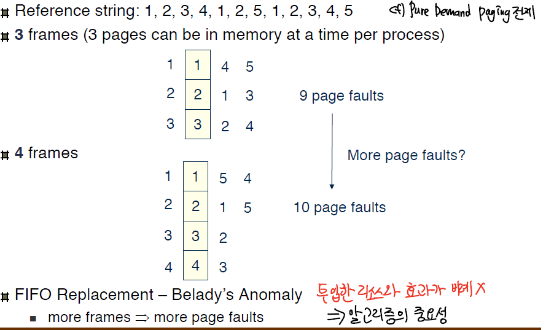
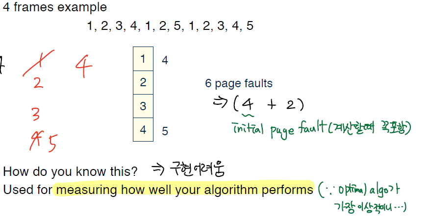
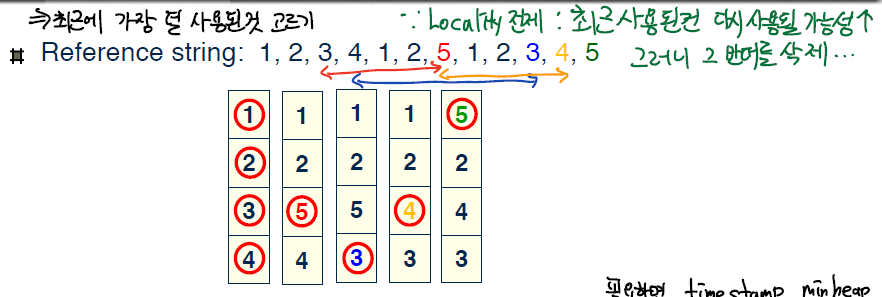

[이전편 : 가상 메모리](https://becomeweasel.me/virtual-memory/)

## 지역성

페이지 교체 알고리즘에 대해 언급하기 전에 먼저 **지역성**이라는 것에 대해서 알아야 한다.

- **시간 지역성** (Temporal Locality ) : 현재 참조된 메모리가 **가까운 미래내에 참조**될 가능성이 높음
  - loop,subroutine,stack
- **공간 지역성** (Spatial Locality) : 하나의 메모리가 참조되면 **주변의 메모리가 참조**될 가능성이 높음
  - Array 순회, 명령어의 순차실행

프로그램의 메모리 참조는 고도의 지역성을 가진다. 임의의 시간 Δt 내에 프로그램의 **일부분만을 집중적으로 참조**한다는 것이다.  
이러한 지역성이 있기 때문에 적절한 페이지 교체 알고리즘이 중요하다.

왜 중요할까?  
예를 들어서 주기적으로 두개의 페이지만 참조하는 로직이 있다고 해보자.  
만약 그 두개의 페이지를 번갈아가면서 교체를 한다면, 페이지 폴트는 두 개의 페이지에 대해서 접근할때마다 계속 일어날 것이다.

이게 왜 위험하냐면, **불필요한 I/O 작업의 오버헤드도 있고, 그때마다 컨텍스트 스위칭**이 계속 일어나기 때문이다.


## 페이지 교체 알고리즘

페이지 폴트가 났을때, 메모리에 빈공간이 있으면 올리면 되는 일이다. 물론 I/O가 들어가긴 하지만.
근데 만약 **모든 메모리가 사용중**이라면 교체될 페이지를 골라야하는데, 이걸 잘 고르는게 성능에 큰 영향을 미친다.

그러므로 원하는 것은 **가장 낮은 페이지 폴트 확률**이다. 모든 예시에서 `[1,2,3,4,1,2,5,1,2,3,4,5]` 의 순서로 페이지가 필요로 한다고 해보자.

일반적으로 프레임의 개수가 많으면, 페이지 폴트의 빈도도 줄어든다.

> 다만 정비례 하는것은 아니다. 이는 '벨라디의 모순'과 연관되어 있다.

### FIFO

- 단순하게 페이지 교체를 할 때 **가장 오래된 페이지를 선택해 교체**한다.
  
- 근데 프레임이 3개일때와 4개일때를 비교해보면, **프레임이 늘었는데도 오히려 페이지 폴트가 증가했다. → 이것을 '벨라디의 모순'현상이라 한다.**
- 즉 투입한 리소스와 효과가 비례하지 않음을 알 수 있고, 적절한 교체 알고리즘을 선택하는것이 중요함을 보인다.

### Optimal

- 가장 오랫동안 사용되지 않을 (페이지 교체가 필요한 시점으로부터) 페이지를 선택한다.
  
- 가장 이상적인 알고리즘이기 때문에 가장 낮은 페이지 폴트를 보여준다.
- 그렇지만, 다음에 무엇을 사용할지 알 수 없기 때문에 **구현이 어렵고** Optimal은 다른 알고리즘과의 성능비교의 기준으로 사용된다.
- **만약, 같은 행동을 반복하는 Bot의 형태고, 메모리 예측을 완벽하게 알 수 있다면 적용할 수 있다.**

### LRU

LRU는 **Least Recently Used**의 약자로 페이지 교체를 하는 시점에서  
가장 덜 최근에 사용된것, 다시 말해 **가장 오래전에 사용한 것** 페이지를 선택해 교체하는 알고리즘이다.


- Optimal을 제외하고 굉장히 좋은 성능을 보이는데, 그 이유는 LRU가 **Temporal Locality를 전제로 하고 있기 때문이다.** **최근에 사용된것은 다시 참조될 가능성이 크니,** 반대로 가장 오래전에 사용한것을 지우면서 페이지 교체 자체를 줄이려는 것이다.
  - 그런데 문제점은 **LRU를 실제로 구현하는데에 있다.**
    - 예를 들어 모든 페이지에 참조된 시간을 적어놓는다면, 페이지 테이블에 추가적인 메모리가 들것이고 (min heap으로 컷해도 될듯) 참조될때마다 이것을 계속 수정하는 오버헤드가 있다.
    - 만약 Linear하게 가장 오래전에 사용된 것을 찾는다고 해보자.
    - 이때의 시간복잡도는 `n`개의 페이지에 대해서 `O(n)`인데, 이 N 값이 의미하는 것은 프로세스의 개수이고 보통 너무 크다는데 있다.
  - **그러므로 커널에 구현하기는 시간적/공간적 오버헤드가 너무 크다. 따라서 근사치 모델이 필요하다.**

### LRU 근사

- 카운터 구현
  - 메모리 참조가 일어날때마다 CPU counter를 올리고, 페이지 A가 참조되면 페이지에 카운터를 덮어씌운다.
  - O(n)의 조회방식, 심지어 그때마다 메모리 액세스가 한번 더 일어남.
- 스택 구현
  - 페이지 번호로 [Doubly Linked List](https://becomeweasel.me/array-and-linked-list/#doubly-linked-list) 형태로 스택을 구현한다.
  - 페이지 A가 참조되면, A를 헤드로 옮긴다.
    - 이때 6번의 포인터 움직임이 필요하다.
  - 찾는데 드는 오버헤드는 없지만, 매번의 페이지 참조마다 6번의 메모리 액세스가 있다.
  - **교체가 일어나지 않아도 평소 오버헤드가 너무 크다.**
- **두번째 기회 (Second Chance)**
  - 기본적으로 FIFO다.
  - 페이지를 **원형의 큐**로 구성한다.
  - 페이지 테이블 내의 모든 페이지의 Ref bit를 초기값 0으로 할당하고, 참조가 되면 1로 바꾼다.
  - 참조비트가 **0인 페이지를 찾으면, 그 페이지를 교체**한다.
  - **만약 1이라면, 그 페이지는 0으로 바꾸고 한번 더 돈다. 한번의 기회를 더 주는것이다.**
  - 한번 더 돌았을때도, 0이면 교환한다.
  - 그런데 모든 **bit가 1인 경우를 생각해보면, FIFO의 알고리즘처럼 동작한다.**

### LFU

- 전제는 **많이 사용되는 페이지는 더 많이 사용될 것**이라는 전제
- 페이지에 참조된 횟수를 나타내는 카운터를 넣는다.
- 가장 카운터가 적은 페이지를 교체한다.
- 하지만 어떠한 페이지가 집중적으로 참조되다가 그 뒤에도 사용되지 않으면 어느정도까지 계속 머무르는 경향이 일어난다. 즉 전제와 어긋나게 된다.

### MFU

- 전제는 **카운터가 작은 페이지는 이제 막 들어왔고, 사용되지 않았다**는 전제.
- 페이지에 참조된 횟수를 나타내는 카운터를 넣는다.
- 가장 카운터가 큰 페이지를 교체한다.
- **Locality가 자주 변하는 시스템에서 유용하다.**

## 프리페이징(Prepaging)

프로세스가 시작될때는 항상 initial page fault가 난다. 아무것도 안올라와 있기 때문에..

이것을 방지하기 위해서, 프로세스가 필요로 하는 페이지의 전부 혹은 일부를 참조되기전에 미리 메모리에 올리는것이다.

물론, 페이지가 사용되지 않으면 낭비가 있다.

## Swap의 어떤 이점이 있는가?

- 장점
  - 가상 메모리를 만들고 유지하는데 도움이 된다. 그렇기에 더 많은 프로세스가 구동될 수 있다.
  - 실제 필요한 메모리용량만큼만 디스크에서 메모리로 올릴 수 있게 해주니, 물리메모리보다 더 큰 용량의 프로세스가 구동될 수 있다.
- 단점
  - 디스크에 접근하는 I/O → 디스크가 입출력을 할때 기다리지 않고 컨텍스트 스위칭

```toc

```
