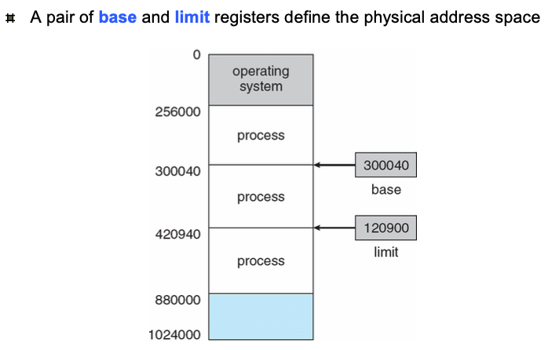
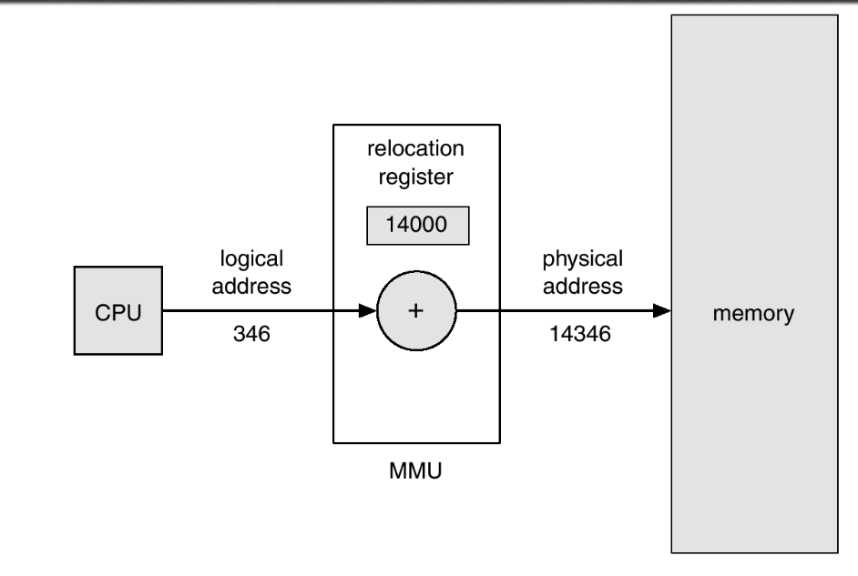
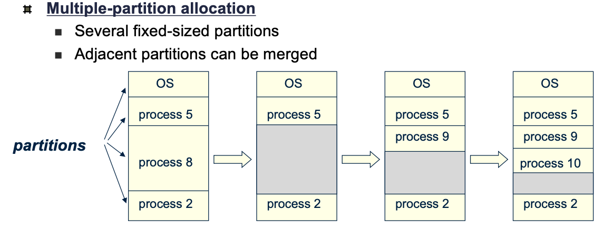
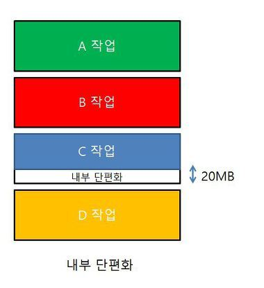
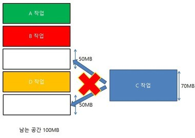
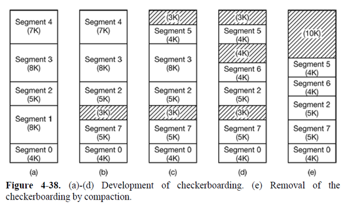
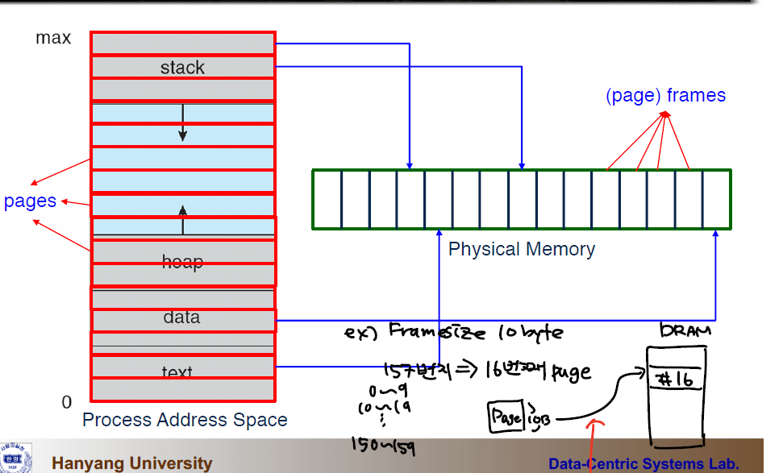
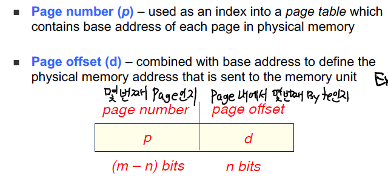
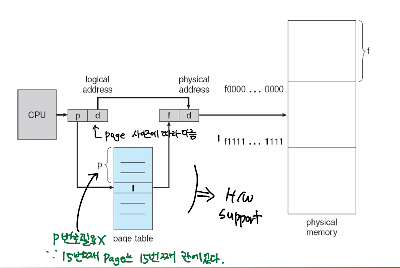

운영체제의 핵심 부분인 하나인 메모리 관리에 대해서 적겠다.

대략 3편으로 구성되며 페이징,가상메모리,페이지 교체 알고리즘 순이다.

## MMU

CPU는 프로세스를 구동할 때 PC를 참조해서 다음 명령어를 메모리에서 가져온다. 명령어를 참고해 필요한 데이터가 있으면 메모리에서 가져오는데 이때 주소체계가 서로 다르다.

아래의 그림처럼 base와 limit 레지스터 안에 있는 값들을 조합해서 CPU가 사용하는 주소(**논리 주소**)와 실제 메모리 주소(**물리 주소**)를 구할 수 있다.


그러면 왜 두 주소를 구분하였을까?

**가장 큰 이유는 보안이다.** Limit 레지스터를 둠으로써, P1이 P2의 메모리 영역을 참조하는 Memory Illegal Access를 방지하는 Protection의 기능을 수행한다.

MMU는 Memory-Management Unit의 약자로 위에서 말한 **논리주소를 물리주소로 대응**시켜주는 HW 장치이다.

MMU 방식에서는 **relocation 레지스터**가 존재하는데, 프로세스가 메모리 주소를 만들때마다 relocation 레지스터 안의 값이 더해지고 이를 통해서 메모리에 접근할 수 있게 된다.
>base 레지스터와 역할이 동일하다고 생각하면 된다.



## 연속적인 할당(Contiguous Allocation)

메모리에 프로그램을 연속적으로 할당하는 방법이다. 간단하게 말해서 아래에서부터 차례차례 채워가는 방식. 메모리를 연속적으로 사용하기 때문에 간단한 MMU만으로 구현할 수 있다. 

일반적으로 커널은 낮은 메모리주소에 배치되고, 유저 프로세스는 높아지는 메모리 주소를 가진다.

또 커널을 제외한 메모리 영역을 하나로 보는 방식과 여러개의 파티션으로 보는 방식이 있다.

여러개의 파티션으로 할당하는 방법에서는 다수의 고정된 크기의 파티션으로 나누어져 있고, 2개 이상의 파티션에 할당할때는 합병(merge)해서 할당한다.


그런데 그림에서 마지막 단계를 잘보면 P10과 P2 사이의 빈 공간이 보인다.
이것을 **Hole**이라고 하는데, 단순히 말해서 할당가능한 메모리의 영역이다.

이 Hole은 크기가 커서 프로세스를 할당받을 정도가 되면 문제가 되지 않지만, 그 크기가 작을때는 **파편화** 문제가 생길 수 있다.

## 파편화 (Fragmentation)

파편화 혹은 단편화는 메모리 내에서 할당가능한 영역이 존재하지만, 할당이 불가능한 상태를 의미한다. 두가지 종류가 있다.

- **내부 파편화**
    - 할당을 하는 단위가 존재할때 생긴다.
    - 프로그램이 **필요한 사이즈보다 더 큰 메모리가 할당**되면서 **파티션 내부적**으로 **메모리 공간이 낭비**되는 상황
        
        
        
- **외부 파편화**
    - 남아있는 메모리가 흩어져 있어서 **총 메모리 양은 할당할 수 있을 정도인데 실제론 할당할 수 없을때**
        
        
        
    - 내부 파편화와는 다르게 할당을 하는 단위가 존재해도 생기고, 존재하지 않아도 생길 수 있다.
        - 존재할때는 왜 생길까?
            - B프로세스의 다음 메모리 공간을 보자.  
                원래는 프로세스가 들어갈 자리인데도 그 프로세스가 끝나고 D가 끝나지 않았다면 C는 들어가지 못한다.
    - 즉, 사용가능한 메모리 영역은 있는데, **연속적이지 않은것이다.**
    - **압축**(compaction) 기법을 통해서 해결 할 수 있는데, **오버헤드가 크다.** (JVM GC의 mark-and-compaction 생각해보자.)

## 세그멘테이션 (Segmentation)

페이징 방법에서는 가상 메모리를 서로 **같은** 크기로 분할했지만, 세그먼테이션 방법에서는 서로 크기가 다른 논리적 단위인 세그먼트로 분할한다.

세그먼트들의 크기가 각각 다르기 때문에(code를 위한것,데이터를 위한것...) 필요할때마다 빈 공간을 찾아서 해결한다.

프로세스가 딱 필요한 만큼만 메모리를 배정해주기 때문에 내부파편화 문제는 없지만, **외부 파편화 문제는 존재한다.**

- 아래 그림을 보자. (a)번 상황에서 Segement 1이 빠지고 S7이 들어오면, S7이 더 작기 때문에 공간에는 맞지만 S2와 S7 사이에 빈공간이 생긴다.
- 비슷한 상황이 S4가 나가고 S5가 들어오는 상황에서도 생기고 3과 6의 상황에서도 생긴다.
이런 빈 공간이 생기기 때문에 **세그멘테이션은 외부파편화 문제**가 여전히 존재한다.
    
    

## 페이징 (Paging)

**논리적 메모리 주소 공간이 물리적인 메모리 공간에서 비연속적으로 배치하게끔 허용**하는 기법을 의미한다.

물리메모리를 고정된 사이즈의 **프레임(Frame)** 이라는 크기로 나누고, 동일한 사이즈로 논리메모리를 **페이지(Page)** 로 나눈다.

즉 , 프로세스가 일정량의 페이지를 요구하면, 같은 양의 충분한 프레임을 찾아서 매치시켜준다. 그렇기 때문에 허용가능한 프레임을 추적해야한다. 

또 페이지와 매치되는 프레임을 찾기 위해 **페이지 테이블**을 관리해야 한다.

하지만 외부 파편화 문제는 해결할 수 있지만(비연속적으로 배치하니) **내부 파편화 문제는 여전히 존재한다.** 



위의 그림처럼 프로세스의 메모리주소를 **같은 크기의 페이지**로 나누고 물리 메모리의 **프레임**과 대응시킨다.

이 대응이라는 것은 논리주소를 단순히 구성할 순 없고, 일반적으로 `2^m`바이트의 논리 메모리 사이즈와 페이지 사이즈가 `2^n`바이트일때, 아래와 같이 m 비트를 (m-n)비트,n비트로 구성한다.



페이지 오프셋은 `2^n`바이트의 페이지 중에서 현재 몇번째 바이트를 지시하는지 알려주고, m-n비트의 페이지 넘버는 페이지 테이블 내에서 몇번째 프레임을 가리키는데 사용된다.



이러한 페이징 방식에서 논리주소 변환은 위의 구조를 가진다.  
잘보면 offset인 d는 주소 변환에는 안쓰이고 바로 물리주소에 대응시켜버린다.  
반대로 p인 페이지 넘버는 page table내부에서 frame number와 매치시키기 위해서 사용되는데 p→f 의 역할을 하드웨어의 지원을 받아서 수행된다.

### 페이지 테이블

페이지 번호와 프레임 넘버를 매치시켜주는 구조를 페이지 테이블(Page Table)이라고 하는데 , **메모리 안에 저장된다.**

그렇기때문에 실제로 어떠한 메모리에 접근할때는 **두 번의 메모리 접근**이 필요하다.

1. 메모리에 있는 페이지 테이블 접근
2. 변환된 물리적 주소에 가서 메모리 접근

이 메모리 접근은 꽤 비용이 큰 작업이기 때문에 **TLB**라는 새로운 하드웨어 캐시가 쓰인다. 

### TLB

TLB는 Associative Memory라고도 불리는 하드웨어 캐시인데, 논리주소를 물리주소로 변환할때 메모리접근을 줄이기 위해서 사용된다.

페이지테이블과 유사하게 페이지 번호와 프레임 번호가 대응되게 기록되어 있다.  
다만, **모든 페이지 번호가 TLB 안에 있는 것은 아니다.**

물론 이 레코드들을 다 순차적으로 읽는것은 아니고, **하드웨어의 지원을 받아 병렬적으로 읽기 때문에 매우 빠르다.**  

>이에 관해서 좋은 답변이 있어서 공유한다. [How does a TLB lookup compare all keys simultaneously?](https://cs.stackexchange.com/questions/119744/>how-does-a-tlb-lookup-compare-all-keys-simultaneously)

>요악하자면 단일 CPU 안에서라도 파이프라이닝 기법을 이용해서 병렬적으로 읽는다는 것. (컴퓨터구조 수업을 참고하자.)


TLB가 도입되면서 (p,d)의 논리주소를 물리적 주소로 변환하는 방법이 변했다.

1. **TLB를 먼저 확인**해서 p에 해당하는 프레임 번호가 있는지 찾는다.
    1. 있다면, **프레임 넘버 f와 오프셋 d를 가지고 바로 메모리에 접근한다.**
    2. 없다면 2번으로 간다.
2. **메모리**에 있는 **페이지 테이블을 확인**한다.
3. 페이지 테이블에 적힌 **프레임 넘버 f와 오프셋 d를 가지고 메모리에 접근한다.**
4. **가장 최근에 사용된 (p,d)→(f,d) 를 TLB에 저장한다.**

1,4번 때문에 TLB는 논리적→물리적 주소 변환에서 **캐시 역할**을 수행한다고 볼 수 있다.


>💡 다만 일반적인 CPU 캐시(L1,L2...)와는 목적 자체가 다르다. TLB는 주소 변환 속도 향상을 위한것이어서 MMU에 의한 주소변환시에 생기고 , CPU 캐시는 데이터를 가져올때 메인 메모리 접근을 줄이기 위하여 메인 메모리 접근시점에 참조된다.
>물론 둘 다 메인 메모리 접근을 줄이기 위함이라는 점은 비슷하다.

>A cache stores a memory location temporarily while a TLB is like a cache that stores address translation (virtual to physical address)

**단 이 TLB도 컨텍스트 스위칭이 일어날때 비워진다.**  

그 이유는 새로운 프로세스가 CPU를 할당받게 되면, 다른 메모리 주소공간을 참조할것이기 때문이다.  
이때문에 컨텍스트 스위칭 직후 TLB 미스가 연속적으로 생긴다.

### 페이지 사이즈
페이지의 크기에 대해서도 얘기해보자.  
페이지의 크기를 정하면, 페이지 테이블의 크기도 결정되므로 적절한 페이지 크기 선정이 중요하다.

여기서 말하는 **적절한**의 기준이 뭘까?

>만약 모든 프로세스가 4K만 요구하는데 페이지 사이즈가 8K면?

>모든 페이지에 4K만큼의 내부 파편화가 생기는 것이다.

- 만약 페이지 사이즈가 크다면?
    - 페이지 테이블의 크기는 줄어든다.
    - 한 개의 페이지 테이블안에 들어있는 데이터가 많으니 **공간 지역성**을 잘 만족한다. 
    - 한 번에 많은 양의 데이터를 디스크에서 가져오니 **I/O 작업이 줄어든다.**
    - **내부 파편화** 문제가 증가한다.
    - 필요하지 않은 데이터가 메모리에 올라올 수 있다.
    
- 만약 페이지 사이즈를 작다면? 
    - 내부 파편화 문제가 감소한다.
    - 필요한 데이터만 메모리에 가져올 수 있다.
    - **공간 지역성**을 지키기 어려워 페이지 폴트 발생 확률이 늘어난다.
    - 페이지 테이블 내의 엔트리가 많아지니 페이지 테이블의 크기가 커진다. **오버헤드가 발생한다.**

따라서 여러가지 트레이드 오프를 고려해서 페이지의 크기를 정하는 것이 중요한데,  
일반적으로 메모리 크기도 커지고, 프로세스 크기도 커져서 페이지 사이즈의 크기도 커지고 있다.

리눅스 16.04 기준 아래와 같은 명령어로 페이지 사이즈를 알 수 있는데 4096으로 4K다.
```C
$ getconf PAGESIZE
> 4096
```

```toc
```