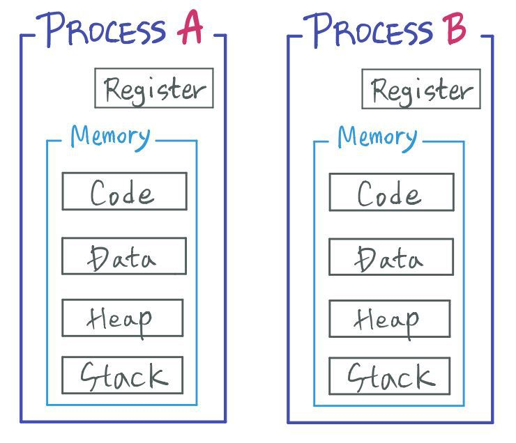
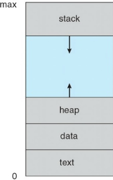
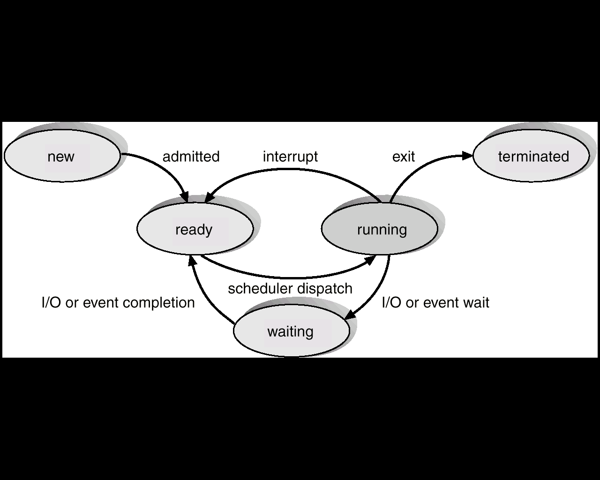
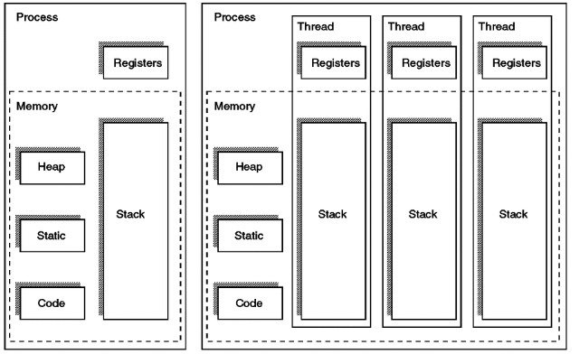

프로세스란, **실행중인 프로그램**을 의미한다. 
프로그램을 실행하기 위해서는 **주소공간,파일,메모리** 등이 필요한데 **운영체제로부터 이런 것을 할당받은 프로그램을 프로세스**라 한다.

>프로그램은 어떤 작업을 수행하기 위한 파일로써 **정적인 상태**이고, 프로세스는 그 작업을 수행하는 **동적인 상태**다.

## 프로세스의 메모리 구조

프로세스는 아래 그림과 같은 메모리 구조를 띄고 있다.



프로세스는 각자 본인이 사용하는 메모리 영역과 레지스터 값을 가진다. 

프로세스의 메모리 영역은 **코드,데이터,힙,스택** 영역으로 구성된다.

- **코드** : 사용자가 작성한 프로그램 함수들의 코드가 기계어 명령 형태로 변경되어 저장되는 공간
- **데이터** : **전역 변수 또는 static 변수** 등 프로그램이 사용하는 데이터를 저장하는 공간
- **스택** : **함수의 복귀주소와 지역변수,매개변수,반환값**을 저장하는 공간. 재귀함수가 반복되거나 지역변수가 너무 많으면 stack overflow 발생. **가변적이다**.
- **힙** : 프로세스 실행 중에 **런타임에 할당**되는 영역. 이곳에 메모리를 할당하는 것을 **동적 할당**이라고 한다. **가변적이다**.



이처럼 프로세스는 **각자의 메모리 영역**을 가지기에 프로세스간의 메모리는 서로 침범 할 수 없다.

## 프로세스 제어 블록 (Process Control Block, PCB)

PCB(Process Control Block)는 **특정 프로세스에 대한 중요한 정보를 저장**하고 있는 운영체제의 자료구조이다. 그렇기에 PCB는 일반적으로 보호된 메모리 영역,예를 들면 커널 스택등에 위치한다.

OS는 프로세스를 관리하기 위해 **프로세스를 생성함과 동시에 고유한 PCB를 생성한다.**

프로세스는 CPU를 할당받아 작업하다가도 context-switching이 일어나면, 진행하던 작업을 저장하고 CPU를 반환해야하는데, 이때의 **작업 진행상황이 PCB에 저장**된다. 
그 후 다시 CPU를 할당받게 되면 PCB 안에 있던 정보들을 불러와서 작업이 멈추었던 시점에서부터 다시 시작한다.

- 프로세스 식별자 : PID
- 프로세스 상태 : `new,ready,running,waiting,terminated`
    
    
    
- 프로그램 카운터,**PC** : 프로세스가 **다음에 실행할 명령어 주소**
- CPU **레지스터**
- CPU **스케쥴링 정보** : 우선순위, 스케쥴 큐에 대한 포인터 ← 이것을 바탕으로 MLFQ나 RR이 동작한다.
- **메모리** 관리 정보 : **페이지 테이블 또는 세그먼트 테이블에 대한 정보 포함**
- 입출력 상태 정보 : 프로세스에 할당된 입출력 장치들과 열린 파일 목록
- 어카운팅 정보 : 사용된 CPU 시간, 시간제한, 계정번호

이 PCB들은 **커널 스택과 같은 보호된 메모리 영역 내에서 Linked List 형태로 관리된다.** PCB List Head에 PCB들이 생성될때 붙는 방식으로 관리가 된다.

## 스레드(Thread)

**스레드는 프로세스가 할당받은 자원을 이용하는 실행 단위다.** 

한 프로세스 내에서 동작되는 여러 실행 흐름으로 프로세스 내의 주소 공간이나 자원을 공유할 수 있다.

스레드는 스레드 ID,PC,레지스터 집합, 그리고 각자의 스택으로 구성된다(독립적인 메모리는 아니고, 스택 포인터로 표시한다). 

이를 통해 멀티 쓰레딩을 달성할 수 있는데 멀티쓰레딩은 하나의 프로세스를 여러개의 실행단위(스레드)로 나누어서 자원을 공유하며 자원의 생성과 관리의 중복을 줄여 수행능력을 높이는 것이다.

- 공유
    - 같은 프로세스에 속하는 스레드들은 **힙,데이터,코드 영역을 공유한다.** 추가적으로 open된 파일등도 공유한다.
- 공유하지 않는 것
    - 각자의 스택과 레지스터(PC 포함)은 공유하지 않는다.

이렇게 하나의 프로세스 내에서 다수의 실행 단위인 스레드로 구분하여 공유할 자원은 공유하고, 독립적인것은 따로 두어 수행 능력을 향상시키는 것을 멀티스레딩이라 한다.

### 스레드에서의 메모리 구조



스레드 역시 프로세스와 단짝인 개념인데, 짧게 말하면 ***프로세스가 할당받은 자원을 이용하는 실행의 단위*** 이다. 위의 그림처럼, 여러개의 스레드는 각자의 레지스터와 스택을 가지지만, 나머지 영역은 가지지 않는다. 대신에 **코드,힙,데이터** 영역을 공유해서 병렬적인 수행이 가능하다.

- **TMI : 왜 스레드는 각자의 스택을 가지고 있을까?**
    
    스레드가 하나의 실행의 context라는 것을 생각하면 자명하다. 그 context내에서 아주 간단하게 여러개의 지역변수,파라미터,반환값,복귀주소등을 가지는데, 그 스레드들이 만약 서로의 스택을 공유하게 된다면, 그 context가 서로 섞이게 된다. 사실 각자의 스택을 가지기 때문에 스레드가 종종 Lightweight Process라고 불리는 이유다. **그리고 각자의 스택을 가지고 있다고 얘기하지만 사실은 하나의 메모리공간을 stack pointer를 이용해서 분리하는 것이다.**
    
- **TMI2 : 그럼 스레드는 왜 각자의 PC와 register도 있을까?**
    
    위의 답과 비슷한 이유인데, PC(Program Counter)나 레지스터의 역할은 **현재 명령어가 어디까지 수행되었는지,수행될때 쓰던 데이터는 무엇이었는지** 알려주는 것이다. 스레드는 CPU를 할당받을때 프로세스처럼 스케쥴러에 의해 결정되는데, 그렇기에 명령어가 연속적으로 실행됨을 보장하지 못하기에 **어디까지 실행되었는지 기록**할 필요가 있는데 그래서 스레드가 각자의 PC를 가지는 것이다.
    

### 스레드의 장점과 단점

- **장점**
    - **반응성**
        - 특정 스레드가 I/O 작업을 처리중이거나(blocked) 긴 작업을 수행중이여도 다른 스레드는 본인의 일을 계속 할 수 있다.
    - **자원 공유**
        - 프로세스는 shared memory나 message passing과 같은 기법을 이용해서 자원을 공유할 수 있지만, 스레드끼리는 프로세스의 자원을 서로 공유한다.
    - **경제적**
        - 프로세스의 자원을 공유하기 때문에 새로운 메모리 주소공간을 할당받을 필요가 없어 생성에 자원이 적게 들어간다.
        - 스레드 간에 컨텍스트 스위칭을 할 때 캐시 메모리 안비워도 된다. 어차피 같은 메모리 주소공간을 사용하니까 오버헤드가 적다.
        - 근데 이것도 극복하려고 thread pool이라는 기술도 있다.
    - 확장가능성
- 단점
    - **공유자원**을 사용하기 때문에 **동기화 문제**를 고려해야 한다.
        - lock을 함으로써 공유자원에 대한 동기화를 해결할 수 있는데 이게 병목현상이 될 수 있다.
        - 그러므로 적절한 부분만 lock을 하는 것이 필요하다. → Critical Section Only
  
# **멀티 프로세싱 vs 멀티 스레드**

- 멀티 프로세싱
    - 두 개 이상의 다수의 프로세스가 협력적으로 하나의 작업을 동시에 병렬적으로 처리하는 것
    - 프로세스간 메모리 공유는안되기 때문에, **IPC**를 이용해 소통
    - 하나의 프로세스에서 문제가 생겨도 다른 프로세스는 계속 진행할 수 있음.
    - **컨텍스트 스위칭 비용이 높음**
- 멀티 스레딩
    - 단일 프로세스 내에서 여러 쓰레드로 나누어 동시에 실행
    - **컨텍스트 스위칭 비용이 거의 없음**
    - 스택을 제외한 **데이터,코드,힙 영역을 공유**하기 때문에 **공유하는데 편리**함
    - 임계영역의 문제가 있음

```toc
```