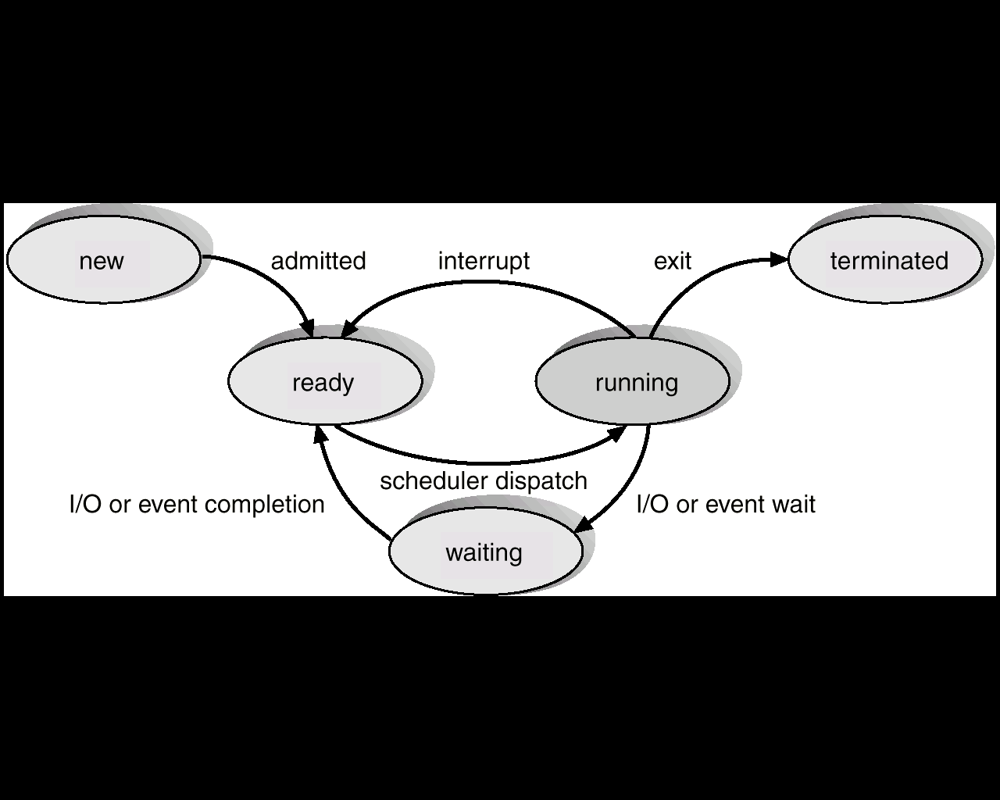
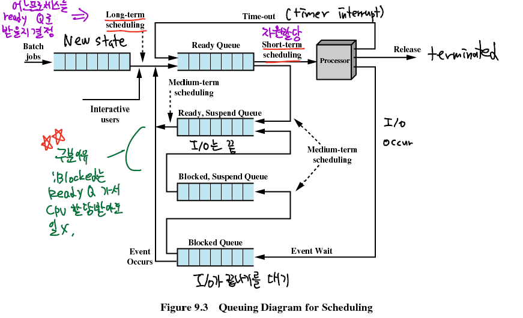
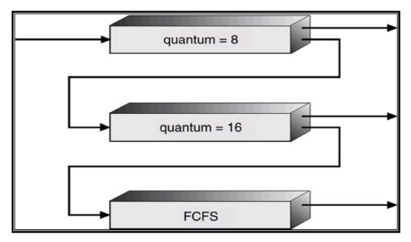

일단 프로세스 스케쥴링 알고리즘에 대해서 언급하기 전에, 프로세스의 상태와 Context-Switching에 대해서 알아야 한다.

여러가지 프로세스의 상태를 기반으로 전이(Transition)되며 이를 바탕으로 스케쥴링 알고리즘이 이루어진다.
## **프로세스의 상태**



프로세스의 상태는 OS에 따라서 개수도 다르고, 명칭도 조금 다르지만, 가장 대표적인 그림은 위의 상태와 같다.

- `new` : 프로세스가 생성된 상태이다. 이때는 Readuy Queue 안에 들어 있지 않기 때문에 **CPU를 받을 대상이 아니다.**
- `ready` : 프로세스가 **CPU를 할당받기 위해 대기**하는 상태이다. 보통 **Ready Queue 안**에 들어와있는 상태라고 얘기한다. **스케쥴링의 대상**이 된다.
- `running` : 현재 CPU를 할당받아 **작업중인** 상태다. Single core 시스템에서는 1개다.
- `wating` : 프로세스가 **입출력이나 이벤트가 끝나기를 기다리는** 상태이다.
- `terminated` : 프로세스가 **종료된** 상태다. 단 프로세스 구조체가 사라진 것은 아니다.

그림에서 프로세스의 상태가 특정 작업들로 인하여 변하는 것을 볼 수 있는데 이것을 프로세스의 **상태 전이(Transition)** 라고 한다.

- `admitted` : 생성된 프로세스가 CPU를 받을 준비가 되어서 **Long-term Scheduler(Job Scheduler)** 에 의해서 선택받아 Reaudy queue로 옮겨지는 작업이다.
    - **Long Term Scheduer :** 어떠한 프로세스를 레디큐로 옮길지 선택하는 스케쥴러다. 자주 일어나지 않고, **멀티프로그래밍의 정도(DOM)** 가 이것에 영향을 받는다.
        - 일반적으로 많은 프로세스가 한꺼번에 메모리에 올라오면, 일부는 디스크에 저장된다.
        - 존재하는 이유는 기존의 프로세스들이 자원을 확보하기 위해서 존재한다. 무턱대고 다 RQ로 올리면 기존의 프로세스는 작업이 진행되지 않는다.
- `scheduler dispatch` : `ready` 상태에 있는 프로세스를 **Short term Scheduler**가 선택해서 자원을 할당한 후 실행시키는 행위다.
    - **Short Term Scheduler :** RQ에 있는 프로세스 중에서 어떠한 것이 다음으로 실행될지, CPU를 할당할지 선택하는 스케쥴러다.
        - 빈번하게 발생한다. 그렇기에 이 스케쥴러의 오버헤드를를 줄여야 전체 오버헤드를 줄일 수 있다.
        - 스케쥴링 알고리즘과 아주 깊은 연관이 있다.
- `interrupt`  : 인터럽트는 조금 논란이 있는데, 저 그림상에서는 입출력 이벤트는 포함하지 않는다. **Context-switching이 일어난다.**
    - 선점식(preemptive) 방식에서는 타이머(**Timer)** 이벤트가 있다. 인터럽트 핸들러가 인터럽트를 일으켜서 STS에게 다른 프로세스를 선택할지, 지금 프로세스를 그대로 둘지 결정하게끔 한다. 만약 바뀐다면 전이가 일어난다.
    - 비선점식(non-preemptive 혹은 cooperative) 방식에서는 양보(**Yield**)가 있다. 이 방식에서는 OS가 프로세스를 스케쥴링할때 인터럽트를 사용,허용하지 않는다. 대신에 작동중인 프로세스가 자발적으로 양보를 해서 스케쥴러가 다른 프로세스를 스케쥴링할 수 있는 방식을 쓴다.
- `I/O or event wait` : 실행 중인 프로세스가 입출력이나 이벤트를 처리해야 하는 경우, 입출력/이벤트가 끝날때까지 대기 상태로 만드는 것. **Context-switching이 일어난다.**
    - 여기서 왜 **ready로 안보내는지가 중요하다.** 왜냐면, 이 프로세스는 ready로 가서 자원을 할당받을 자격이 없다. **이벤트나 입출력이 끝나지 않았으니 자원을 받아도 사용하지 못하기 때문이다.**
- `I/O or event completion` : 입출력/이벤트가 끝난 프로세스를 ready 상태로 만들어 STS에게 선택될수 있게끔 한다. `wait` 과는 다르게 자원을 할당받기만 하면 작업을 이어나갈 수 있기 때문이다.


## **Context-switching?**

정확한 정의는 "**CPU**가 **다른 프로세스로 스위치**할때, 시스템(OS)이 **기존의 프로세스의 상태를 저장**하고, **다음** 진행될 **프로세스의 저장된 상태값을 불러오는것**"이다.

- 이 때 중요한것이 PCB 등인데, PCB 안에는 CPU 레지스터에 대한 정보, PC,페이지 테이블과 관련된 정보가 있다. 그렇기에 PCB는 프로세스의 문맥을 보관하고 있는 것이다.
- 다시 작업을 수행할때 이것을 참조해서 어디부터 다시 시작할지 참고 할 수 있다. 그렇기에 새로운 프로세스로 선택될때도 PCB를 불러와야하고, ready 상태나 waiting 상태로 프로세스가 전이될때도 PCB를 저장해야한다.

일반적으로 context switch하는 시간은 순전한 오버헤드다. 대부분의 시스템은 이 전환 시간동안 어떤 의미있는 작업을 하지 않는다.

또 가장 중요한 부분이 **context-swtichg을 하면서 Cache flushing이 일어난다**. 그렇기에 그 다음에는 **연속적인 캐시 미스**(successive cache misses)가 발생한다. 이 과정이 대부분의 오버헤드를 차지한다.

>💡 캐시를 날리는 이유는 새로운 프로세스는 새로운 virtual adrress를 가지는 새로운 메모리 주소다. 그렇기 때문에 기존의 캐시된 메모리의 주소 영역을 사용할 필요가 없기에 기존의 캐시된 메모리를 Flush 하는 것.

>참고로 스레드도 컨텍스트스위칭을 한다. 그치만 **쓰레드들끼리는 주소공간을 공유**하기 때문에 캐시를 flush할 필요가 없다. 

### **Process context switching vs Thread context switching**
프로세스만 context switching을 하는 것이 아닌 쓰레드끼리도 context switching을 한다. 다만 아래와 같은 차이점이 있다.

- 프로세스간 context switching
    - 커널 단에서 스위칭이 일어난다.
    - 메모리 주소 공간의 전환이 일어난다.
    - 프로세서의 **캐시와 TLB 모두 Flush 된다. → 연속적인 캐시 미스와 TLB 미스가 일어난다.**
    - 메모리 주소공간이 전환되고, 캐시미스가 **필연적으로 동반되므로 훨씬 비용이 비싸다**.
- 쓰레드간 context switching
    - 커널 단에서 스위칭이 마찬가지로 일어난다.
    - 같은 프로세스 내에서 일어나는 스위칭이기에 메모리 주소공간을 그대로 사용한다.
    - 프로세서의 **캐시와 TLB 정보가 유지된다.**
    - 레지스터의 값과 스택 포인터 전환 정도만 일어나니 훨씬 저렴하다.

## **CPU 스케쥴링 알고리즘이란?**

스케쥴링 알고리즘은 레디 큐에 있는 프로세스들을 대상으로 다음으로 실행할(CPU를 할당받을) 프로세스를 고르는 작업이다.

일단 프로세스의 상태를 다이어그램으로 먼저 보자.



레디큐 뿐만 아니라, 새로 만들어지는 큐를 담는 큐도 있고, block(I/O wait) 큐도 있다. 일반적으로 CPU 스케쥴링 알고리즘은 **Short-term scheduling**을 얘기한다.

스케쥴링 알고리즘을 얘기하기 전에 **멀티 프로그래밍(Multi Programming)** 과 **시분할(Time sharing)** (혹은 **멀티 태스킹(Multi Tasking))** 에 대해서 먼저 얘기를 해야한다.

- **멀티 프로그래밍**
    - 작업들을 적절히 구성해 **항상 CPU가 프로세스를 실행**하도록 한다.
    - 어떤 프로세스가 CPU를 할당받아 사용하다 I/O 작업등 CPU를 필요로 하지 않는 순간이 오면, 
    다른 프로세스로 교체해서 그 프로세스가 CPU를 계속 사용할 수 있도록 한다.
    - 이것의 목적은 **CPU 사용률**(CPU Utilization)을 최대화함에 있다.
- **시분할(멀티 태스킹)**
    - CPU가 일할때 **매우 빈번하게 수행중인 작업을 교체**해서 사용자가 상호작용할 수 있는것이다.
    - 반응하는데 걸리는 시간(Response time)이 충분히 작아야 프로그램들이 동시에 진행하는것처럼 보인다.

### 스케쥴링의 발생과 목적

CPU 스케쥴링은 아래와 같은 상황에서 일어난다.

- `running` 에서 `waiting` 으로 갈 때 (I/O Request)
- `running` 에서 `ready` 로 갈 때 (timeout), **Preemptive**
- `waiting` 에서 `ready` 로 갈 때 (I/O Finish, **이때 스케쥴링 해주는 이유는, I/O가 끝난 이후에 핸들링을 해줘야 하기 때문이다**. 기존의 `running` 프로세스는 고려하지 않음),**Preemptive**
- `running` 에서 `terminated` 로 갈 때 (프로세스의 종료)

만약 스케쥴링이 1번과 4번에서만 일어난다면 , non-preempitve지만, 그렇지 않다면 **preemptive** 스케쥴링이다.

스케쥴링 알고리즘에 대한 기준은 몇가지가 있다

- **CPU 이용률** : CPU를 가능한 바쁘게 해야 한다. 높을 수록 좋음
- **Throughput** : 단위시간당 프로세스 처리 수,batch 시스템에선 중요함, 높을 수록 좋음
- **Turnaround time** : 특정 프로세스가 도착시간에서부터 끝날때까지 걸린 시간, 낮을 수록 좋음
- **Waiting time** : 레디큐에서 기다린 시간의 합 , 범용적으로 중요하고, 낮을 수록 좋음
- **Response time** : 요청이 들어왔을때 첫번째 응답까지 걸리는 시간,일반적인 PC에서 중요하다. Throughput과는 반대의 관계이며 낮을수록 좋다.

### 스케쥴링 알고리즘

- **FCFS** (First-Come, First-Served)
    - **비선점**
    - 먼저 CPU를 요청한 프로세스에게 먼저 CPU가 할당된다. **공평하다**.
    - 큐를 이용하면 쉽게 구현이 가능하다
    - 도착순서를 바꿈으로써 전체 waiting time이 바뀐다. **CPU bound job을 뒤로 하면 확 줄어든다**
    - **Convoy Effect** : **시간이 짧게 걸리는 프로세스가 시간이 오래 걸리는 프로세스 뒤에 있으면 CPU 전체 사용률이 줄어든다.**
- **SJF** (Shortest Job First)
    - **기본적으로 비선점** 방식
    - CPU burst time이 가장 작은 프로세스를 먼저 CPU 할당시킨다.
    - **선점방식으로 구현하는것을 SRTF**(Shortest Remaining Time First) 방법은, 현재 프로세스의 남은 시간보다 더 짧은 프로세스가 새로 들어오면, 선점해버리는 방식이다.
        - 컨텍스트 스위칭에 드는 **오버헤드를 고려하지 않을시에는 SJF보다 성능이 좋다.**
        - 만약 선점방식이라면, CPU burst time이 긴 프로세스는 계속 실행되지 못하는 **기아(starvation)** 현상이 발생 할 수 있다.
    - 하지만 현실적으로 SJF는 구현하기 어려운데, **CPU의 남은 시간을 예측불가**하기 때문이다. 그래서 평균 waiting time이 최소인 Optimal한 알고리즘이다.
    - 그나마 유사하게 접근 하는 방식은 **이전 CPU burst time을 기반으로 예측**하는 것이다.
- **Priority Scheduling**
    - 각 프로세스에게 우선순위 지시자가 연결되어 있다.
    - **가장 높은 우선순위**(일반적으로 가장 낮은 숫자)를 가진 프로세스에게 CPU가 할당된다
    - SJF도 CPU burst time이라는 우선순위를 가지는 우선순위 스케쥴링 방식이다.
    - 선점과 비선점 방식 모두 구현이 가능하다.
        - 선점 : 새**로 도착한 프로세스의 우선순위가 기존의 것보다 높으면 CPU 교체** (SRTF)
        - 비선점 : 신경쓰지 않고 새로운 프로세스를 **그저 레디큐 맨 앞에 배치**
    - 우선순위가 낮은 프로세스는 계속 실행되지 못하는 **기아(starvation) 현상**이 발생하는데, 시간이 지날때마다 프로세스의 우선순위를 올려주는 **에이징(Aging) 방식으로 해결 가능**
- **RR**(Round-Robin) Scheduling
    - 각각의 프로세스는 **Time quantum**이라 불리는 짧은 시간을 부여받음.
    - 이 시간이 **끝나면**, 프로세스는 **다른 프로세스로 무조건 교체되고**(선점) 레디큐의 마지막으로 돌아간다.(FCFS의 측면)
    - q초의 quantum을 가지는 n개의 프로세스가 있으면, q초마다 한번씩은 1/n의 CPU 타임을 보장받는다. 
    → **최대 (n-1)*q 초까지만 기다리면 무조건 보장받는다. 이를 통해서 waiting time의 upper bound를 보장받게 된다.**
    - q의 사이즈를 적절히 고르는 것이 중요하다.
        - q가 너무 **크면** → **FCFS**랑 다를게 없다.
        - q가 너무 **작으면** → 잦은 컨텍스트 스위칭, 그로 인한 **오버헤드가 커지기 때문에 throughput이 감소한다.**
- **Multi-Level Queue**
    - 레디큐를 두개 이상으로 구분해 **I/O bound job**과 **CPU bound job**으로 구분한다. 그 이유는 **I/O bound job은 interaction이 많아서 response를 빨리 얻어야 하기 때문이다**. (우선순위를 높여야겠지?)
    - 크게 두 분류로 나누는데 foreground와 background로 나눈다.
        - foreground : **interactive**하고 , I/O job 위주이며, **RR 알고리즘**으로 동작하여 **response time**을 높이는데 주력으로 둔다.
        - background : **batch job**(CPU bound job)위주이며, **FCFS**로 동작하며 throughput을 높이는데 집중한다.
    - 각 큐들은 독립적인 스케쥴링을 가지고 있고, **foreground가 다 수행되어야 background를 선택한다.**
        - 그렇기 때문에 **background job들은 기아현상**이 발생할 수 있다. (계속 foreground로 들어오면)
- **MLFQ**
    - 프로세스들은 **큐들 사이에서 서로 이동**이 가능하다.
        
        
        
    - 새로운 프로세스는 q=8인 큐로 진입하고, **큐 내부적으로는 FCFS**의 행동을 취한다. **Q1과 Q2의 작업이 있으면 선점한다.**
    - CPU를 얻으면 8ms동안 수행되고, 그 안에 **끝나지 않으면 Q1으로 강등당한다.**
    - Q2에서 16ms동안 수행되고, 그 안에 **끝나지 않으면, Q2로 강등당한다.** 이런 방식을 취함으로써 **Convoy Effect를 방지할 수 있다.** (CPU bound job은 우선순위가 낮으니)
    - 단, **yield**와 같이 I/O 작업으로 인해 q가 소진되기전에 CPU를 포기하면 **강등당하지 않고 우선순위를 그대로 유지한다.**
    - MLFQ는 burst time이 짧은 **대화형 작업들을 빨리 처리하려고 해 response time에서 강점을 보이지만 , CPU bound job들은 기아 현상을 겪을수 있다.**
        - 주기적으로 모든 작업의 우선순위를 **상향조정** 할 수 있다. 예를 들어 모두를 Q0로 올려보낸다. 이 과정에서 CPU bound job들도 조금이나마 작업을 진행할 수 있다.
    - **의도적인 I/O 작업 호출**로 **우선순위를 유지하는 프로세스가 있을 수 있다**. 이 프로세스는 예를 들어 7ms가 지난 후 의미 없는 I/O 작업으로 우선순위를 유지한다.
        - 누적적인 **CPU 사용 시간을 기록**해서 방지한다. PCB 안에 기록하지 않을까..?

# **선점식 vs 비선점식**

- 선점식은 프로세스에게 한번 실행될때 제한된 시간만큼 CPU를 할당한다. 작업 도중에 자원을 반납당하고 ready 상태로 진입한다. 비선점식은 프로세스가 종료되거나, yield를 통해서나 I/O를 위해서 자발적으로 ready에 가지 않는 한 자원을 반납하지 않는다.
- 선점식만 실행 중에 인터럽트를 허용한다.
- 선점식은 프로세스의 우선순위에 따라 스케쥴링을 하는데, 우선순위가 낮은 프로세스가 선택받지 못하는 기아(starvation)현상이 일어날 수 있다. 비선점식은 수행시간이 긴 프로세스(CPU-bound job)이 스케쥴링되면, 그 뒤의 작업들이 오랜 기간동안 선택받지 못한다.
- 선점식은 context-swtiching이 자주 일어나 이로 인한 오버헤드가 크고, 비선점식은 필수적인 context-switching을 제외하면 자주 일어나지 않아 오버헤드가 비교적 적다.
- 선점식은 우선순위에 따른 유연성을 가지지만(예를 들어 우선순위 promotion을 진행하는 MLFQ) 비선점식은 그렇지 않다.

이러한 특징때문에 interactive한 시스템에선 반응성 때문에 선점식을, batch job을 자주 수행하는 시스템에선 비선점식을 사용하곤 한다.
```toc
```