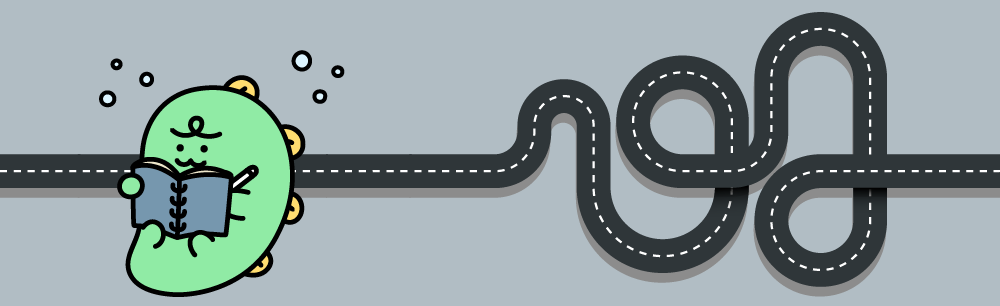

### 문제 제목
[경주로 건설](https://programmers.co.kr/learn/courses/30/lessons/67259)

### 문제 설명

건설회사의 설계사인 죠르디는 고객사로부터 자동차 경주로 건설에 필요한 견적을 의뢰받았습니다.
제공된 경주로 설계 도면에 따르면 경주로 부지는 N x N 크기의 정사각형 격자 형태이며 각 격자는 1 x 1 크기입니다.
설계 도면에는 각 격자의 칸은 0 또는 1 로 채워져 있으며, 0은 칸이 비어 있음을 1은 해당 칸이 벽으로 채워져 있음을 나타냅니다.
경주로의 출발점은 (0, 0) 칸(좌측 상단)이며, 도착점은 (N-1, N-1) 칸(우측 하단)입니다. 죠르디는 출발점인 (0, 0) 칸에서 출발한 자동차가 도착점인 (N-1, N-1) 칸까지 무사히 도달할 수 있게 중간에 끊기지 않도록 경주로를 건설해야 합니다.
경주로는 상, 하, 좌, 우로 인접한 두 빈 칸을 연결하여 건설할 수 있으며, 벽이 있는 칸에는 경주로를 건설할 수 없습니다.
이때, 인접한 두 빈 칸을 상하 또는 좌우로 연결한 경주로를 직선 도로 라고 합니다.
또한 두 직선 도로가 서로 직각으로 만나는 지점을 코너 라고 부릅니다.
건설 비용을 계산해 보니 직선 도로 하나를 만들 때는 100원이 소요되며, 코너를 하나 만들 때는 500원이 추가로 듭니다.
죠르디는 견적서 작성을 위해 경주로를 건설하는 데 필요한 최소 비용을 계산해야 합니다.

예를 들어, 아래 그림은 직선 도로 6개와 코너 4개로 구성된 임의의 경주로 예시이며, 건설 비용은 6 x 100 + 4 x 500 = 2600원 입니다.

또 다른 예로, 아래 그림은 직선 도로 4개와 코너 1개로 구성된 경주로이며, 건설 비용은 4 x 100 + 1 x 500 = 900원 입니다.

도면의 상태(0은 비어 있음, 1은 벽)을 나타내는 2차원 배열 board가 매개변수로 주어질 때, 경주로를 건설하는데 필요한 최소 비용을 return 하도록 solution 함수를 완성해주세요.

#### 제한 사항
* board는 2차원 정사각 배열로 배열의 크기는 3 이상 25 이하입니다.
* board 배열의 각 원소의 값은 0 또는 1 입니다.
* 도면의 가장 왼쪽 상단 좌표는 (0, 0)이며, 가장 우측 하단 좌표는 (N-1, N-1) 입니다.
원소의 값 0은 칸이 비어 있어 도로 연결이 가능함을 1은 칸이 벽으로 채워져 있어 도로 연결이 불가능함을 나타냅니다.
* board는 항상 출발점에서 도착점까지 경주로를 건설할 수 있는 형태로 주어집니다.
출발점과 도착점 칸의 원소의 값은 항상 0으로 주어집니다.


### 예제 입출력
**입력**
```
[[0,0,0],[0,0,0],[0,0,0]]	
[[0,0,0,0,0,0,0,1],[0,0,0,0,0,0,0,0],[0,0,0,0,0,1,0,0],[0,0,0,0,1,0,0,0],[0,0,0,1,0,0,0,1],[0,0,1,0,0,0,1,0],[0,1,0,0,0,1,0,0],[1,0,0,0,0,0,0,0]]	
[[0,0,1,0],[0,0,0,0],[0,1,0,1],[1,0,0,0]]	
[[0,0,0,0,0,0],[0,1,1,1,1,0],[0,0,1,0,0,0],[1,0,0,1,0,1],[0,1,0,0,0,1],[0,0,0,0,0,0]]	
```
**입출력 예 #4**

>붉은색 경로와 같이 경주로를 건설하면 직선 도로 12개, 코너 4개로 총 3200원이 듭니다.
만약, 파란색 경로와 같이 경주로를 건설한다면 직선 도로 10개, 코너 5개로 총 3500원이 들며, 더 많은 비용이 듭니다.

**출력**
```
900
3800
2100
3200
```

### 풀이
처음 든 생각은 카카오다운 문제였다. BFS/DFS와 같은 어렵지 않은 탐색 풀이를 요구하지만 , naive하지 않고 여러가지 제약을 주고 ~~문제가 귀엽고~~ 문제 설명이 굉장히 친절하다는 것이다. 예시도 굉장히 많고 각각의 예시에 대해서 설명이 나와있기 때문에 코너케이스 방어에 쉽고 논리구조 쌓기가 수월하다.

**그렇다고 마냥 쉬운 문제는 아니다.**

#### 사고의 과정
문제 독해를 천천히 해보면, 최단경로를 구하는 문제처럼 포장을 해놓았다. 하지만 바로 위에 언급한 **입출력 #4**를 보면 파란색 경로가 최단경로임을 알 수 있지만, 최단경로가 아닌 빨간색 경로가 가장 적은 비용으로 목표지점에 도달할 수 있는 경로다. naive하게 최단경로를 구하는 문제는 아닌것이다. 

그렇다고 [트리의 지름](https://www.acmicpc.net/problem/1967) 같은 최장경로 문제일까? **전혀 아니다.** 최소한 우리가 구하는 경로는 최단경로에 근접하지만, 그 안에서 비용을 고민해야 하는 문제다. 

문제내에 명시된 비용의 제약사항은 아래와 같다.
>인접한 두 빈 칸을 상하 또는 좌우로 연결한 경주로를 직선도로라고 합니다. 또한 두 직선 도로가 **서로 직각으로 만나는 지점을 코너**라고 부릅니다.

쉬운 말로 바꾸면, 경주로가 계속 **오른쪽으로 가다가 위,아래 방향**으로 바꾸면 되면 코너가 생긴다는 것이다. (**왜 왼쪽이 제외되었는가는 아래에서 설명하겠다.**) 다시 말해서 탐색의 방향이 전환되는 시점에서 코너가 생긴다는 것이고, 직전의 탐색의 방향이 중요하니 기록 할 필요가 있다.

>이걸 본 순간 바로 떠오른 비슷한 문제가 있다. 백준의 [로봇](https://www.acmicpc.net/problem/1726)이라는 문제인데, 단순히 탐색이 아닌 이전 탐색에서의 방향이 지금의 탐색의 명령개수에 영향을 주는 문제다.

#### visit 배열에 이전 방향이 포함되어야하나?
직전 탐색의 방향이 중요하다는 것은, 직전 탐색에서의 상황이 단순 **x,y**좌표가 아니라 **상,하,좌,우**인 방향 역시 포함한다는 것이다. [일차원 DFS 탐색에 관한 이전 글](https://velog.io/@hsw0194/%EB%B0%B1%EC%A4%80-16922-%EB%A1%9C%EB%A7%88%EC%88%AB%EC%9E%90-%EB%A7%8C%EB%93%A4%EA%B8%B0)에서 명시한 내용 중에서 _BFS와 DFS든 노드의 방문여부 배열의 차원을 구성하는것은 노드를 방문할때의 상황의 개수에 따라 나뉘어 진다는것_ 이라는 부분이 있다. 

그러면 (x,y)를 방문했는지 체크하는 visit 배열이 직전 방향까지 포함한 3차원이여야 할것같다.
> `visit[y][x][prev_dir]` =이전 방향이 prev_dir인 상태로 (x,y)를 방문했는지

아마 탐색할때 이런 식으로 검사하면 같은 방향 접근시 중복 방문을 막을 수 있다.
```python
if 0<=ny<n and 0<=nx<n and board[ny][nx]!=1 and not visit[ny][nx][dir]:
    visit[ny][nx][dir]=True
    q.append((ny,nx,dir))
```
#### 확실하게 틀리는 반례
**문제 해결!!!** 이면 참 좋겠지만, 예시조차 통과하지 못한다. 그 이유는 아래와 같다.

위의 그림에서 파란색 경로와 빨간색 경로가 있다고 할때 빨간색 경로가 최소비용을 가지는 경로다. 주의 깊게 봐야할 부분은 초록색 박스를 친 부분이다. 

만약 파란색 경로가 빨간색 경로보다 먼저 수행된다고 한다면 , **(3,1)에서 (3,2)** 으로 내려올때 `visit[2][3][up]`의 값은 `False`에서 `True`로 바뀌게 된다. **(3,2)** 를 위에서 아래로 내려오는 방문은 추후 탐색에서 방문 불가능한 상태인것이다.

그런데 빨간색 경로는 정확하게 **(3,2)** 로 내려오는 경로를 포함하고 있다. `visit[2][3][up]`을 체크하게 되는데, 이전 탐색인 파란색 경로에서 이미 `True`로 저장했기 때문에 방문할수 없게 되는 것이다. **최소 비용**이 아닌 경로가 미리 방문했기 때문에 **최소 비용**을 가지는 경로가 정상적인 탐색을 진행할 수 없게 되는 것이다.

#### 그러면 어떻게?
그러면 어떻게 해야하는 걸까 ? 모든 가능한 경로마다 방문했던 좌표를 기록해야 하나? 그러면 확실하게 답을 구할 수 있다. 파란색이 방문한 **(3,2)** 와 빨간색이 방문한 **(3,2)** 는 다르기 때문이다. 하지만 공간 복잡도가 지수만큼 증가하기에 적절하지 않다.

문제를 다시 천천히 읽어보면, 각각의 좌표들에 대해서 **최소 비용**경로로 접근해야하는 것이다. 위의 예시를 다시 보면, **(3,2)** 를 방문할때 빨간색 경로의 비용과 파란색 경로의 비용을 비교하면 빨간색 경로의 비용이 더 적다. 그 말은 이미 파란색 경로에서 **(3,2)** 를 방문했더라도, 빨간색 경로가 더 적은 건설비용을 계산 할 수 있으면 **(3,2)** 를 재방문하게 해야 한다. **조건적인 재방문을 허용할 필요가 있고 `visit` 배열을 재정의해야 한다.**

#### visit 배열의 DP적 특성
> `visit[y][x]` = (x,y)를 방문했을때의 비용, (x,y)를 방문할때 비용이 visit[y][x]보다 작거나 같으면 재방문 가능

이렇게 정의하고 다시 문제를 보자. 모든 노드들간의 간선이  **양의 가중치를 갖는** 그래프에서의 **DP와 BFS**문제로 볼 수 있다.

결국에 문제의 핵심은 **(y,x)로 도착하는 최소 비용** 경로가 새로 있다면, 중복 방문을 허용하는 아이디어다. 위에 살짝 언급한 아래 사례는 visit 배열의 특성을 생각하면 자명하게 풀린다.
>경주로가 계속 오른쪽으로 가다가 위,아래 방향으로 바꾸면 되면 코너가 생긴다는 것이다. (왜 왼쪽이 제외되었는가는 아래에서 설명하겠다.) 

**오른쪽**으로만 가다가 **왼쪽**으로 방향을 트는 것은 , 왔던 곳을 되돌아 가는 것이고, **모든 좌표끼리의 이동은 양의 가중치**를 갖기 때문에 되돌아 갈때는 왔던 것보다 무조건 큰 비용을 갖기 때문에 왼쪽 방향으로 이동을 고려할 필요가 없는 것이다.

**`visit[y][x]`의 비용보다 같을때도 중복 방문을 허용**해야 하는 이유가 뭘까?
간단히 생각해서 최소비용 경로가 무조건 **(3,3)** 을 방문해야 한다고 해보자. **(3,3)** 을  직선으로 방문할때가 있고, 꺾어서 방문할때가 있다. 만약 **(3,3)** 을 방문하기 전까지의 둘의 비용이 같다고 할때 ,먼저 꺾어서 방문하게 되는 경우에는 추후에 추가적으로 코너 건설 비용이 500만큼 더 들기 때문에 **최소 비용** 거리가 아닐 수 있다. 그렇기에 비용이 같을때 방문을 막게 된다면 일직선으로 **(3,3)** 을 방문하는 최소비용 거리를 구할수 없다.


나머지 부분은 단순 구현이기 때문에 설명은 생략한다.

### 풀이코드
```python
from collections import deque
def solution(board):
    n=len(board)
    answer = 1e9
    # 최단거리가 최소값이 아닐 수 있다. 하지만 근접하게 풀어야한다.
    
    dy=[-1,1,0,0]
    dx=[0,0,-1,1]
    
    q=deque()
    # visit 배열을 모두 INF로 채움
    visit=[[float('inf') for _ in range(n)]for _ in range(n)]
    
    q.append((0,0,0,-1))
    
    while q:
        y,x,cost,prev_dir=q.popleft()
        
        # 도착했다면
        if y==n-1 and x==n-1:
            answer=min(answer,cost)
            continue
            
        
        for k in range(4):
            # 이전 방향과 다르다면 코너 건설비용이 추가로 듬
            curve_cost=0 if prev_dir==k else 500
            
            new_cost=cost+100+curve_cost

            ny,nx=y+dy[k],x+dx[k]
            
            # (nx,ny) 방문시 이전 방문보다 적은 비용으로 방문하면
            if 0<=ny<n and 0<=nx<n and board[ny][nx]!=1 and new_cost<=visit[ny][nx]:
                visit[ny][nx]=new_cost
                q.append((ny,nx,new_cost,k))
    # 초기 출발시에는 방향이 없으니 무조건 코너를 돌게 하는데
    # 불필요하게 500의 초과 비용이 발생하니 빼줘야함
    return answer-500

```

>백준 난이도로 환산하면 골드4 정도로 보인다.

>아주 깔끔하고 재밌는 문제였다. 30~40분 내로 풀이하면 적절하다.

>bottom up DP로 풀어도 충분히 답이 나올것같다.

```toc

```
