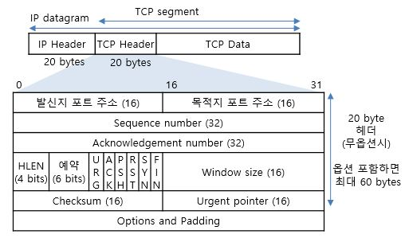
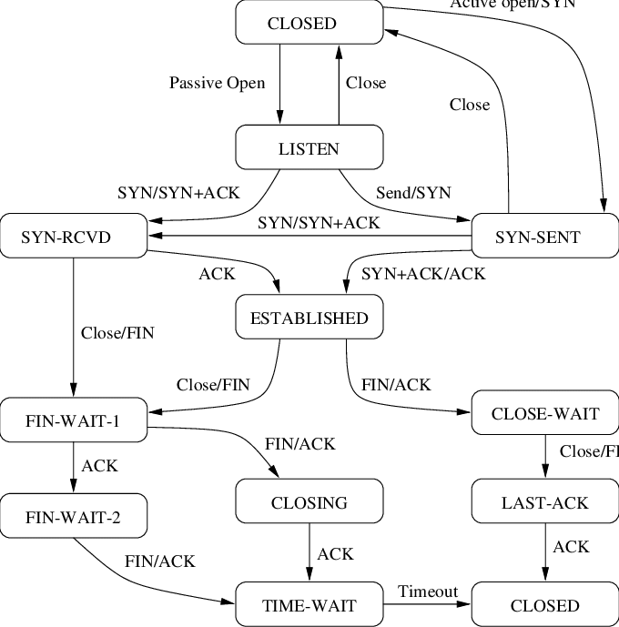
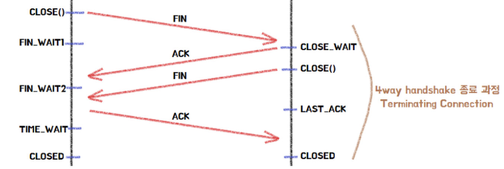
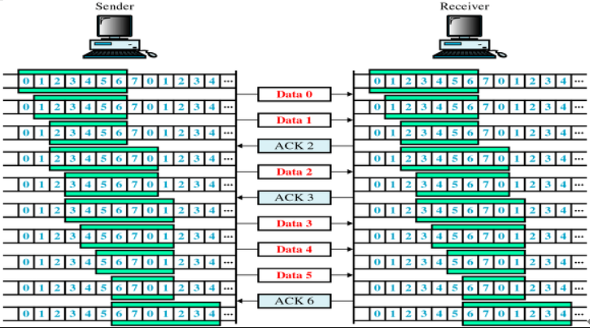
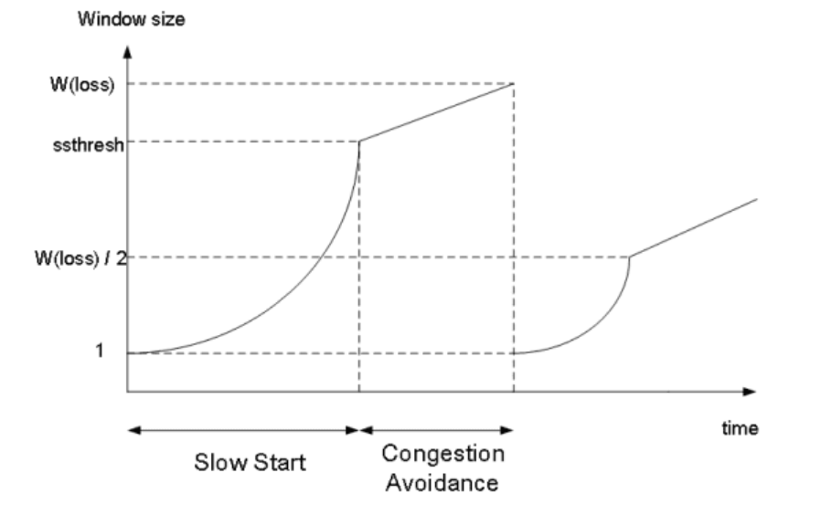
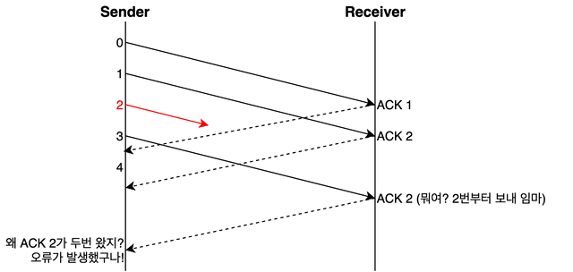
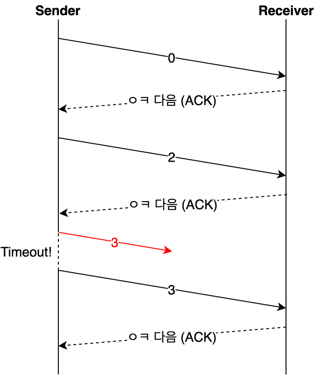
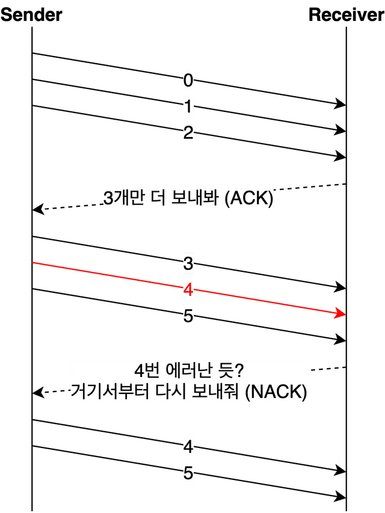

## TCP

**신뢰성 있는 데이터 전송**을 지원하는 **연결 지향형 전송계층** 프로토콜로 **3 way handshake로 연결을 수립**하고 , **4 way handshake로 연결을 해제**한다.

- **혼잡 제어, 흐름 제어, 오류 제어**등을 통해 **신뢰성을 보장**하지만 이것때문에 UDP와 비교해서 속도가 느리다.
- 또 **SEQ 넘버**와 **ACK 넘버**를 통해서 데이터 흐름 속에서 **데이터들의 순서를 파악**할 수 있기 때문에 신뢰성이 높아진다.
- 인터넷은 신뢰성을 갖추지 못하기 때문에 **종단간의 신뢰성 있는 Byte Stream**을 전송하도록 설계되었다.
- 연결을 유지하며 **1:1 통신**을 한다. 그렇기에 브로드캐스팅과 같은 시스템에선 적합하지 않다.
    
    
    
    TCP Header
    

### TCP 연결 과정

TCP는 통신을 시작하기전에 연결 수립이 필수적이다. 이것을 통해서 상대방과의 세션을 수립하여 통신의 정확성을 획득할 수 있다.

클라이언트는 서버에 접속을 요청하고 서버는 요청을 수락하는 ack와 flag가 설정된 패킷을 클라이언트에게 발송한다.

1. 클라이언트가 서버에 접속을 요청하는 SYN(a)이 설정된 패킷을 보낸다. 이때 클라이언트는 `SYN_SENT`
2. 서버가 클라이언트의 요청인 SYN(a)를 받고 클라이언트에게 요청을 수락한다는 ACK(a+1)과 SYN(b)이 설정된 패킷을 보낸다. 서버는 `SYN_RCVD` 상태
3. 클라이언트는 서버의 수락 요청에 대한 응답인 ACK(a+1)과 SYN(b) 패킷을 받고, ACK(b+1)을 서버로 보내면 연결이 성립된다. 클라이언트는 `ESTABLISHED` 상태가 되고, 서버는 ACK을 받으면 `ESTABLISHED` 상태가 된다.

이 과정에서 SYN이나 ACK가 dropped 된다면, 재전송(retransmission)이 일어난다. 만약 3번 과정에 ACK가 drop된다면 그 다음에 데이터를 보낼때 ACK도 같이 담아서 보내면서(piggy-backing) 연결을 수립한다.

### 2 way handshake으로 부족한가?

부족하다. TCP는 양방향성 connection이기 때문에, 양쪽의 통신 수립이 필수적이다. 클라이언트와 서버가 있다고 했을때, 클라이언트가 서버에게 SYN을 보내고, 서버가 ACK와 SYN만 보낸다고 하면, 서버 입장에선 제대로 연결되었는지 확인이 불가능하다. 서버의 ACK와 SYN에 대한 클라이언트의 응답인 ACK가 필요하니 3 way handshaking을 해야한다.


>💡 초기에 클라이언트에서 보내는 SYN 넘버는 ISN이라는 난수를 생성한다. 그 이유는 이전의 seq와 순차적인 정보를 전송하면, 서버가 판단하기에 이전 연결에서 보내는 정보라고 인식 할 수 있기 때문이다.


>💡 SYN flooding attack 이라는 공격이 있는데, 간단히 서버에 대해서 SYN 패킷만 무수히 보내는 것을 의미한다. 이것이 왜 유용하냐면, SYN 패킷을 보내면, 서버는 연결을 수립하는 과정이라고 생각해서 SYN/ACK 패킷을 보내고 ACK를 기다리는 half-open 상태에 돌입한다. 이 상태에서 서버는 클라이언트에 대한 정보를 가지고 있어야 하기때문에, 접속자(혹은 접속을 시도하려는) 사람의 정보를 저장하는 Backlog Queue가 꽉 차게 되고(정상적으로 연결이 수립되면 삭제하지만 그렇지 않으니) Backlog Queue가 꽉 차게 되어서 다른 연결 요청 정보 저장이 불가능해서 정상 Client들이 연결을 수립할 수 없게 된다.

>해결 방법으로는 Backlog Queue를 늘리는 것이 있지만 임시적인 해결책이다. 또 한가지 방법 중 하나는 방화벽에서 동일 클라이언트 IP에 대한 SYN 임계치를 설정해두는 방법이다.


### TCP 연결 해제 과정

4 way handshake를 통해 TCP는 연결을 해제한다.

1. 클라이언트가 서버에게 연결을 종료하겠다는 FIN 패킷을 보낸다.
2. 서버는 클라이언트의 요청에 대한 응답으로 ACK 패킷을 보낸다.
3. 서버는 자신의 통신이 끝날때까지 기다린다 . `CLOSE_WAIT` 단계다. → Socket Hang UP 에러 발생가능
4. 처리해야할 통신이 모두 끝났다면 FIN 패킷을 보낸다.
5. 클라이언트가 FIN에 대한 응답으로 ACK 패킷을 보낸다.
6. 클라이언트의 ACK 패킷을 받은 서버는 소켓을 닫는다.
7. 클라이언트가 서버로부터 앚기 받지 않은 데이터가 있을 수 있으니 기다리는 과정을 거친다. `TIME_WAIT` 단계다.

>💡 [에러 발생]
>클라이언트에서 FIN 패킷 전송 후 ACK 패킷을 기다리는 FIN_WAIT1과 서버의 ACK 패킷을 받은 후 FIN 패킷을 기다리는 FIN_WAIT2 에러 발생으로 인해 Time out이 되면 스스로 연결을 종료한다.
>그러나, CLOSE_WAIT은 Application이 close()를 적절하게 처리하지 못하면 CLOSE_WAIT 상태로 계속 기다리게 되어 Socket Hang Up 에러가 발생할 수 있다.

### TCP 상태 다이어그램



- CLOSED, LISTEN, SYN-SENT, SYN-RECEIVED, ESTABLISHED, FIN-WAIT-1, FIN-WAIT-2, TIME-WAIT, CLOSING, CLOSE-WAIT, LAST-ACK 등 상태가 존재한다.
- CLOSED : 연결이 존재하지 않을 때
- LISTEN : 서버에서 SYN이 오는 것을 기다리는 상태.
- SYN-SENT: SYN을 보내고 ACK을 기다리는 상태(클라이언트)
- SYN-RCVD: SYN을 받고 SYN+ACK을 보낸상태(서버)
- ESTABLISHED: ACK을 받게 되면 서버 클라이언트 각각 이 상태로 들어섬
- FIN-WAIT-1: FIN을 클라이언트 쪽에서 보냈을 떄 ACK을 기다리는 상태
- FIN-WAIT-2: 첫번째 FIN에 대한 ACK을 받고 다음 FIN이 날라 올 때까지 기다리는 상태
- CLOSE-WAIT: 첫번째 FIN을 받고 ACK을 보낸 뒤 보낼 데이터들을 보내고 ACK을 받는 상태
- LAST-ACK: 전송이 완료되고 서버쪽에서는 FIN을 보내고 ACK을 기다리는 상태
- TIME-WAIT: FIN이 오고 ACK을 보내준 뒤 일정 시간동안 기다림
- CLOSING: 클라이언트 쪽은 TIME-WAIT이 종료 된 후, 서버쪽은 ACK이 도착한 후 종료된 상태를 의미한다.


## TCP의 신뢰성을 위한 방법들
### 흐름 제어

**송신측과 수신측의 데이터 처리 속도 차이를 해결하기 위한 기법이다.**

수신측이 너무 지나치게 많은 패킷을 받지 않도록 조절하는것이 목적이고, 기본적인 개념은 수신측이 송신측에게 자신의 상태를 피드백한다는 것이다.

- 수신측이 송신측보다 데이터 속도가 빠르면 문제 없지만, 느릴때 문제가 생김.
- 수신측의 제한된 저장용량를 초과한 이후,즉 버퍼 오버 플로우 후에 도착하는 데이터는 손실될 가능성이 있으며, 손실되면 불필요한 응답과 데이터 전송이 빈번하게 오고감.
- 이를 해결하기 위해서 송신 측의 데이터 전송량을 수신측에 따라서 조절해야한다.

- 해결 방법
    - **Stop and Wait** : 매번 전송한 패킷에 대해 확인 응답을 받아야만 그 다음 패킷을 전송하는 방법. 그렇기에 비효율적이다.
        - Timeout을 설정하고, 그 Timeout 안에 ACK를 받지 못하면 실패한것으로 간주, 같은 프레임을 재전송한다.
        - 만약 이 Timeout이 너무 짧으면, ACK와 상관없이 계속 다시 보낼것이다.
    - **Sliding Window** : Stop and wait의 비효율성을 개선한 기법으로, 수신측에서 설정한 window 크기 만큼 송신측에서 확인 응답 없이 세그먼트를 전송할 수 있게하는 방식이다.  (윈도우 크기 = 가장 최근 ACK로 응답한 프레임 수 - 이전에 ACK 프레임을 보낸 프레임 수)
        - 3 way handshaking을 할 때 송신측이 수신측의 window size에 맞게 자신의 window size를 조절한다. TCP 헤더안에 있으니..
        - 수신측에서 설정한 윈도우 크기만큼의 세그먼트를 확인 응답없이 보낼 수 있게 하여 동적으로 흐름을 제어하는 방식.
        - 송신측이 ACK 를 수신하지 않았더라도 여러개의 패킷들을 보낼 수 있다. (window size만큼 한번에 보내는방식)
        - 0,1,2,3,4,5,6가 윈도우 사이즈에 맞을때, 0,1을 보내면 윈도우는 2,3,4,5,6 으로 변한다.
        - ACK를 받게 된다면, 0,1이 정상적으로 수신되었음을 알게되고 윈도우는 옆으로 두칸 이동해(slide) 2,3,4,5,6,7,8로 변한다.
            
            
            

### 혼잡 제어

송신측의 데이터 전달과 네트워크의 데이터 처리 속도 차이를 해결하기 위한 기법.

- 송신측이 네트워크를 통해서 데이터를 전달할때, 라우터가 만약 **데이터가 너무 몰려서(혼잡할때) 모든 데이터를 처리할 수 없게 되고**,
- 송신 측은 다시 데이터를 보내고, 혼잡을 가중시켜서 **오버플로우나 데이터 손실**을 일으키게 된다.
- 그 과정에서 혼잡을 피하기 위해서 **강제로 송신측의 데이터 전송속도를 줄이는데**, 이것을 혼잡제어라 한다.

- 해결방법
    - **AIMD (Additive Increase / Multiplicative Decrease)**
        - 처음에는 패킷을 하나씩 보내고, **문제없이 도착하면 window size를 1씩 증가**시켜가며(additive increase) 전송하는 방법
        - 만약 **패킷 전송에 실패하거나 일정 시간(timeout)을 넘으면, window size를 절반으로 감소**시킨다.
        - 이 방식은 fair 한데, 여러 개의 호스트가 네트워크름 공유할때, 처음 보내는 쪽이 1부터 보내기에 불리하지만 나중에는 평형한 상태를 맞추기 때문.
        - 하지만 초기에 1씩 보내기때문에 **높은 대역폭을 충분히 사용하지 못하고** , 혼잡상황을 **미리 감지 못해 혼잡이 일어나야지만 대역폭을 줄이는 방식**.
            
            
            
    - **Slow Start**
        - AIMD 방식이 전송 속도를 올리는데 있어서 오래걸리는 단점(1씩 증가하기 때문에)이 있기에 이것을 개선하는 방식.
        - AIMD와 마찬가지로 1개의 패킷을 보내면서 시작하지만, **문제없이 도착하면 window size를 2배로 늘려준다.**
        - 혼잡현상이 발생하면, window size를 1로 떨어트림.
        - 처음에는 네트워크에서 혼잡을 유발하는 window size를 알 수 없지만, 한번 혼잡현상이 발생하면 **최대 수용량에 대한 유추**가 가능해지기에, 그 window size의 **절반까지는 이전처럼 2배**로 증가하되, **그 이후부터는 완만하게 1씩 증가시키는 방식**을 택함.
            
            
            
        - 임계값(ssthresh)단계에서 부터는 **혼잡회피**(Congestion Avoidance)를 사용한다.
    - **혼잡 회피 (Congestion Avoidance)**
        - window size가 임계값에 도달한 이후부터는 조만간 혼잡이 발생해 데이터 손실 발생 확률이 커지기 때문에 조심스럽게 접근한다.
        - window size를 linear하게 1씩 증가시키는 방법을 사용.
        - 만약 혼잡이 발생했을 경우에, window size를 1로 줄이고, 임계값을 손실 발생했을때의 window size(W)의 절반인 W/2로 줄임.
    - **Fast Retransmit (빠른 재전송)**
        - 수신측은 순서대로 잘 도착한 마지막 패킷의 다음 번호를 ACK로 보내기 때문에, **중간에 손실이 있을시에는 중복된 ACK**를 받게 된다.
        - 이것을 감지하면, 문제가 되는 순번의 패킷을(**SR**) 재전송 해줄수 있다.(혹은 문제 지점부터 싹 다시보내거나,**GBN**)
        - **3 ACK Duplicated**, 즉 송신 측이 **3번 이상 중복**된 승인 번호를 받으면 혼잡이라고 인식한다.
        - 이때는 **설정된 타임아웃이 지나지 않아도** 해당 패킷을 재전송할 수 있다. (GBN or SR)
        - 이 방법으로 설정한 타임아웃 시간이 지나서야 대처하는 **기존의 방법보다 낭비되는 시간을 줄일 수 있다.**
    - **Fast Recovery** (빠른 회복)
        - TCP Tahoe : 초기 버전으로 타임아웃이 되거나 3 dup ack가 발생시 W를 1로 줄이고 slow start로 들어간다.
        - TCP Reno : 개선 버전이다. Tahoe가 무조건 W를 1로 줄이기에 대역폭을 온전히 사용 못할 수 있다. 그렇기에 **3 Dup ACK는 조금 덜한 혼잡이라고 본다.**
            - 3 Dup ACK : 현재 W의 절반으로 W를 줄이고, 1씩 linear하게 증가시킨다. 이때 임계점을 현재 W의 절반으로 설정한다.
            - Timeout : Tahoe와 마찬가지로 W를 1로 줄이고 slow start 한다. 임계점을 수정하지 않는다

### 오류 제어

기본적으로 TCP는 ARQ(Automatic Repeat Request), **재전송 기반 오류제어**를 사용한다. 뭔가 오류가 생기면, 송신측이 수신측에게 해당 데이터를 다시 전송하는 방법이다.

그렇지만 이 재전송이라는 작업 자체가 했던 일을 다시 해야하는 비효율적인 방법이기 때문에, 이 재전송 과정을 최대한 줄일 수 있는 방법을 사용한다.

**오류가 발생했다는것은 어떻게 알까?**

- NACK(부정 응답) : 더 명확해보이지만, 수신측에서 ACK/NACK를 선택하는 추가적인 과정이 필요하다.
- ACK가 오지 않음 : 수신측이 아예 데이터를 받지 못해 ACK를 못 보내거나, 수신 측이 제대로 응답했지만 ACK가 유실(lose)되는 경우
- 중복된 ACK
    - 송신측이 SEQ 2를 가지는 데이터를 이미 보냈는데도, 수신 측에서 이번엔 2번을 보내달라고 하면 문제가 생겼음을 알 수 있다.
    - 중복된 ACK 한 두번으로는 판단하지 않고, 3번 정도 받았을때 오류로 판단. 그 이유는 TCP가 중복된 ACK를 받앗을때 패킷 로스인지, 세그먼트들의 순서가 reordering 되는건지 명확히 알 수 없기 때문에 3번까지 보는것. 순서가 뒤집히는 이유는 TCP 아래 계층에서 라우팅 하는 단계에서 다른 경로를 택할수도 있기 때문.
        
        
        
    
- [해결 방법](https://evan-moon.github.io/2019/11/22/tcp-flow-control-error-control/)
    - Stop and wait : 흐름 제어때도 나왔엇지만, 제대로 받았다는 응답이 올때까지 대기하고 그 다음 데이터를 보내는 방식.
        - 아주 기본적으로 오류 제어가 가능하다.
            
            
            
        - 하지만 흐름 제어에 sliding window 방법을 사용하다면 데이터를 연속적으로 보내기 위함인데, 이런 방식으로 오류 제어를 사용하면, 그 이점을 잃는다.
    - **Go Back N (GBN)**
        - 데이터를 **연속적**으로 보내다가, **어느 데이터부터 오류가 발생했는지 검사**하는 방식.
            
            
            
        - 데이터를 연속적으로 보낸 후 한개의 ACK 혹은 NACK(오류 제어에선 설명의 간단함을 위해서 NACK로 사용)만으로 오류 파악이 가능하니, 슬라이딩 윈도우와 찰떡 (sliding window가 네트워크 대역폭의 이용률을 높이기 위해서 다른 프레임을 보내기전에 ACK를 요구하지 않는데 )
        - 만약 4번 데이터에서 에러를 감지하면, 수신측은 4번 데이터 이후 받은 모든 데이터를 폐기후 송신측에 알리는 방식이다.
            >왜 데이터들을 다 폐기할까?
                
            >수신자의 버퍼관리가 간단하다. 결국에 수신자도 상위 계층에 데이터를 전달하는 입장인데, 순서가 잘못 넘어온 데이터에 대해서(n+1만 오고, n은 오지 않음) 버퍼링을 할 필요가 없기 때문이다. 
                
        - 송신측은 5번까지 이미 전송을 했지만, 4번 데이터에서 에러가 났다는것을 알았기에 4번으로 되돌아가서(Go Back) 다시 전송해야 한다.
        - ACK이 누적적(cumulative)이다.
        - SR에 비해서 구현이 간단하지만, GBN의 특성상 같은 데이터가 계속 오갈 수 있으니 대역폭을 효율적으로 사용하지 못한다.
        - 또 SR에 비해서 버퍼사이즈를 크게 잡을 수 있는데 시퀀스 넘버가 n비트일때 `2^n-1`개의 window 사이즈를 가질 수 있다. 왜 1을 빼냐면,
    - **Selective Repeat (SR)**
        - **오류가 난 데이터만** **선택적인 재전송**을 의미한다. GBN이 stop and wait에 비하면 효율적이지만, 에러가 발생하면 그 이후 정상적으로 받은 데이터를 모두 폐기처분하니, 재전송해야하는 비효율이 아직 있다.
            
            
            
        - 문제가 있는 데이터만 재전송하니 효율적이고 만능처럼 보이지만, 버퍼에 데이터들이 연속적이지 않다는 문제점이 있다.
        - 위 예시에서 데이터는 `0,1,2,3,5` 가 들어있다가 4를 재전송 받게 되면, `0,1,2,3,5,4` 의 데이터가 들어있다.
        - 기존의 버퍼 안에서 데이터를 정렬할 수 없으니, **별도의 버퍼**를 두어서 그 안에서 재정렬을 해줘야 한다.
        - GBN에 비해서 재전송이 적다는 점에서 효율적이지만, 추가적인 로직이 필요해서 복잡하고, 별도의 버퍼를 관리하는데 드는 비용이 있다.
        - ACK이 각각(individual)이다. (사진상으로는 안그런것처럼 보이지만)
        - 시퀀스 넘버가 n비트 일때 `2^(n/2)`개 이하의 window size로 제한되어 있다. 만약 `2^(n/2)`이라고 해보자. 그럼 뒤의 절반이 왔을때, 나머지 앞 절반이 안오면 뒤의 절반을 추가 버퍼에 가지고 있을텐데, 안 온 부분에 대해서


## UDP

**비연결형** 서비스를 지원하는 전송계층 프로토콜이다. 사전에 연결 설정을 하지 않은 **데이터그램 방식**으로 데이터를 전달한다.
별도의 **연결을 수립하지 않고** 보내기 때문에, 각각의 패킷은 서로 다른 경로를 통해서 전송될 수 있고 각각은 독립적이고 그렇기에 패킷에 **순서를 부여하진 않는다**.

실제로 UDP 헤더 부분을 보면 아래와 같이 받는 포트와 보내는 포트 정보, UDP 길이, checksum으로만 구성되어 있는 8Byte 구조이다.


- UDP는 TCP와 달리 흐름제어, 오류제어 , 손상된 세그먼트에 대한 **재전송을 하지 않는다.**
- 오직 Checksum 필드를 통해서 **최소한의 오류만 검출**하기 때문에 신뢰성이 TCP에 비해서 낮은 편이지만, 이 때문에 TCP에 비해서 **속도가 빠르다.**
- 그렇기에 신뢰성 보다는 **연속성이 중요한 서비스** , 예를 들어 실시간 서비스에서 자주 사용된다.
- TCP가 소켓을 open해서 통신하는 구조에 반해서 UDP는 오직 IP를 기반으로만 데이터를 전송한다.
- 흐름제어가 없기 때문에, 패킷이 제대로 전송되었는지, 오류가 없는지는 확인할 수 없다.

또 대표적으로 UDP를 사용하는 서비스가 DNS인데(모든 DNS가 UDP만 쓰는것은 아니다.) 아래 이유로 사용된다.

- 3way handshake와 같은 연결 수립 과정이 없기 때문에, **연결 설정에 드는 비용이 없어 빠르다**.
- 연결 상태를 유지하는 TCP의 특성상 버퍼에 대한 정보,혼잡제어 정보, seq,ack 번호와 같은 정보를 저장해야하기에  **UDP가 더 많은 클라이언트를 수용할 수 있다.**
- **DNS의 레코드는 일반적으로 작아서** UDP 세그먼트에 어울린다. (50-550 Byte)
- UDP가 신뢰성이 없긴 하지만, DNS가 더 상위계층(application layer)의 프로토콜이니 **만약 응답이 오지 않는 경우에서는 다시 전송하도록 지시할 수 있다.**

단, DNS의 응답의 크기가 512Byte 보다 크거나, zone transfer(DNS 레코드를 primary에서 secondary로 옮기는 작업)을 할때에는, 데이터의 정합성 검사를 위해서 TCP를 사용한다.

```toc
```