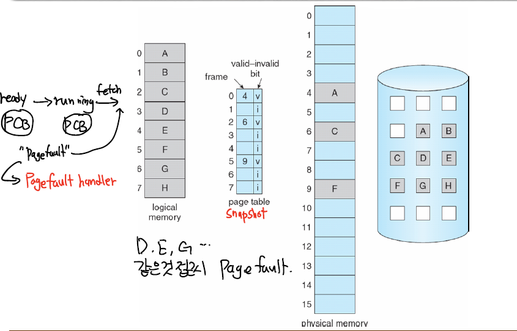
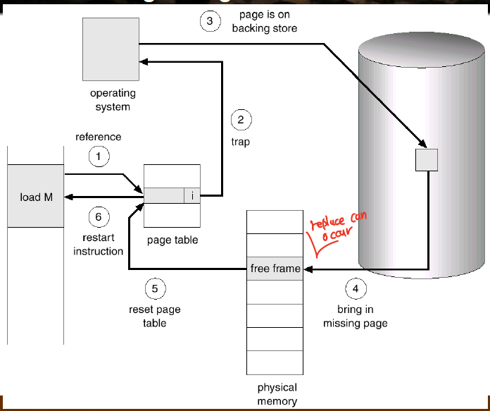
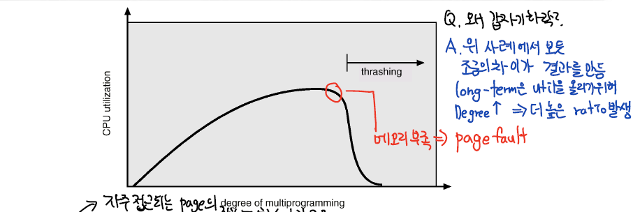

[이전편 : 페이징](https://becomeweasel.me/paging/)

## 가상 메모리 (Virtual Memory)

가상 메모리는 논리적 메모리와 물리 메모리를 분리시켜, **프로세스 전체가 메모리내에 올라오지 않아도 실행가능하도록 하는 기법이다.**

물론 프로그램이 실행되기 위해서는 메모리에 프로세스가 올라와야 하는것은 맞다. 하지만 특정 부분을 실행할때는 그 부분만 메모리 위에 올라와있어도 구동이 된다.

그렇기 때문에 논리적 주소공간은 실제 물리적 주소공간보다 훨씬 커도 된다. 왜냐면, 어차피 일부만 실행할때 필요하니까..
그럼 가장 핵심적인 기술은 프로세스를 실행할때, 필요한 메모리를 불러오고(**swapped in**) 필요하지 않은 부분은 내리는(**swapped out**) 과정이 필요하다.

가상메모리는 **요구 페이징(Demand Paging)** 이라는 기술로 구현된다.

특정 페이지에 대한 수요가 있을때, 즉 페이지에 대한 참조 요청이 들어왔을때 페이지를 메모리로 불러오는것이다.
다시 말해서 기존의 방법과는 다르게 가상 메모리 방식을 취하면, 시작할때부터 아무 메모리도 올라와있지 않아도 되고 필요할때만 불러오는 방식이다.

프로그램에서 사용되는 일부분만 메모리에 적재하는 가상 메모리를 통해서 아래와 같은것들이 가능하다.

- 시스템 라이브러리가 여러 프로세스 사이에 공유가 가능하다.
  프로세스 입장에서는 자신의 주소공간에 라이브러리가 올라와있다고 생각하지만, 실제로 라이브러리가 들어 있는 물리 메모리는 하나로 모든 프로세스에 공유되는 방식이다.
- **프로세스가 만들어질때 훨씬 더 효율적이다.** 왜냐면, 실제로 프로세스를 만들때 필요한 모든 메모리를 할당해주는것이 아니라 **필요할때만** 주기 때문에 **훨씬 가볍고 효율적이다.**
  - 예를 들어서 `fork` 를 해서 프로세스를 생성한다고 해보자.
    이때 메모리를 직접 주는것이 아니라 **기존의 메모리를 그대로 사용하게끔만 하고 프로세스는 이것을 독립적인 메모리 공간으로 인식한다.**
- **실제 물리 메모리보다 더 큰 메모리를** 요구하는 프로세스를 구동시킬 수 있다.
- **더 많은 프로세스가 구동이 가능하다.**

## 요구 페이징 (Demand Paging)

페이지를 메모리에 올릴때 오직 그것이 필요할때만 수행하는것을 요구 페이징이라고 한다.
이것을 Lazy Swapper이라고도 하는것같다.(그 페이지 필요할때까지 절대 페이지를 메모리에 올리지 않는다)

- **적은 I/O** : 전체 코드내에서 접근 안되는 주소공간은 가져올 필요가 없으니.
- **적은 메모리 사용량**
- **빠른 응답** : 모든 페이지가 올라와있을 필요가 없으니 시작이 빠르다.
- **더 많은 유저** : "_논리적 메모리 >> 물리적 메모리_ " 이니 더 많은 프로세스를 수용가능하다.

만약에 특정 페이지가 필요하다고 하자. 그럼 그 페이지를 참조해야하는데, 아래와 같은 분기를 가지게 된다.

- 페이지에 대한 잘못된 참조 → 에러
- 메모리에 올라와있지 않음 → 데이터를 메모리에 적재함

그럼 이 올라와있지 않거나 올라와 있는것을 어떻게 구분할까?  
논리주소와 물리주소를 변환할때 쓰였던 페이지 테이블을 이용해 페이지 테이블의 엔트리에 **valid-bit**를 부착해서 구분한다.

만약 valid-bit가

- True면
  - 현재 그 메모리를 가져온다.
- False면
  - **Page Fault 발생**
  - Page fault에 대한 처리를 하는데 일반적으로 페이지에 해당하는 프레임을 찾아서 로드시킨다.
  
  위 그림을 보면 B,D,E,F,G,H는 valid-bit가 invalid로 되어있다.  
  만약 이때 B나 F와 같은 페이지를 참조하려 하면 **Page Fault**가 일어나는 것이다.

그럼 **페이지 폴트** (Page Fault)가 뭘까?

## 페이지 폴트 (Page Fault)
페이지 폴트는 valid-bit가 invalid 인 곳에 MMU가 접근을 할때 HW trap을 발생시키면서 생긴다.

valid-bit가 invalid 하다는 것은 현재 메모리안에 내가 원하는 페이지가 존재하지 않음을 의미하므로,  
원하는 페이지에 해당하는 프레임을 메모리로 가져온 후 프로그램이 계속 동작되게끔 해야한다.  
이것을 페이지 폴트 핸들링이라고 한다.

### 페이지 폴트 핸들링

페이지 폴트는 결국에 인터럽트이기 때문에 ISR을 수행하는 처리과정을 거친다.

아래는 프로세스가 특정한 페이지를 참조하려고 했을때의 과정에 Page Fault 핸들링하는 과정이 추가된것이다.

1. 프로세스가 **논리주소** (p,d) 를 가지고 메모리에 접근하려고 시도한다.
2. **TLB를 먼저 확인**해서 p에 해당하는 프레임 번호 f가 있는지 확인한다.
   1. **TLB Hit**,있다면 바로 메모리로 접근해서 (f,d)를 가져온다.
   2. **TLB Miss,** 없으니 이제 페이지 테이블을 참조해야 한다.
3. **(p,d)를 가지고 페이지 테이블에 접근한다.**
   1. 페이지 테이블에 p에 해당하는 f가 valid하면, 메모리에 접근해서 로드한다.
        - 이때 **TLB 엔트리도 갱신된다.**
   2. 만약 valid하지 않다면 현재 메모리에 올라와있지 않다는 것 → Page Fault
4. 운영체제가 메모리 접근할때의 주소를 확인한다.
   1. 잘못된 접근인가? 그러면 중지시켜야 한다.
   2. 아니라면 진행.
5. 물리 메모리에서 적절히 빈공간을 찾는다.
   1. 만약 이때 없다면, **적절하게 다른 프레임을 교체시켜야 한다.** 이 교체의 방식이 매우 중요한데, 잘 골라야 다음에 replace가 일어날 확률을 줄인다.
6. 저장소에서 매치되는 페이지를 프레임에 올린다.
   1. **이때 프로세스는 `wait` 상태인데, 저장소 접근 자체가 I/O 이기 때문이다. 컨텍스트 스위칭 발생.**
   2. I/O가 끝나면, 페이지 테이블 엔트리가 업데이트 되고, valid-bit가 valid로 설정된다. 이때도 컨텍스트 스위칭 발생할것같다.
   3. **프로세스는 레디큐로 옮겨진다. 그리고 일반적으로 스케쥴링되는것처럼 기다려야 한다.**
7. CPU를 다시 할당받게 되면 페이지 폴트 트랩 처리가 끝난다.
8. 페이지 폴트를 촉발시켰던 명령어부터 다시 수행한다. (PC를 증가시키지 않기 때문에. 만약 PC 증가시키면 그 명령어는 강제로 건너띄는것이다.)



## 쓰레싱 (Threshing)

스레싱은 멀티프로그래밍 환경에서 페이지 폴트가 많이 일어나서 시스템이 아무런 작업도 하지 못하고 페이지를 메모리에서 가져오고 빼내는 과정만 반복해 CPU 이용률이 급격하게 떨어지는 현상이다.

더 최악인 점은 CPU 이용률이 떨어지니, 레디큐에 프로세스를 올리는 Long-term scheduler가 판단하기를
”CPU 이용률을 높이기 위해 멀티프로그래밍 정도를 올려야 함"이라고 판단하고 레디큐에 더 많은 프로세스를 올리면서 페이지폴트는 더 늘어간다.

- 여기서 멀티프로그래밍 정도가 느는것과 페이지폴트가 무슨상관일까?
  - 새로운 프로세스가 올라오면, Short-term scheduler가 새로운 프로세스에 CPU를 할당할 것이고, 이때는 initial page fault가 생기기 때문이다.

결국 Swap-in,Swap-out만을 하느라 바쁘고, 프로세스는 Block 되며, CPU는 대부분의 상황에서 **IDLE** 상태다.
>I/O 작업만 하니까..



위의 그림처럼 MPD를 계속 올리다보니 스레싱이 발생하고, 그러면 더 MPD를 올리게되고 페이지폴트는 더 자주일어나면서 CPU 이용률은 급감한다.

결국에 자주 접근되는 페이지가 메모리에 올라와있지 않으면 이런 많은 페이지 폴트가 생기는데,  
그렇기 때문에 각 프로세스가 필요로 하는 **최소 프레임의 개수만큼은 보장**을 해주어야 한다.

```toc

```
